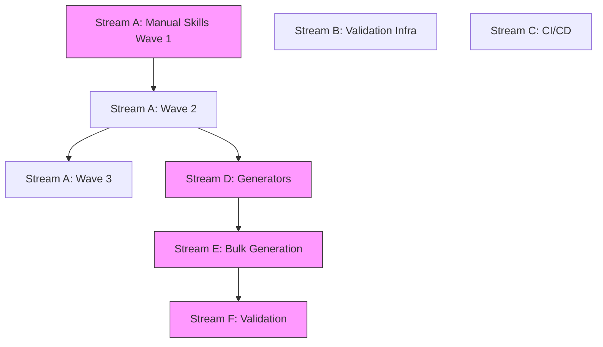

# Execution Plan: Level 3 Resources Implementation

**Phase**: 3 - Execution Plan with Parallelization
**Date**: 2025-10-27

## Critical Path

```
Checkpoint 1: 5 manual skills (1-2 days)
    ↓
Checkpoint 2: 10 manual skills + Validation infra (2-3 days)
    ↓
Checkpoint 3: 15 manual skills + Generators built (3-4 days)
    ↓
Checkpoint 4: Bulk generation (1-2 days)
    ↓
Checkpoint 5: Validation + fixes (2-3 days)
    ↓
Checkpoint 6: CI/CD integration (1 day)
```

**Total Timeline**: 10-15 days

---

## Parallel Streams

### Stream A: Manual Skills (Priority: CRITICAL)

**Owner**: Main + 4 Parallel Agents
**Duration**: 3-4 days

#### Wave 1: Critical Infrastructure (5 skills) - PARALLEL
**Duration**: 1 day with 5 agents

| Agent | Skills | Category | Rationale |
|-------|--------|----------|-----------|
| Agent-A1 | tls-configuration | cryptography | Most requested, score 100 |
| Agent-A2 | consensus-raft | distributed-systems | Core distributed systems |
| Agent-A3 | http2-multiplexing | protocols | Modern web essential |
| Agent-A4 | postgres-query-optimization | database | Most used database skill |
| Agent-A5 | api-authentication | api | Core API skill |

**Success Criteria**: Each agent completes Resources structure, 2-3 scripts, REFERENCE.md

#### Wave 2: Secondary High-Value (5 skills) - PARALLEL
**Duration**: 1-1.5 days with 5 agents

| Agent | Skills | Category | Rationale |
|-------|--------|----------|-----------|
| Agent-A1 | security-headers | security | Security essential |
| Agent-A2 | crdt-fundamentals | distributed-systems | Advanced distributed |
| Agent-A3 | integration-testing | testing | Testing core |
| Agent-A4 | code-review | engineering | Development practice |
| Agent-A5 | react-state-management | frontend | Most used frontend |

#### Wave 3: Completing Manual Set (5 skills) - PARALLEL
**Duration**: 1-1.5 days with 5 agents

| Agent | Skills | Category | Rationale |
|-------|--------|----------|-----------|
| Agent-A1 | distributed-tracing | observability | Observability core |
| Agent-A2 | graphql-schema-design | api | Alternative API approach |
| Agent-A3 | test-driven-development | engineering | Development methodology |
| Agent-A4 | nextjs-seo | frontend | Modern framework |
| Agent-A5 | docker-optimization | containers | Container best practice |

**Handoff Protocol**:
1. Agent creates Resources in `skills/{category}/{skill}/resources/`
2. Agent commits work to feature branch
3. Agent reports completion with file paths
4. Main agent validates structure
5. Patterns added to PatternLibrary

---

### Stream B: Validation Infrastructure (Priority: HIGH)

**Owner**: Agent-B (Validation Specialist)
**Duration**: 2-3 days
**Runs in parallel with**: Stream A (Manual Skills)

**Tasks**:
- [ ] B1: Create script validator (`scripts/validate_skill_scripts.py`)
- [ ] B2: Create reference validator (`scripts/validate_references.py`)
- [ ] B3: Create example validator (`scripts/validate_examples.py`)
- [ ] B4: Create integration test framework (`scripts/integration_test_runner.py`)
- [ ] B5: Create Docker compose templates for common services
- [ ] B6: Test validation infrastructure on vulnerability-assessment

**Dependencies**: None (independent)

**Integration Point**: Used in Checkpoint 2 to validate manual skills

---

### Stream C: CI/CD Setup (Priority: MEDIUM)

**Owner**: Agent-C (CI/CD Specialist)
**Duration**: 1-2 days
**Runs in parallel with**: Stream A, Stream B

**Tasks**:
- [ ] C1: Create `.github/workflows/skills-quality.yml`
- [ ] C2: Add script linting (shellcheck, pylint)
- [ ] C3: Add reference URL checking
- [ ] C4: Add Resources structure validation
- [ ] C5: Configure pre-commit hooks
- [ ] C6: Test CI on feature branch

**Dependencies**: None (independent)

**Integration Point**: Used in Checkpoint 6

---

### Stream D: Generator Development (Priority: CRITICAL)

**Owner**: Agent-D (Generator Specialist) + Main
**Duration**: 3-4 days
**Starts after**: 10 manual skills complete (Checkpoint 2)

**Tasks**:
- [ ] D1: Analyze patterns from 10 manual skills
- [ ] D2: Build Reference Generator (`scripts/generators/generate_reference.py`)
- [ ] D3: Build Validation Script Generator (`scripts/generators/generate_validation_script.py`)
- [ ] D4: Build Test Script Generator (`scripts/generators/generate_test_script.py`)
- [ ] D5: Build Example Extractor (`scripts/generators/extract_examples.py`)
- [ ] D6: Build Documentation Generator (`scripts/generators/generate_readme.py`)
- [ ] D7: Create Pattern Library (`scripts/generators/pattern_library.py`)
- [ ] D8: Test generators on 3 skills not in manual set
- [ ] D9: Refine based on test results
- [ ] D10: Document generator usage

**Dependencies**: Requires 10 manual skills complete

**Integration Point**: Used in Stream E (Bulk Generation)

---

### Stream E: Bulk Generation (Priority: CRITICAL)

**Owner**: Main + 4 Parallel Agents
**Duration**: 1-2 days
**Starts after**: Stream D complete (Checkpoint 3)

**Categories** (108 remaining HIGH priority skills):

#### Batch 1: distributed-systems (13 remaining) - Agent-E1
- consensus-paxos, vector-clocks, logical-clocks, eventual-consistency
- conflict-resolution, replication-strategies, partitioning-sharding
- distributed-locks, leader-election, gossip-protocols
- probabilistic-data-structures, dotted-version-vectors, interval-tree-clocks

#### Batch 2: engineering (9 remaining) - Agent-E2
- code-quality, refactoring-patterns, technical-debt, pair-programming
- continuous-integration, functional-programming, design-patterns
- domain-driven-design, rfc-technical-design

#### Batch 3: database (10 remaining) - Agent-E3
- postgres-migrations, postgres-schema-design, redis-data-structures
- mongodb-document-design, orm-patterns, duckdb-analytics
- apache-iceberg, redpanda-streaming, database-selection
- database-connection-pooling

#### Batch 4: Mixed Categories (remaining ~76 skills) - Agents E4-E8
- frontend: 8 remaining
- observability: 7 remaining
- protocols: 7 remaining
- cryptography: 6 remaining
- security: 5 remaining
- testing: 5 remaining
- api: 6 remaining
- infrastructure: 6 remaining
- containers: 3 remaining
- debugging: 4 remaining
- build-systems: 2 remaining
- cloud: 13 remaining
- others: ~8

**Process**:
1. Agent loads skill list from audit
2. Agent runs all generators on each skill
3. Agent creates Resources structure
4. Agent commits per skill (or batch of 5)
5. Agent reports completion

**Success Criteria**: All 108 skills have Resources directories

---

### Stream F: Validation & Fixes (Priority: HIGH)

**Owner**: Agent-F (Validation) + Main
**Duration**: 2-3 days
**Starts after**: Stream E complete (Checkpoint 4)

**Tasks**:
- [ ] F1: Run validators on all 123 skills
- [ ] F2: Spot-check 25 random skills manually (20%)
- [ ] F3: Collect validation failures
- [ ] F4: Categorize failures (generator issue vs skill-specific)
- [ ] F5: Fix generator issues
- [ ] F6: Regenerate failed skills
- [ ] F7: Manual fix for skill-specific issues
- [ ] F8: Re-validate all fixed skills
- [ ] F9: Generate final quality report

**Success Criteria**: 95%+ validation pass rate

---

## Dependencies



**Critical Path**: A → D → E → F (purple nodes)
**Parallel Streams**: B, C (can run anytime)

---

## Checkpoints

### Checkpoint 1: After 5 Manual Skills (Day 1-2)
**Review**:
- [ ] All 5 skills have complete Resources
- [ ] Scripts are executable and documented
- [ ] Patterns are identifiable
- [ ] Quality meets standard

**Decision Point**: Continue with Wave 2 or adjust approach?

### Checkpoint 2: After 10 Manual Skills (Day 3-4)
**Review**:
- [ ] 10 skills complete with Resources
- [ ] Validation infrastructure ready
- [ ] Patterns extracted to library
- [ ] Generator design started

**Decision Point**: Begin generator development?

### Checkpoint 3: After 15 Manual Skills + Generators (Day 6-7)
**Review**:
- [ ] All 15 manual skills complete
- [ ] Generators tested on 3 sample skills
- [ ] Quality acceptable
- [ ] Ready for bulk execution

**Decision Point**: Start bulk generation?

### Checkpoint 4: After Bulk Generation (Day 8-9)
**Review**:
- [ ] All 108 skills generated
- [ ] Structure validation passing
- [ ] No major errors

**Decision Point**: Begin validation phase?

### Checkpoint 5: After Validation (Day 11-13)
**Review**:
- [ ] 95%+ validation pass rate
- [ ] All failures addressed
- [ ] Quality report generated
- [ ] Ready for CI integration

**Decision Point**: Integrate CI/CD?

### Checkpoint 6: Final (Day 14-15)
**Review**:
- [ ] All 123 skills validated
- [ ] CI/CD passing
- [ ] Documentation complete
- [ ] Ready to merge

**Decision Point**: Merge to main?

---

## Rollback Strategy

**If Wave 1 fails**:
- Roll back agent commits
- Review patterns
- Adjust approach
- Continue manually

**If generators fail**:
- Fall back to manual creation
- Fix generator issues
- Test on small batch
- Resume bulk execution

**If validation fails**:
- Categorize failures
- Fix high-priority issues
- Re-generate if needed
- Accept <5% failure rate with manual fixes

---

## Parallel Execution Schedule

### Day 1-2: Maximum Parallelism (7 agents)
- Agents A1-A5: Manual Skills Wave 1 (5 parallel)
- Agent B: Validation Infrastructure
- Agent C: CI/CD Setup

### Day 3-4: Continued Parallel (7 agents)
- Agents A1-A5: Manual Skills Wave 2 (5 parallel)
- Agent B: Continue validation work
- Agent C: Continue CI/CD work

### Day 5-6: Pattern Learning (7 agents)
- Agents A1-A5: Manual Skills Wave 3 (5 parallel)
- Agent D: Begin generator development
- Agent B, C: Complete their streams

### Day 7-8: Generator Development (1-2 agents)
- Agent D + Main: Complete generators
- Test generators
- Document usage

### Day 9-10: Bulk Generation (8 agents)
- Agents E1-E8: Parallel bulk generation
- Each agent handles 13-15 skills

### Day 11-13: Validation (2 agents)
- Agent F: Run validators
- Main: Spot-check quality
- Fix and regenerate as needed

### Day 14-15: Integration (1 agent)
- Agent C: Final CI/CD integration
- Main: Final quality check
- Prepare merge

---

## Resource Allocation

**Peak Parallelism**: 8 agents (Day 9-10)
**Average Parallelism**: 5-7 agents (Day 1-8)
**Critical Resources**:
- Context budget: Monitored per agent
- Git conflicts: Agents work on independent skills
- Testing infrastructure: Shared validation environment

---

## Success Metrics

1. **Completion**: 123/123 HIGH priority skills have Resources ✅
2. **Quality**: 95%+ validation pass rate ✅
3. **Consistency**: All skills follow established pattern ✅
4. **Documentation**: Every script documented ✅
5. **Validation**: All scripts tested ✅
6. **CI/CD**: Quality gates passing ✅
7. **Timeline**: Complete in 14-15 days ✅

---

**Phase 3 Complete**: ✅
**Next Phase**: Plan → Artifacts (Execution with Parallel Agents)
