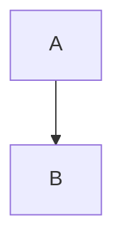

# Diagrams Skills

Visual documentation and diagramming with Mermaid.js and other tools.

## Available Skills

### Mermaid.js Core Diagrams

**mermaid-flowcharts.md**
- Process flow visualization
- Node shapes and connections
- Decision trees and branching
- Subgraphs and organization
- Common patterns: API flows, data pipelines, authentication

**mermaid-sequence-diagrams.md**
- Interaction and message flows
- Participants and actors
- Message arrow types
- Activation boxes and control flow
- Common patterns: REST API, microservices, retry logic

**mermaid-class-state-diagrams.md**
- UML class diagrams
- Object relationships and hierarchies
- State machines and transitions
- Composite states and choice nodes
- Common patterns: API models, repositories, workflows

**mermaid-er-diagrams.md**
- Entity-relationship diagrams
- Database schema design
- Cardinality and relationships
- Keys and attributes
- Common patterns: E-commerce, auth systems, CMS

### Mermaid.js Advanced Diagrams

**mermaid-architecture-diagrams.md**
- C4 diagrams (Context, Container, Component)
- Block diagrams
- System architecture visualization
- Infrastructure and deployment
- Common patterns: Microservices, serverless, Kubernetes

**mermaid-charts.md**
- Data visualization charts
- Pie charts for distributions
- XY charts (line and bar)
- Quadrant charts for prioritization
- Radar charts for multi-dimensional comparison

**mermaid-project-diagrams.md**
- Gantt charts for project timelines
- Task dependencies and critical path
- Timeline diagrams for chronology
- Milestone tracking
- Common patterns: Release plans, sprints, migrations

**mermaid-specialized.md**
- Git graphs for version control workflows
- Sankey diagrams for data flows
- Mindmaps for concept hierarchies
- Requirement diagrams
- Common patterns: Gitflow, budget allocation, learning paths

## Quick Reference

### When to Use Which Diagram

**Process & Logic**:
- Flowchart: Algorithm, decision tree, workflow
- Sequence: API interaction, protocol, communication

**Structure & Design**:
- Class: Object model, API structure, OOP design
- ER: Database schema, data relationships
- Architecture: System design, infrastructure, deployment

**Data & Metrics**:
- Pie: Distribution, percentages, breakdown
- XY: Trends, comparisons, time series
- Quadrant: Prioritization, risk assessment
- Radar: Skill assessment, multi-dimensional comparison
- Sankey: Flow analysis, conversion funnels

**Planning & History**:
- Gantt: Project schedule, dependencies, critical path
- Timeline: Product roadmap, history, milestones
- GitGraph: Branching strategy, release workflow

**Ideation & Organization**:
- Mindmap: Brainstorming, concept breakdown, learning paths
- State: Lifecycle, protocol states, FSM

## Usage Patterns

### Documentation
```bash
# In markdown files

```

### Live Preview
- Use https://mermaid.live for development
- Auto-renders in GitHub/GitLab markdown
- VS Code: Install "Mermaid Preview" extension

### Combining Diagrams

**Start broad, drill down**:
1. Architecture diagram → System context
2. Sequence diagram → Runtime behavior
3. Class/ER diagram → Data/object structure
4. Flowchart → Business logic detail

**Example workflow**:
- C4 Context → What systems exist?
- C4 Container → What technologies?
- Sequence → How do they interact?
- Class → What's the data model?
- Flowchart → What's the algorithm?

## Best Practices

1. **One diagram, one purpose**: Don't mix abstraction levels
2. **Label everything**: Axes, relationships, transitions
3. **Limit complexity**: Split large diagrams into focused views
4. **Use consistent styling**: Establish patterns for colors, shapes
5. **Document assumptions**: Add notes for non-obvious details
6. **Version control**: Track diagram changes like code

## Integration

These skills integrate with:
- **api-*** skills: Document API design with sequence/class diagrams
- **database-*** skills: Schema design with ER diagrams
- **testing-*** skills: Test flows with sequence/flowcharts
- **containers-*** skills: Deployment with architecture diagrams
- **git-*** skills: Workflow visualization with Git graphs

## Resources

- Mermaid.js: https://mermaid.js.org
- Live Editor: https://mermaid.live
- GitHub Docs: https://docs.github.com/en/get-started/writing-on-github/working-with-advanced-formatting/creating-diagrams
- C4 Model: https://c4model.com
- UML Reference: https://www.uml-diagrams.org
