# Mermaid Architecture Diagrams

**Scope**: System architecture, C4 diagrams, and infrastructure visualization with Mermaid.js
**Lines**: ~430
**Last Updated**: 2025-10-27
**Format Version**: 1.0 (Atomic)

---

## When to Use This Skill

Activate this skill when:
- Designing system architecture
- Documenting microservices topology
- Creating infrastructure diagrams
- Visualizing deployment architectures
- Planning cloud infrastructure
- Mapping service dependencies
- Explaining system context to stakeholders

---

# Part 1: C4 Diagrams

## Core Concepts

### Concept 1: System Context (Level 1)

**Purpose**: Show the system and its users/dependencies

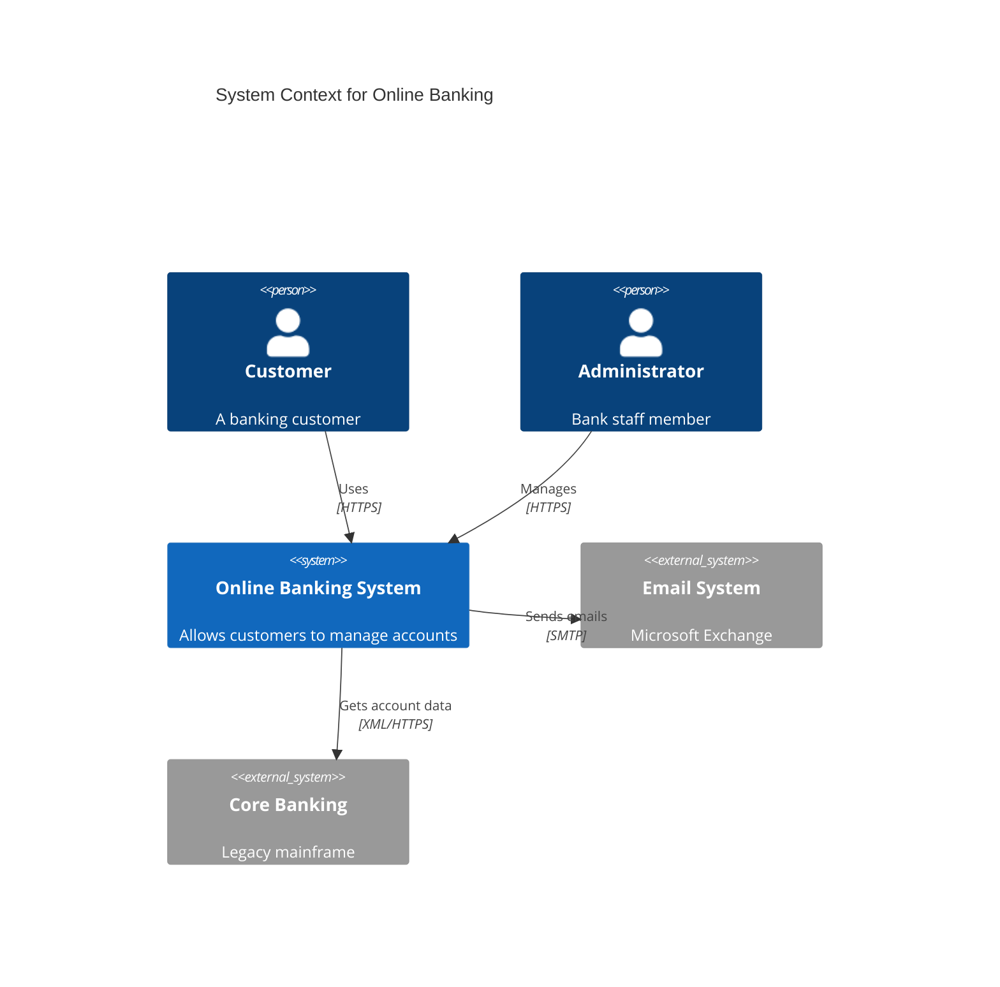

**System boundary**:
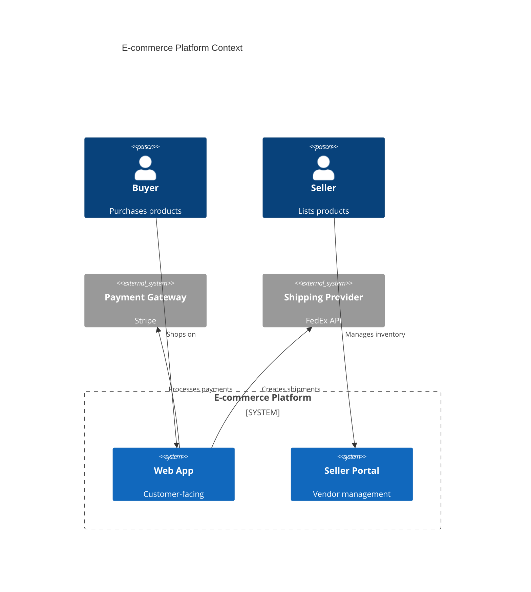

### Concept 2: Container Diagram (Level 2)

**Purpose**: Show high-level technology choices

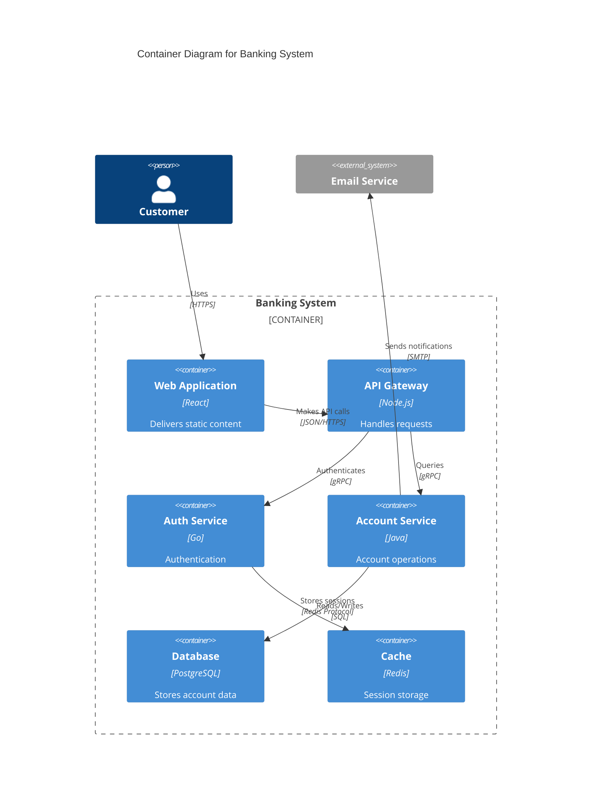

### Concept 3: Component Diagram (Level 3)

**Purpose**: Show internal structure of a container

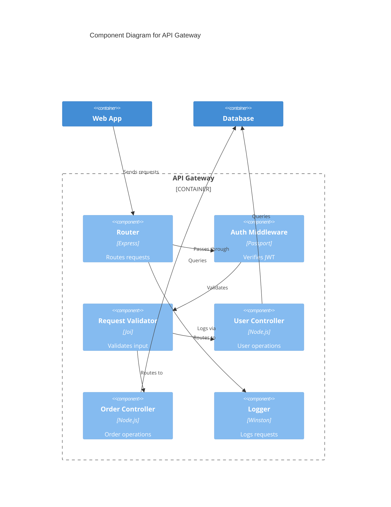

## C4 Common Patterns

### Pattern 1: Microservices Architecture

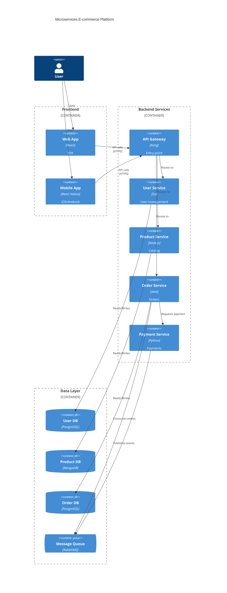

### Pattern 2: Serverless Architecture


---

# Part 2: Block Diagrams

## Core Concepts

### Concept 1: Basic Blocks and Layout

**Simple blocks**:
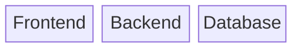

**With labels**:
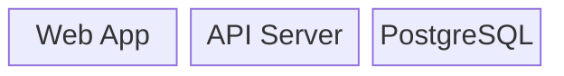

**Block spanning**:
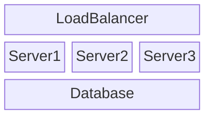

### Concept 2: Block Shapes

**Different shapes**:
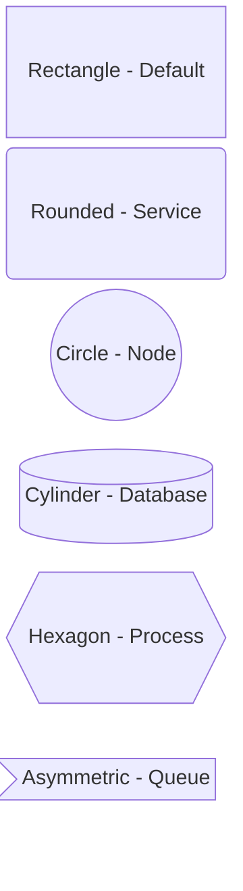

### Concept 3: Nested Blocks

**Grouping components**:
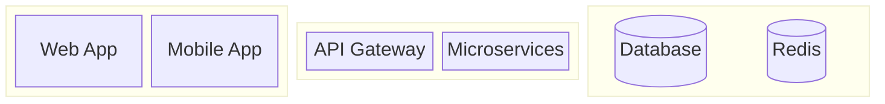

### Concept 4: Connections

**Connecting blocks**:
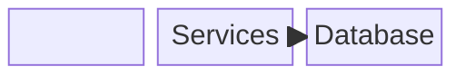

**Labeled connections**:
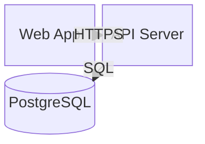

## Block Diagram Patterns

### Pattern 1: Three-Tier Architecture

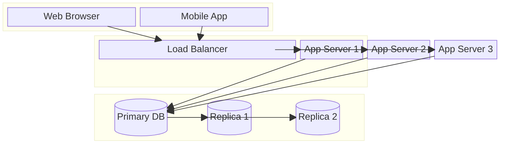

### Pattern 2: Event-Driven Architecture

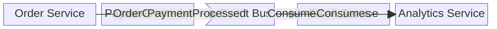

### Pattern 3: Cloud Infrastructure

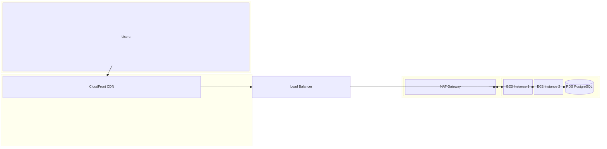

### Pattern 4: Kubernetes Deployment

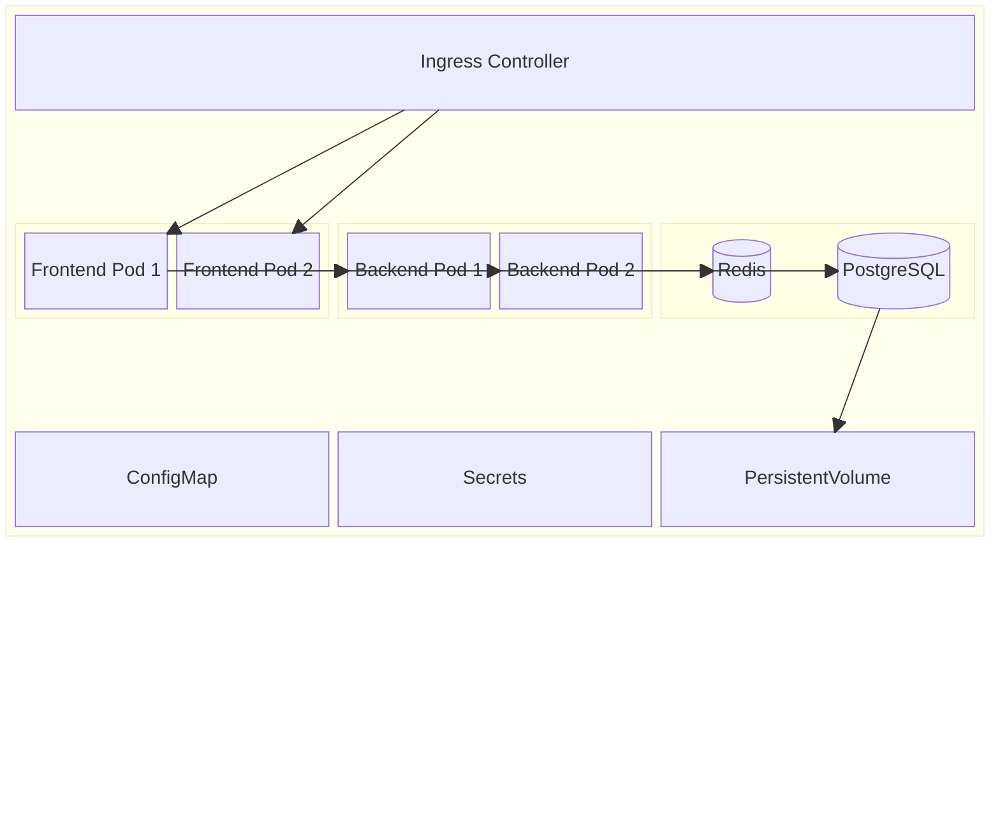

## Best Practices

### 1. Layer Your Architecture
Group components by responsibility:
- Presentation layer
- Application layer
- Data layer
- External systems

### 2. Show Technology Choices
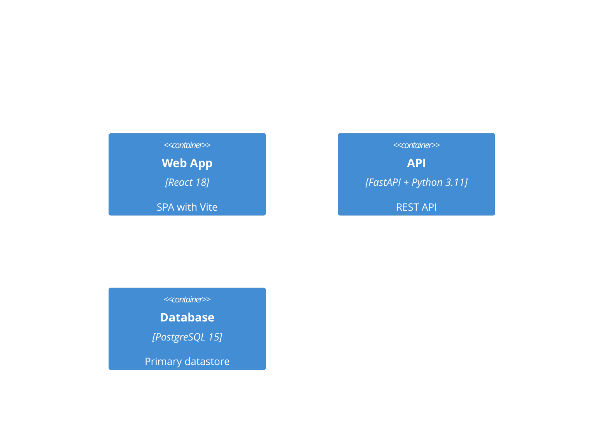

### 3. Indicate Data Flow Direction
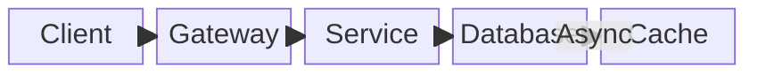

### 4. Group Related Components
Use boundaries and nested blocks to show ownership and deployment context.

### 5. Document External Dependencies
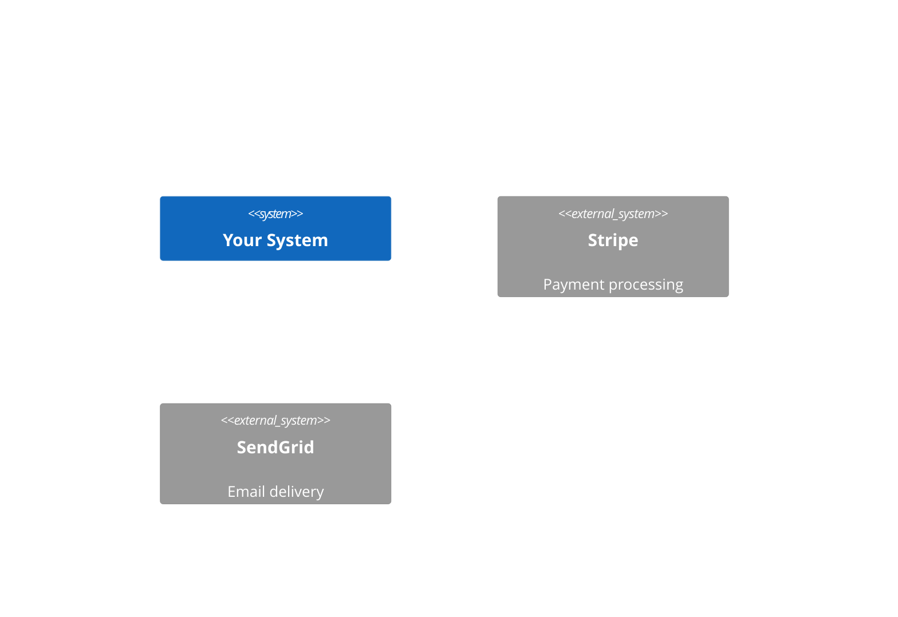

## Anti-Patterns

### ❌ Too Many Components in One Diagram
**Problem**: Visual overload, hard to understand
**Solution**: Split into multiple diagrams by context/layer

### ❌ Missing Technology Labels
```mermaid
C4Container
    Container(api, "API")  %% What technology?
```
**✅ Better**:
```mermaid
C4Container
    Container(api, "API", "Node.js + Express", "REST API")
```

### ❌ Unclear Relationships
```mermaid
block-beta
    A --> B
    B --> C
```
**✅ Better**:
```mermaid
block-beta
    A -- "HTTPS/JSON" --> B
    B -- "gRPC" --> C
```

### ❌ No Grouping or Boundaries
**Problem**: Can't tell what's internal vs external, or which team owns what
**Solution**: Use system boundaries and nested blocks

## Integration Tips

- **Start with Context** → Then drill into Containers → Then Components
- **Use with sequence diagrams** → Show runtime behavior
- **Combine with ER diagrams** → Document data model
- **Export as SVG** → Include in architecture docs

## Related Skills

- `mermaid-sequence-diagrams.md` - Runtime interactions
- `mermaid-flowcharts.md` - Process flows
- `mermaid-er-diagrams.md` - Data modeling

## Resources

- C4 Model: https://c4model.com
- Official Docs:
  - https://mermaid.js.org/syntax/c4.html
  - https://mermaid.js.org/syntax/block.html
- Live Editor: https://mermaid.live
- Architecture patterns: https://microservices.io/patterns/index.html
