# Mermaid Charts

**Scope**: Data visualization with pie, XY, quadrant, and radar charts in Mermaid.js
**Lines**: ~420
**Last Updated**: 2025-10-27
**Format Version**: 1.0 (Atomic)

---

## When to Use This Skill

Activate this skill when:
- Visualizing data distributions
- Creating priority matrices
- Comparing metrics across categories
- Showing performance assessments
- Building dashboards and reports
- Presenting analytics data
- Illustrating multi-dimensional comparisons

---

# Part 1: Pie Charts

## Core Concepts

### Concept 1: Basic Pie Chart

**Simple distribution**:
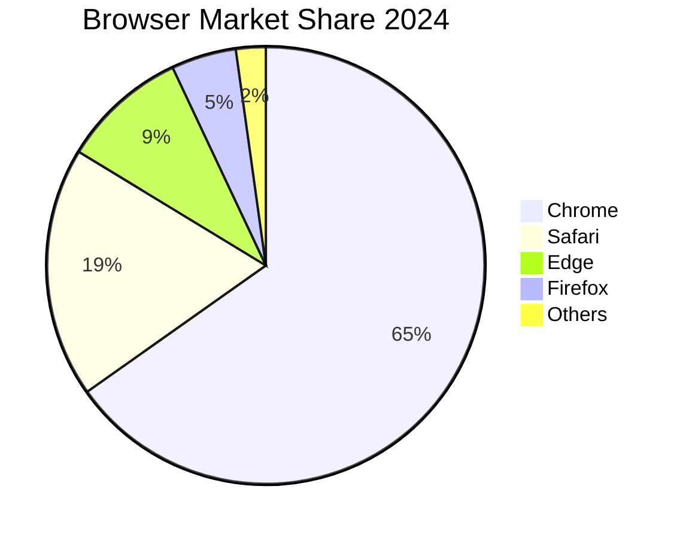
```mermaid
pie
    title Browser Market Share 2024
    "Chrome" : 65.2
    "Safari" : 18.5
    "Edge" : 9.3
    "Firefox" : 4.8
    "Others" : 2.2
```

**With data labels**:
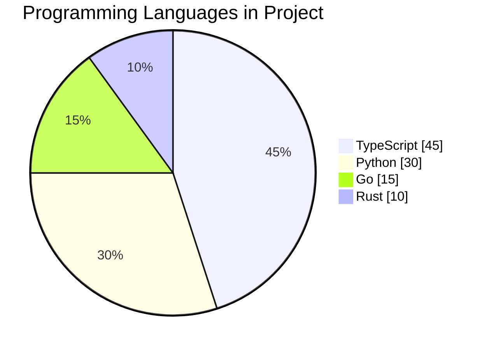
```mermaid
pie showData
    title Programming Languages in Project
    "TypeScript" : 45
    "Python" : 30
    "Go" : 15
    "Rust" : 10
```

### Concept 2: Pie Chart Patterns

**Budget allocation**:
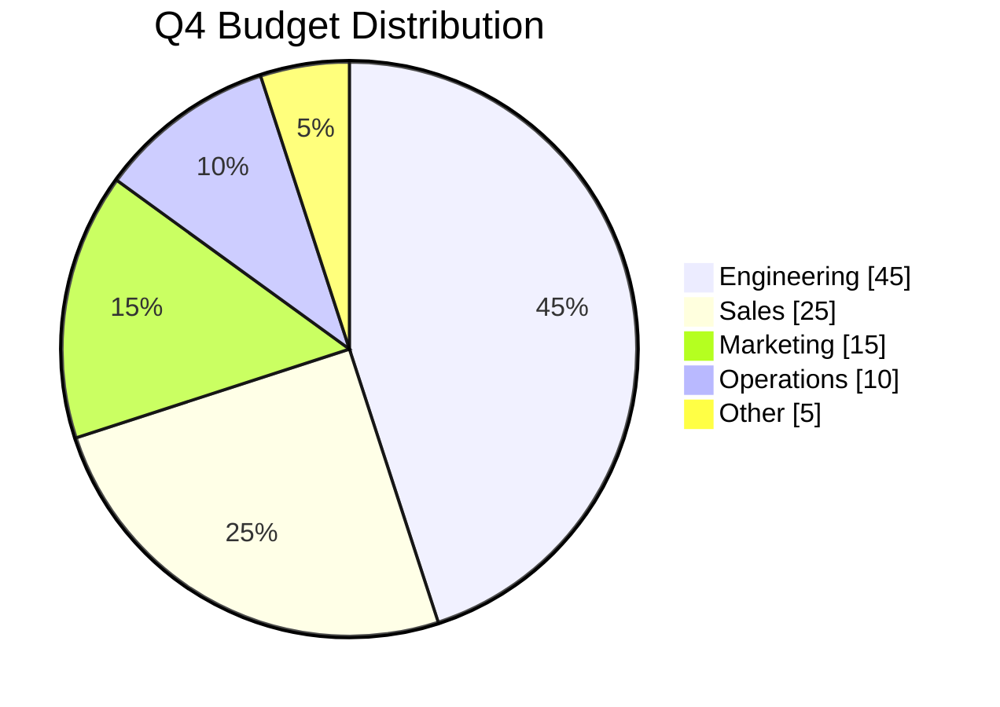
```mermaid
pie showData
    title Q4 Budget Distribution
    "Engineering" : 45
    "Sales" : 25
    "Marketing" : 15
    "Operations" : 10
    "Other" : 5
```

**Service usage**:
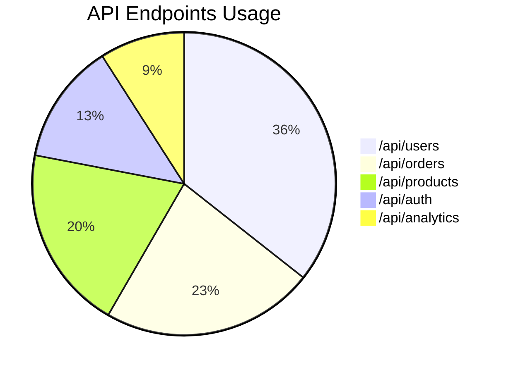
```mermaid
pie
    title API Endpoints Usage
    "/api/users" : 3420
    "/api/orders" : 2180
    "/api/products" : 1890
    "/api/auth" : 1240
    "/api/analytics" : 870
```

**Time allocation**:
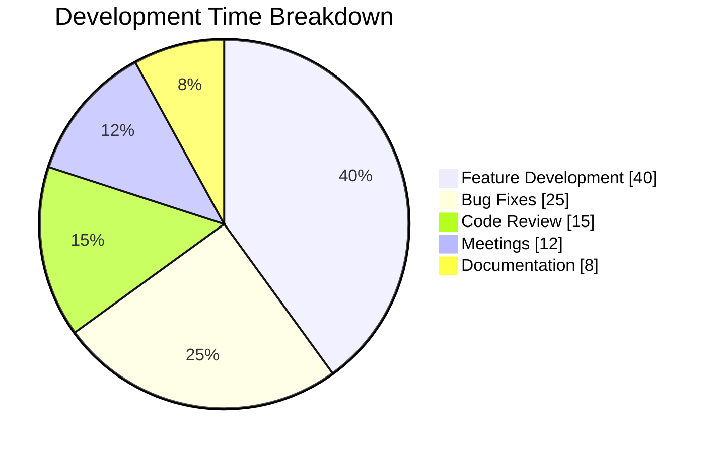
```mermaid
pie showData
    title Development Time Breakdown
    "Feature Development" : 40
    "Bug Fixes" : 25
    "Code Review" : 15
    "Meetings" : 12
    "Documentation" : 8
```

---

# Part 2: XY Charts

## Core Concepts

### Concept 1: Line Charts

**Trend over time**:
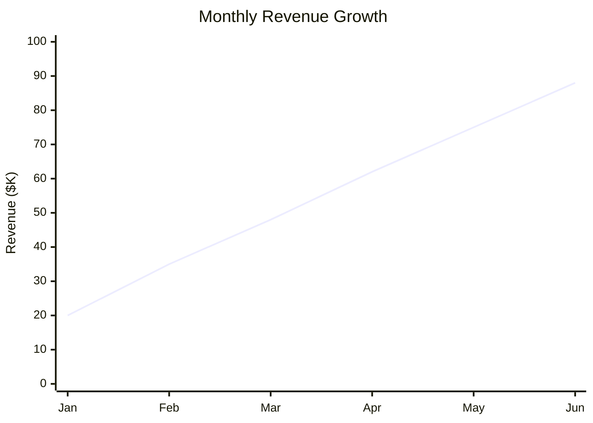
```mermaid
xychart-beta
    title "Monthly Revenue Growth"
    x-axis ["Jan", "Feb", "Mar", "Apr", "May", "Jun"]
    y-axis "Revenue ($K)" 0 --> 100
    line [20, 35, 48, 62, 75, 88]
```

**Multiple series**:
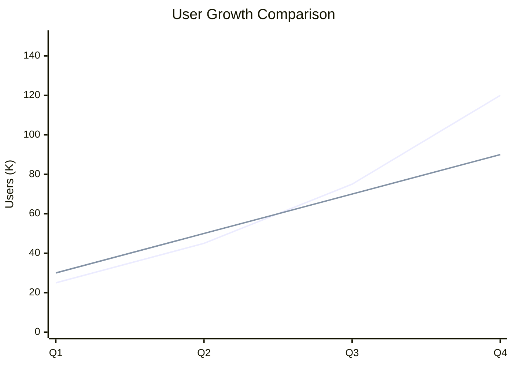
```mermaid
xychart-beta
    title "User Growth Comparison"
    x-axis ["Q1", "Q2", "Q3", "Q4"]
    y-axis "Users (K)" 0 --> 150
    line "Platform A" [25, 45, 75, 120]
    line "Platform B" [30, 50, 70, 90]
```

### Concept 2: Bar Charts

**Categorical comparison**:
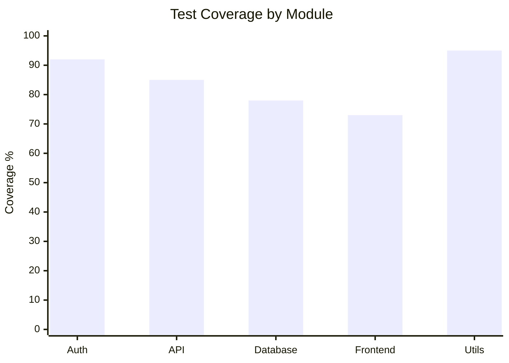
```mermaid
xychart-beta
    title "Test Coverage by Module"
    x-axis ["Auth", "API", "Database", "Frontend", "Utils"]
    y-axis "Coverage %" 0 --> 100
    bar [92, 85, 78, 73, 95]
```

**Grouped data**:

```mermaid
xychart-beta
    title "Bug Count by Severity"
    x-axis ["Sprint 1", "Sprint 2", "Sprint 3", "Sprint 4"]
    y-axis "Bugs" 0 --> 50
    bar "Critical" [5, 3, 2, 1]
    bar "High" [12, 9, 7, 4]
    bar "Medium" [18, 15, 13, 10]
```

### Concept 3: Numeric X-Axis

**Continuous data**:
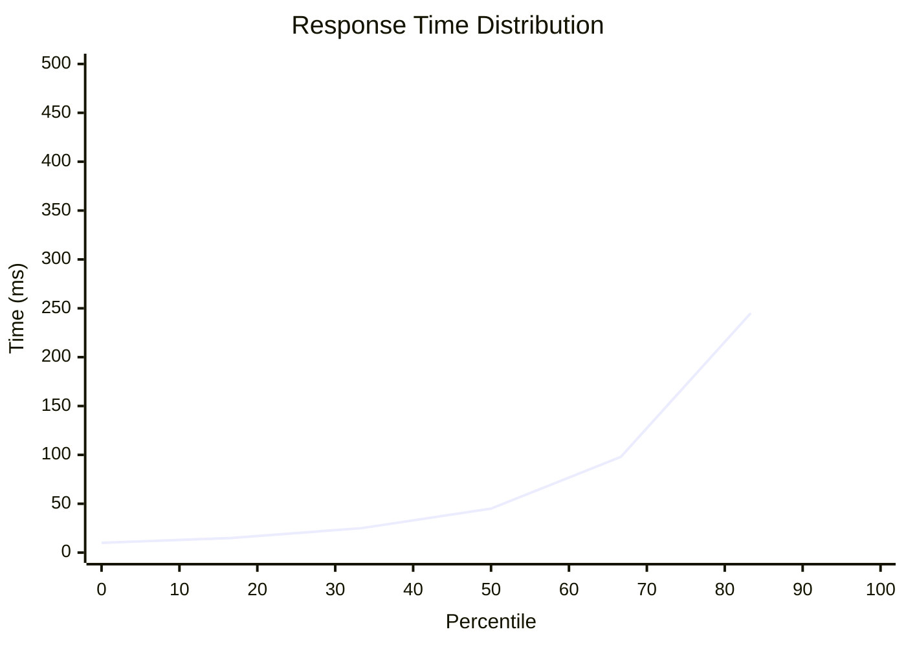
```mermaid
xychart-beta
    title "Response Time Distribution"
    x-axis "Percentile" 0 --> 100
    y-axis "Time (ms)" 0 --> 500
    line [10, 15, 25, 45, 98, 245, 485]
```

## XY Chart Patterns

### Pattern 1: Performance Metrics

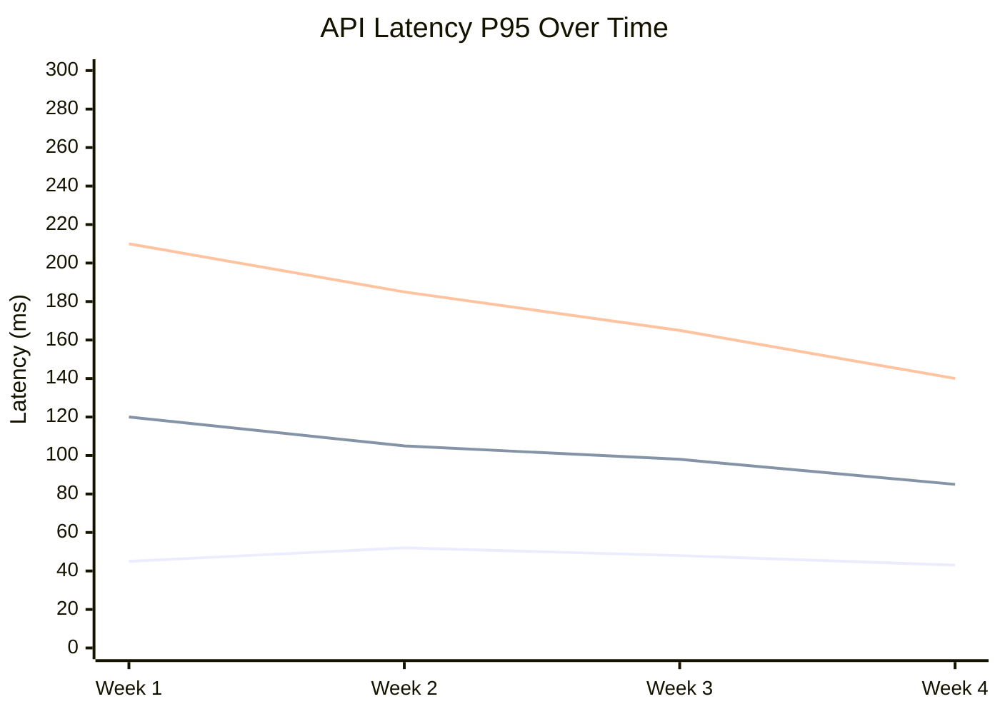
```mermaid
xychart-beta
    title "API Latency P95 Over Time"
    x-axis ["Week 1", "Week 2", "Week 3", "Week 4"]
    y-axis "Latency (ms)" 0 --> 300
    line "Auth Service" [45, 52, 48, 43]
    line "User Service" [120, 105, 98, 85]
    line "Order Service" [210, 185, 165, 140]
```

### Pattern 2: Business Metrics

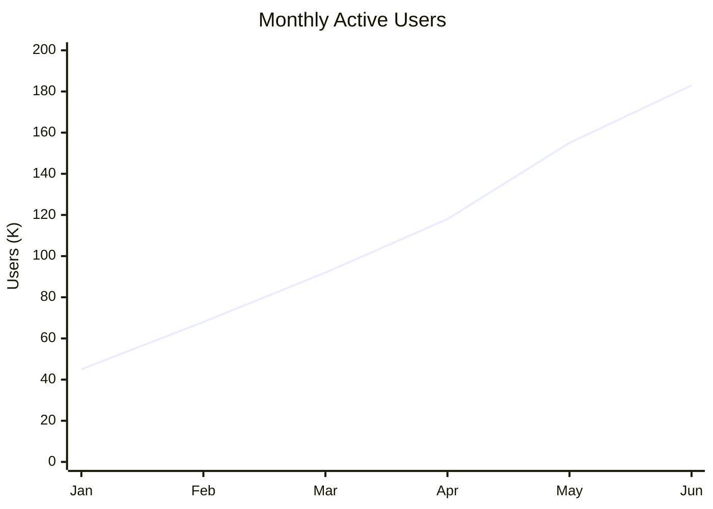
```mermaid
xychart-beta
    title "Monthly Active Users"
    x-axis ["Jan", "Feb", "Mar", "Apr", "May", "Jun"]
    y-axis "Users (K)" 0 --> 200
    line [45, 68, 92, 118, 155, 183]
```

### Pattern 3: Resource Utilization

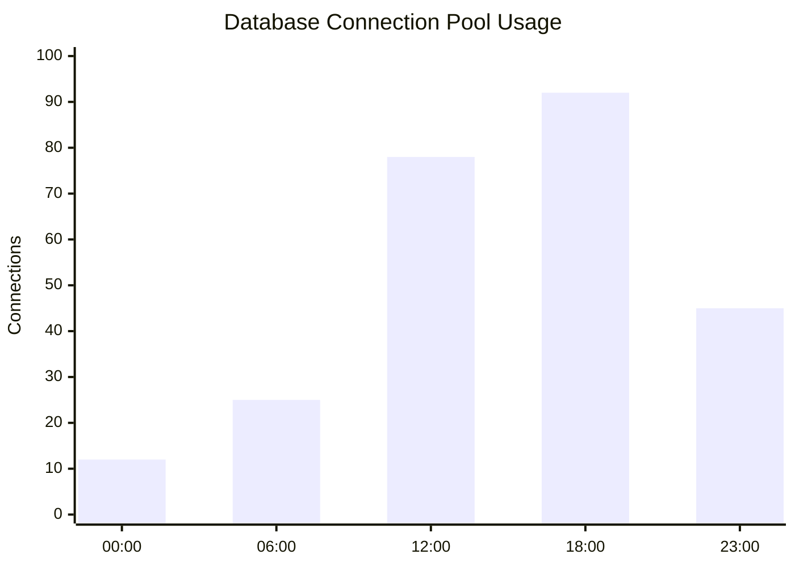
```mermaid
xychart-beta
    title "Database Connection Pool Usage"
    x-axis ["00:00", "06:00", "12:00", "18:00", "23:00"]
    y-axis "Connections" 0 --> 100
    bar [12, 25, 78, 92, 45]
```

---

# Part 3: Quadrant Charts

## Core Concepts

### Concept 1: Basic Quadrant

**2x2 matrix**:
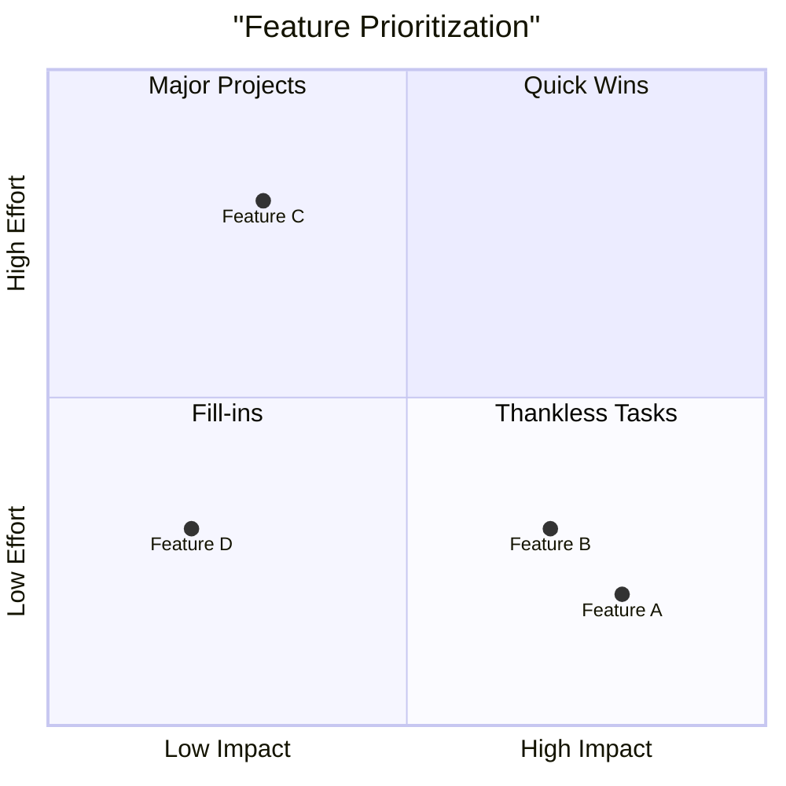
```mermaid
quadrantChart
    title "Feature Prioritization"
    x-axis "Low Impact" --> "High Impact"
    y-axis "Low Effort" --> "High Effort"
    quadrant-1 "Quick Wins"
    quadrant-2 "Major Projects"
    quadrant-3 "Fill-ins"
    quadrant-4 "Thankless Tasks"
    Feature A: [0.8, 0.2]
    Feature B: [0.7, 0.3]
    Feature C: [0.3, 0.8]
    Feature D: [0.2, 0.3]
```

### Concept 2: Styled Points

**With custom colors and sizes**:
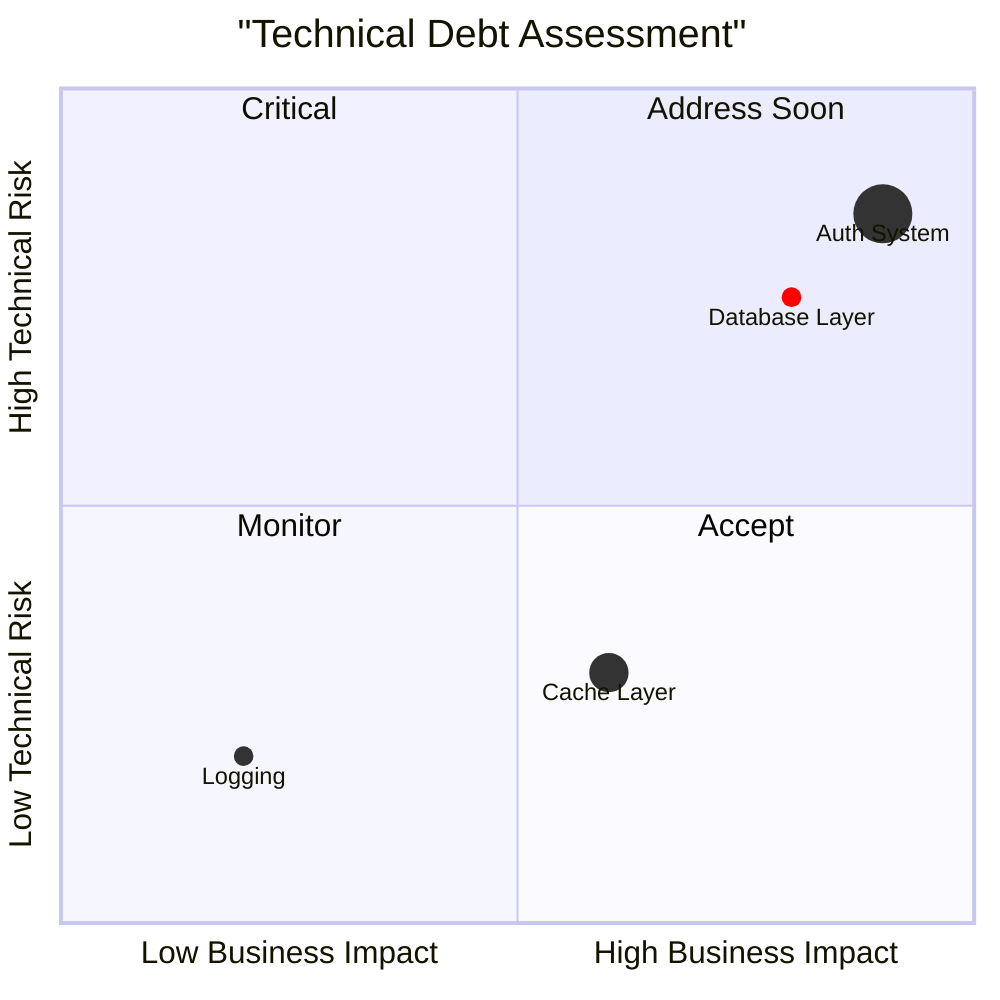
```mermaid
quadrantChart
    title "Technical Debt Assessment"
    x-axis "Low Business Impact" --> "High Business Impact"
    y-axis "Low Technical Risk" --> "High Technical Risk"
    quadrant-1 "Address Soon"
    quadrant-2 "Critical"
    quadrant-3 "Monitor"
    quadrant-4 "Accept"

    Auth System: [0.9, 0.85] radius: 15
    Database Layer: [0.8, 0.75] color: #ff0000
    Cache Layer: [0.6, 0.3] radius: 10
    Logging: [0.2, 0.2]
```

## Quadrant Chart Patterns

### Pattern 1: Eisenhower Matrix

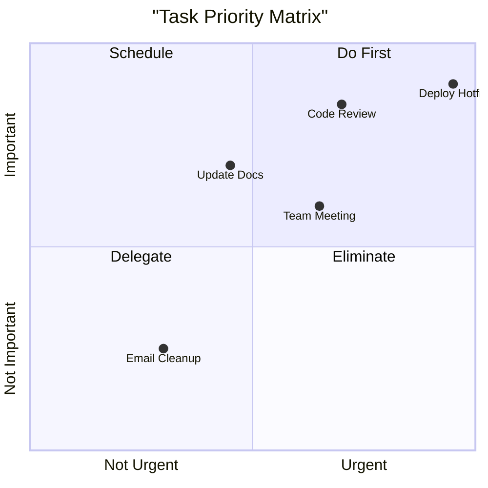
```mermaid
quadrantChart
    title "Task Priority Matrix"
    x-axis "Not Urgent" --> "Urgent"
    y-axis "Not Important" --> "Important"
    quadrant-1 "Do First"
    quadrant-2 "Schedule"
    quadrant-3 "Delegate"
    quadrant-4 "Eliminate"

    Deploy Hotfix: [0.95, 0.90]
    Code Review: [0.70, 0.85]
    Team Meeting: [0.65, 0.60]
    Email Cleanup: [0.30, 0.25]
    Update Docs: [0.45, 0.70]
```

### Pattern 2: Product Strategy Matrix

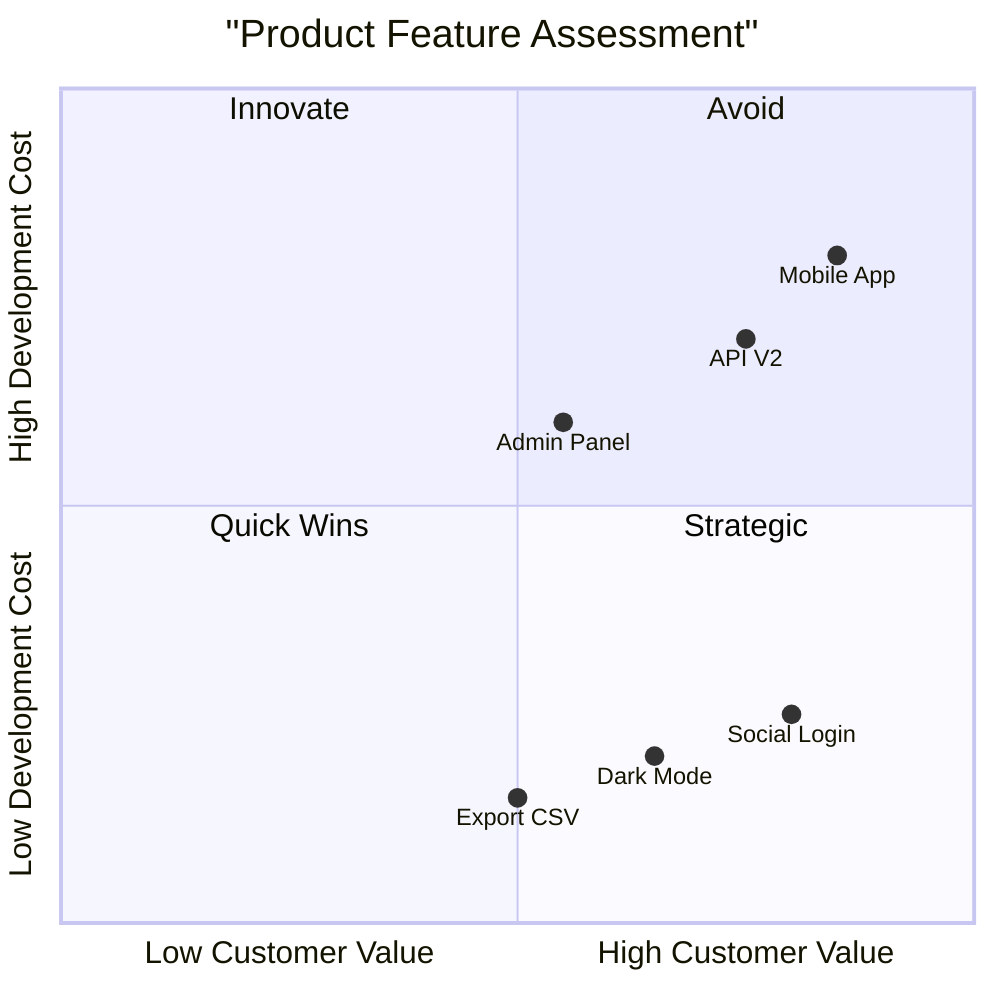
```mermaid
quadrantChart
    title "Product Feature Assessment"
    x-axis "Low Customer Value" --> "High Customer Value"
    y-axis "Low Development Cost" --> "High Development Cost"
    quadrant-1 "Avoid"
    quadrant-2 "Innovate"
    quadrant-3 "Quick Wins"
    quadrant-4 "Strategic"

    Mobile App: [0.85, 0.80]
    API V2: [0.75, 0.70]
    Dark Mode: [0.65, 0.20]
    Admin Panel: [0.55, 0.60]
    Export CSV: [0.50, 0.15]
    Social Login: [0.80, 0.25]
```

### Pattern 3: Risk Assessment

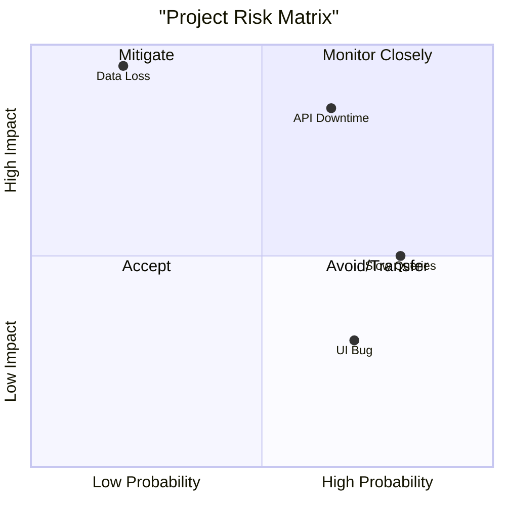
```mermaid
quadrantChart
    title "Project Risk Matrix"
    x-axis "Low Probability" --> "High Probability"
    y-axis "Low Impact" --> "High Impact"
    quadrant-1 "Monitor Closely"
    quadrant-2 "Mitigate"
    quadrant-3 "Accept"
    quadrant-4 "Avoid/Transfer"

    Data Loss: [0.20, 0.95]
    API Downtime: [0.65, 0.85]
    Slow Queries: [0.80, 0.50]
    UI Bug: [0.70, 0.30]
```

---

# Part 4: Radar Charts

## Core Concepts

### Concept 1: Basic Radar Chart

**Single series**:

```mermaid
radar-beta
    title "Developer Skill Assessment"
    axis Frontend, Backend, DevOps, Testing, Security
    curve [4, 5, 3, 4, 3]
```

**Multiple series**:

```mermaid
radar-beta
    title "Team Skill Comparison"
    axis React, Node, Database, Docker, Testing
    curve "Developer A" [5, 4, 3, 4, 5]
    curve "Developer B" [4, 5, 5, 3, 4]
```

### Concept 2: Labeled Axes

**With descriptive labels**:
```mermaid
radar-beta
    title "Product Evaluation"
    axis Performance["Performance"],
         Scalability["Scalability"],
         Security["Security"],
         Usability["Usability"],
         Cost["Cost-Effectiveness"]
    curve "Product A" [4, 5, 5, 3, 4]
    curve "Product B" [5, 3, 4, 5, 3]
```

## Radar Chart Patterns

### Pattern 1: Skill Matrix

```mermaid
radar-beta
    title "Full-Stack Developer Skills"
    axis HTML/CSS, JavaScript, TypeScript, React, Node.js, PostgreSQL, Docker, AWS
    curve "Current Level" [5, 5, 4, 5, 4, 3, 3, 2]
    curve "Target Level" [5, 5, 5, 5, 5, 4, 4, 4]
```

### Pattern 2: Performance Metrics

```mermaid
radar-beta
    title "Service Health Metrics"
    axis Latency, Throughput, Availability, Error_Rate, CPU_Usage, Memory_Usage
    curve "Production" [4, 5, 5, 5, 3, 4]
    curve "Staging" [3, 4, 4, 4, 4, 3]
```

### Pattern 3: Competitor Analysis

```mermaid
radar-beta
    title "Feature Comparison"
    axis Ease_of_Use, Features, Price, Support, Performance, Security
    curve "Our Product" [5, 4, 5, 5, 4, 5]
    curve "Competitor A" [4, 5, 3, 3, 5, 4]
    curve "Competitor B" [3, 3, 5, 4, 4, 4]
```

## Best Practices

### Pie Charts
**Do**:
- Use for showing parts of a whole (percentages)
- Limit to 5-7 slices maximum
- Order slices by size (largest first)
- Use `showData` to display values

**Don't**:
- Use for comparing trends over time (use line chart)
- Include too many small slices
- Use when exact values matter (use bar chart)

### XY Charts
**Do**:
- Use line charts for trends over time
- Use bar charts for categorical comparisons
- Label axes clearly with units
- Choose appropriate scales

**Don't**:
- Start y-axis at arbitrary value (usually start at 0)
- Use too many series (max 3-4 for readability)
- Omit axis labels

### Quadrant Charts
**Do**:
- Use for prioritization matrices
- Label quadrants meaningfully
- Position critical items prominently
- Use size/color to emphasize importance

**Don't**:
- Overcrowd with too many points
- Use vague axis labels
- Forget to define all quadrants

### Radar Charts
**Do**:
- Use for multi-dimensional comparisons
- Keep to 5-8 axes maximum
- Normalize scales across axes
- Compare 2-3 series maximum

**Don't**:
- Use for time series data
- Mix incompatible metrics
- Overcrowd with too many series

## Anti-Patterns

### ❌ Pie Chart for Trends
```mermaid
pie
    title "Revenue" %% Bad: No time context
    "Product A" : 100
```
**✅ Better**: Use line chart for trends

### ❌ Unlabeled Axes
```mermaid
xychart-beta
    x-axis [1, 2, 3, 4]
    y-axis 0 --> 100
    line [20, 40, 60, 80]
```
**✅ Better**: Add descriptive labels and title

### ❌ Too Many Radar Axes
```mermaid
radar-beta
    axis A, B, C, D, E, F, G, H, I, J, K, L
```
**✅ Better**: Group related metrics, max 8 axes

## Integration Tips

- **Pie charts**: Good for dashboards showing distribution
- **XY charts**: Essential for time-series analysis
- **Quadrant charts**: Perfect for decision-making frameworks
- **Radar charts**: Ideal for skill assessments and comparisons

Combine with:
- **Tables** for exact values
- **Flowcharts** for process context
- **Architecture diagrams** for system context

## Related Skills

- `mermaid-flowcharts.md` - Process visualization
- `mermaid-sequence-diagrams.md` - Interaction flows
- `analytics-dashboards.md` - Building metric dashboards

## Resources

- Official Docs:
  - https://mermaid.js.org/syntax/pie.html
  - https://mermaid.js.org/syntax/xyChart.html
  - https://mermaid.js.org/syntax/quadrantChart.html
  - https://mermaid.js.org/syntax/radar.html
- Live Editor: https://mermaid.live
- Data Visualization Best Practices: Edward Tufte's principles
