# Mermaid Class and State Diagrams

**Scope**: Class diagrams (UML) and state machine visualization with Mermaid.js
**Lines**: ~450
**Last Updated**: 2025-10-27
**Format Version**: 1.0 (Atomic)

---

## When to Use This Skill

Activate this skill when:
- Designing object-oriented systems and class structures
- Documenting API object models
- Modeling state machines and lifecycle states
- Visualizing entity relationships and hierarchies
- Creating UML class diagrams
- Mapping application state flows
- Documenting protocol state machines

---

# Part 1: Class Diagrams

## Core Concepts

### Concept 1: Class Definition

**Basic class structure**:
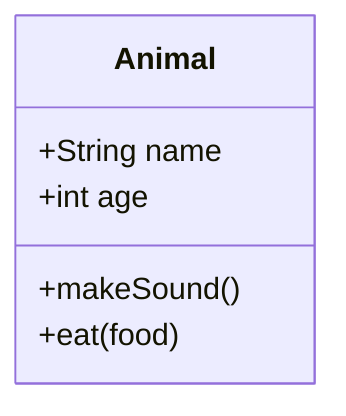

**Visibility modifiers**:
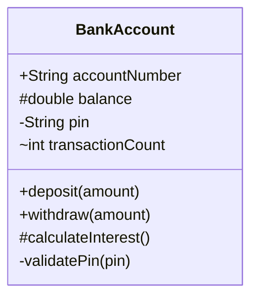

**Legend**:
- `+` Public
- `-` Private
- `#` Protected
- `~` Package/Internal

**With return types**:
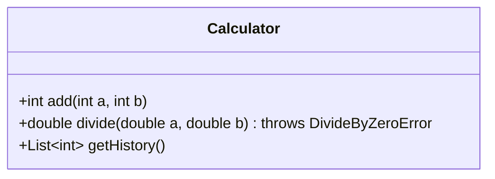

### Concept 2: Relationships

**Inheritance (is-a)**:
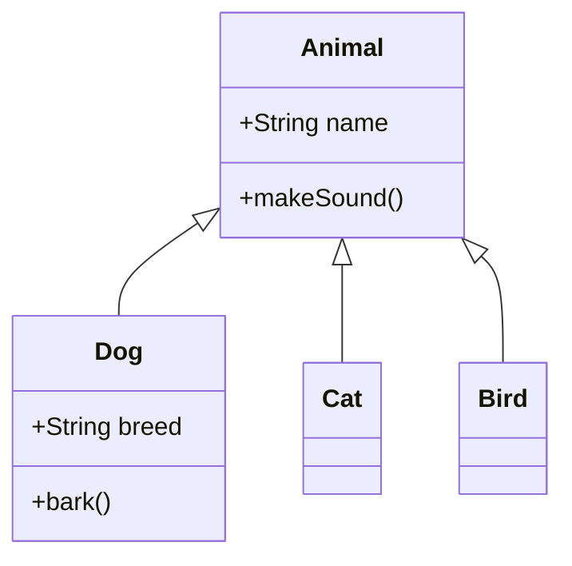

**Composition (has-a, strong ownership)**:
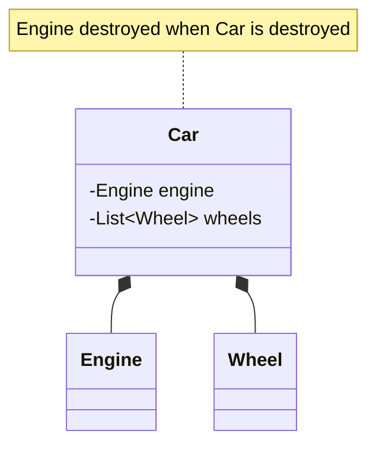

**Aggregation (has-a, weak ownership)**:
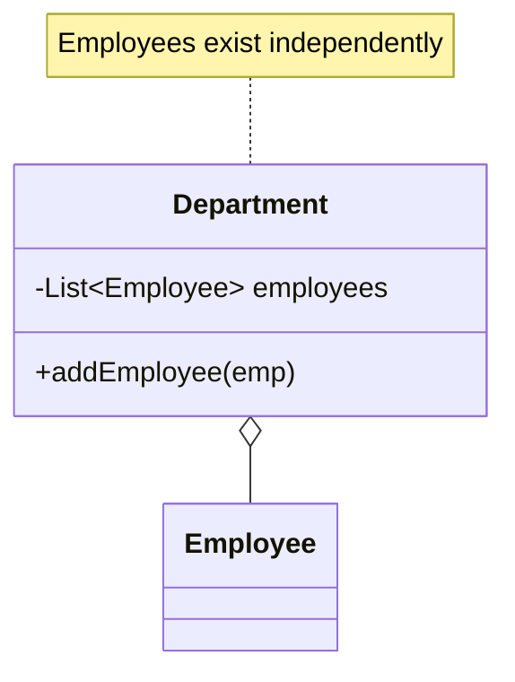

**Association (uses)**:
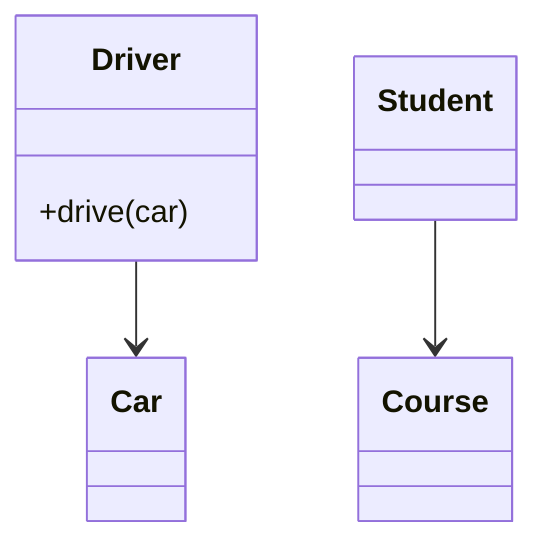

**Dependency (temporary usage)**:
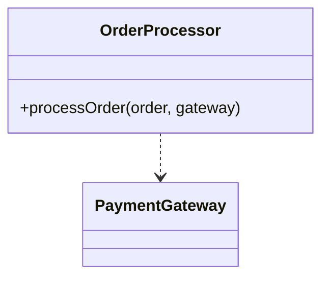

**Relationship summary**:
- `<|--` Inheritance
- `*--` Composition (filled diamond)
- `o--` Aggregation (hollow diamond)
- `-->` Association
- `..>` Dependency

### Concept 3: Cardinality and Multiplicity

**One-to-many relationships**:
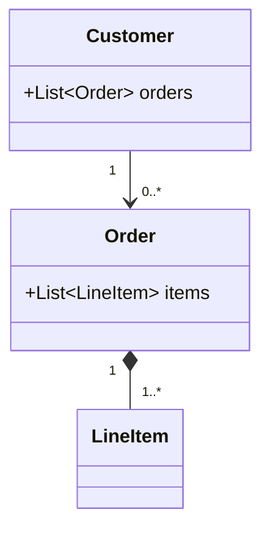

**Many-to-many relationships**:
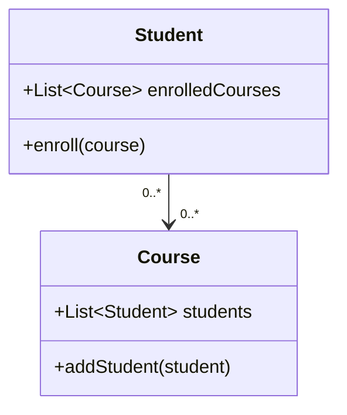

### Concept 4: Abstract Classes and Interfaces

**Abstract classes**:
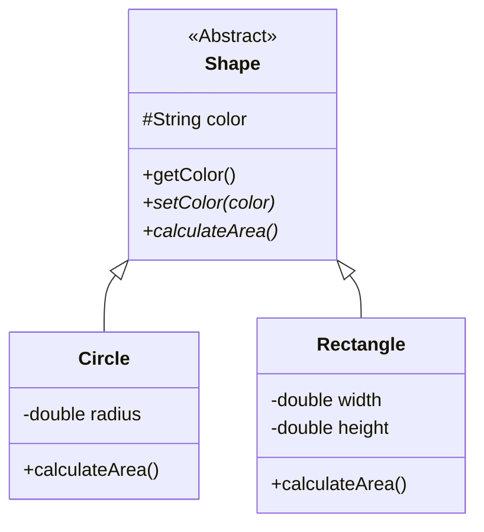

**Interfaces**:
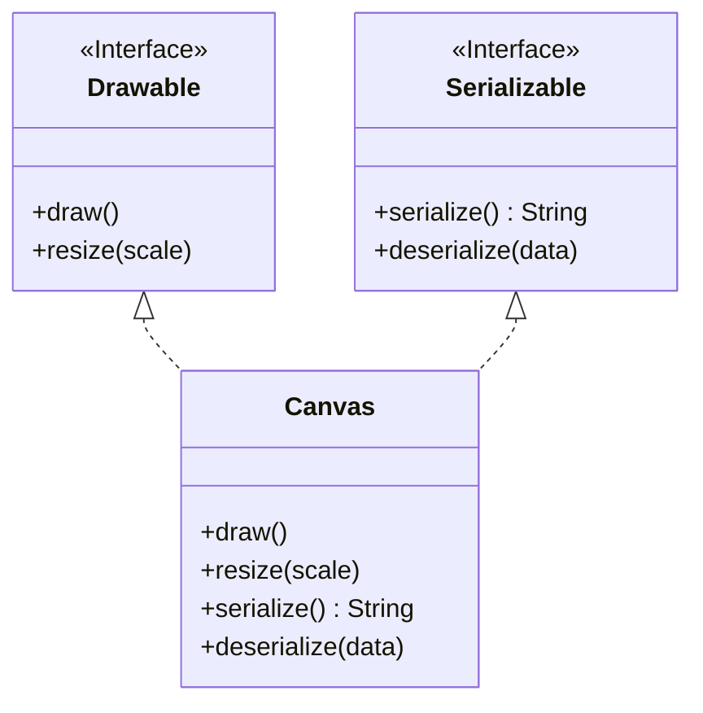

### Concept 5: Generics and Annotations

**Generic types**:
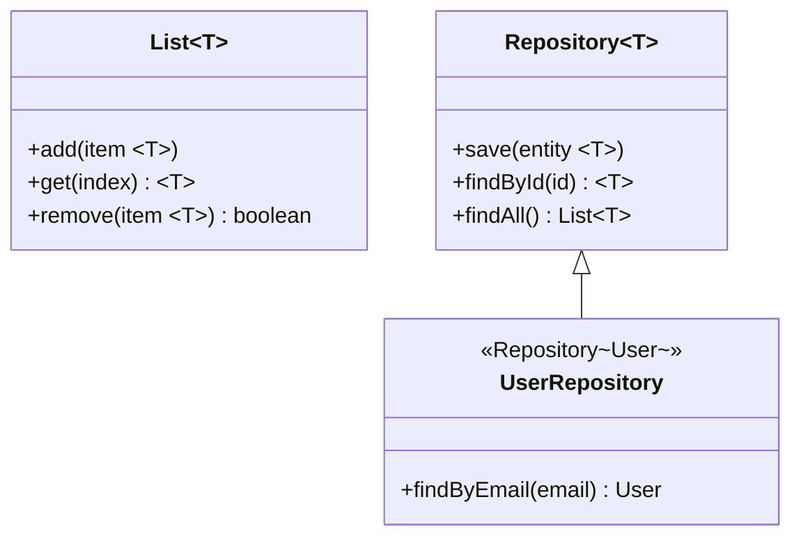

**Annotations**:
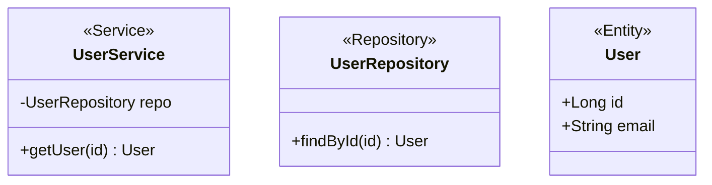

## Common Class Diagram Patterns

### Pattern 1: API Object Model

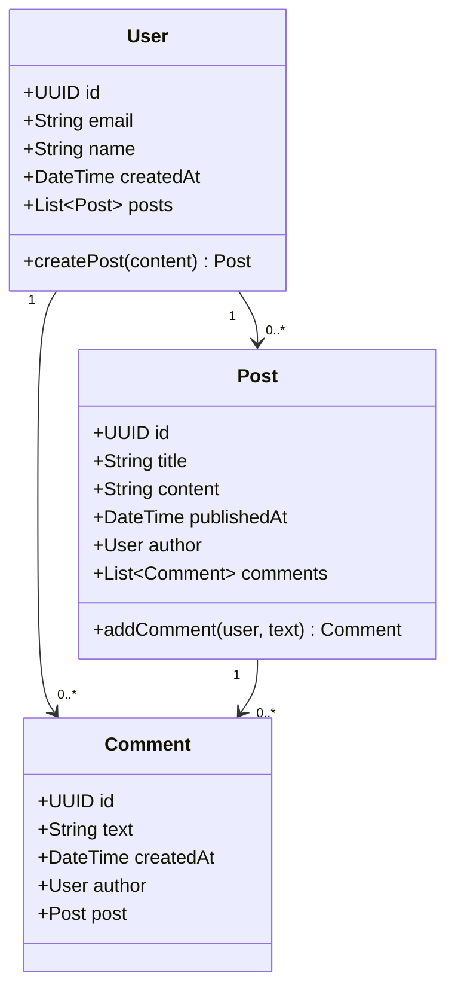

### Pattern 2: Repository Pattern

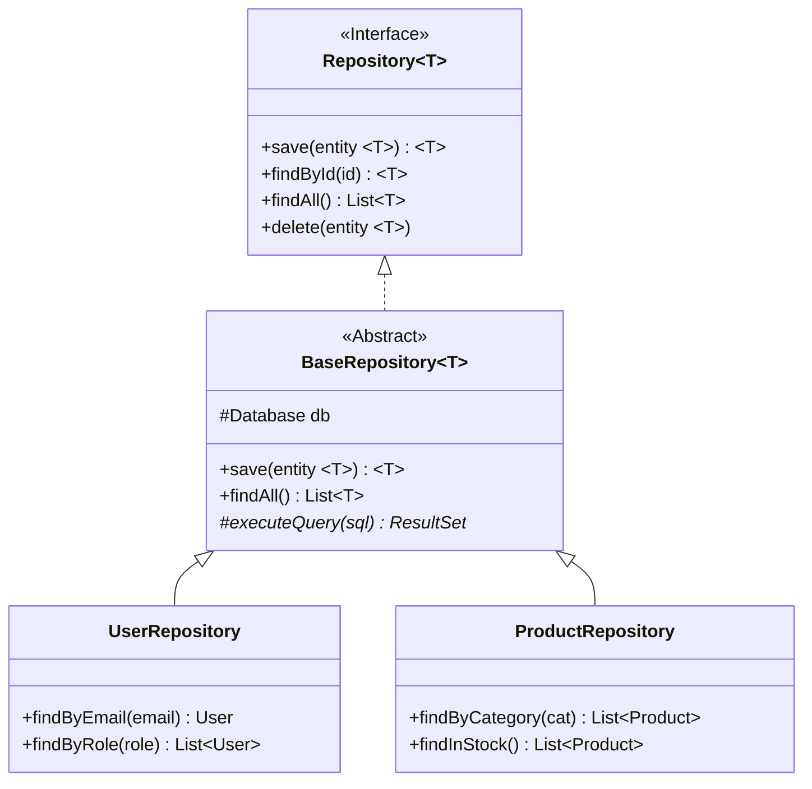

---

# Part 2: State Diagrams

## Core Concepts

### Concept 1: Basic States and Transitions

**Simple state machine**:
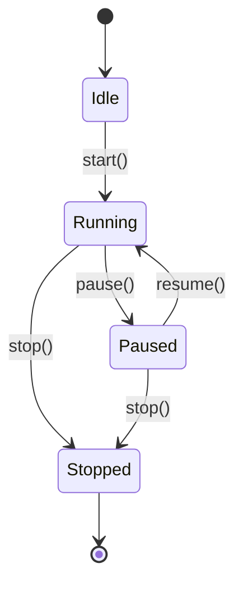

**State descriptions**:
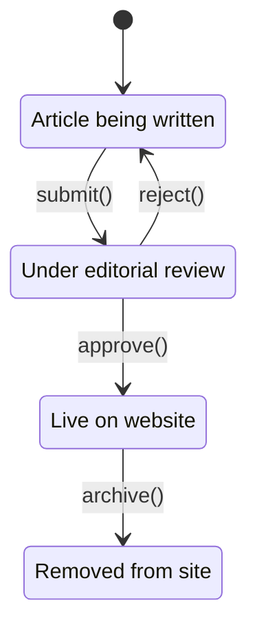

### Concept 2: Composite States

**Nested states**:
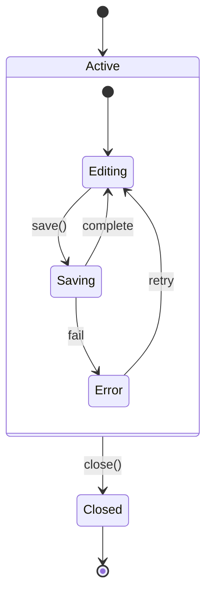

**Multiple nested levels**:
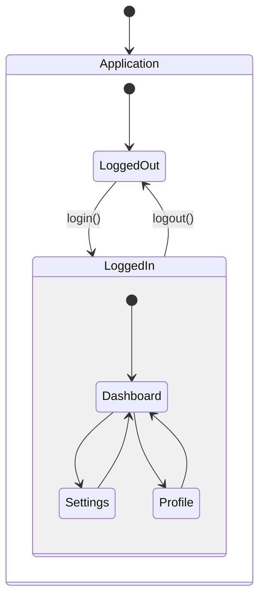

### Concept 3: Choice and Fork/Join

**Choice (conditional branching)**:
```mermaid
stateDiagram-v2
    [*] --> CheckAuth
    CheckAuth --> choice

    state choice <<choice>>

    choice --> Admin: if isAdmin
    choice --> User: if isUser
    choice --> Guest: else

    Admin --> [*]
    User --> [*]
    Guest --> [*]
```

**Fork and Join (parallel states)**:
```mermaid
stateDiagram-v2
    [*] --> Processing

    Processing --> fork
    state fork <<fork>>

    fork --> ValidationStream
    fork --> TransformStream
    fork --> LoggingStream

    ValidationStream --> join
    TransformStream --> join
    LoggingStream --> join

    state join <<join>>

    join --> Complete
    Complete --> [*]
```

### Concept 4: Notes and Documentation

**Notes on states**:
```mermaid
stateDiagram-v2
    [*] --> Pending

    Pending --> Processing: start

    note right of Pending
        Waiting for resources
        Max wait: 5 minutes
    end note

    Processing --> Complete
    Processing --> Failed

    note left of Failed
        Retry automatically
        Up to 3 attempts
    end note

    Complete --> [*]
    Failed --> [*]
```

### Concept 5: Direction and Layout

**Horizontal layout**:
```mermaid
stateDiagram-v2
    direction LR

    [*] --> Step1
    Step1 --> Step2
    Step2 --> Step3
    Step3 --> [*]
```

**Top-to-bottom (default)**:
```mermaid
stateDiagram-v2
    direction TB

    [*] --> Init
    Init --> Ready
    Ready --> Active
    Active --> Done
    Done --> [*]
```

## Common State Diagram Patterns

### Pattern 1: Order Lifecycle

```mermaid
stateDiagram-v2
    [*] --> Created

    Created --> Pending: submit
    Pending --> PaymentProcessing: initiate payment

    state PaymentProcessing {
        [*] --> Authorizing
        Authorizing --> Authorized: success
        Authorizing --> Declined: failure
        Authorized --> Captured
    }

    PaymentProcessing --> Confirmed: payment success
    PaymentProcessing --> Cancelled: payment failed

    Confirmed --> Shipped: ship
    Shipped --> Delivered: confirm delivery
    Delivered --> [*]

    Cancelled --> [*]

    note right of PaymentProcessing
        Payment gateway integration
        Handles retries and failures
    end note
```

### Pattern 2: Document Workflow

```mermaid
stateDiagram-v2
    [*] --> Draft

    state Draft {
        [*] --> Writing
        Writing --> AutoSaving
        AutoSaving --> Writing
    }

    Draft --> Review: submit

    state Review {
        [*] --> PendingReview
        PendingReview --> InReview: assign reviewer
        InReview --> ChangesRequested: request changes
        InReview --> Approved: approve
        ChangesRequested --> InReview: resubmit
    }

    Review --> Published: publish
    Review --> Draft: reject

    Published --> Archived: archive
    Archived --> Published: restore

    Published --> [*]
    Archived --> [*]
```

### Pattern 3: Connection State Machine

```mermaid
stateDiagram-v2
    [*] --> Disconnected

    Disconnected --> Connecting: connect()
    Connecting --> Connected: success
    Connecting --> Failed: error

    Failed --> Disconnected: reset
    Failed --> Connecting: retry

    Connected --> Idle

    state Connected {
        [*] --> Idle
        Idle --> Sending: send()
        Sending --> Idle: complete
        Idle --> Receiving: data arrives
        Receiving --> Idle: complete
    }

    Connected --> Disconnecting: close()
    Disconnecting --> Disconnected

    note right of Failed
        Exponential backoff
        Max 5 retries
    end note
```

## Best Practices

### Class Diagrams

**1. Clear naming**:
```mermaid
classDiagram
    %% Good: Descriptive names
    class UserAuthenticationService {
        +authenticate(credentials)
    }

    %% Bad: Cryptic abbreviations
    class UAServ {
        +auth(cred)
    }
```

**2. Proper relationship types**:
- Use composition for "part-of" relationships
- Use aggregation for "has-a" with independent lifecycle
- Use association for "uses" relationships
- Use dependency for temporary usage

**3. Interface segregation**:
```mermaid
classDiagram
    %% Good: Focused interfaces
    class Readable {
        <<Interface>>
        +read() String
    }

    class Writable {
        <<Interface>>
        +write(data)
    }

    %% Bad: God interface
    class Everything {
        <<Interface>>
        +read()
        +write()
        +delete()
        +update()
        +search()
    }
```

### State Diagrams

**1. All states reachable**:
- Every state should have entry path from [*]
- Every state should have exit path to [*] or terminal state
- No orphaned states

**2. Label transitions**:
```mermaid
stateDiagram-v2
    %% Good: Clear labels
    Idle --> Processing: startJob()
    Processing --> Complete: onSuccess()

    %% Bad: Unlabeled
    Idle --> Processing
    Processing --> Complete
```

**3. Document complex logic**:
Use notes for non-obvious state behavior, timeout conditions, retry logic, external dependencies.

## Anti-Patterns

### ❌ Too Many Classes in One Diagram
Creates visual overload. **Solution**: Split into multiple diagrams by domain/layer.

### ❌ Missing Visibility Modifiers
```mermaid
classDiagram
    class User {
        id
        password
        email
    }
```
**✅ Better**:
```mermaid
classDiagram
    class User {
        +UUID id
        -String password
        +String email
    }
```

### ❌ State Diagram with No Error Paths
```mermaid
stateDiagram-v2
    [*] --> Processing
    Processing --> Complete
    Complete --> [*]
```
**✅ Better**:
```mermaid
stateDiagram-v2
    [*] --> Processing
    Processing --> Complete: success
    Processing --> Failed: error
    Failed --> Processing: retry
    Failed --> [*]: max retries
    Complete --> [*]
```

## Integration Tips

- **Start with class diagram** → Define structure
- **Then state diagram** → Model behavior
- **Combine with sequence** → Show runtime interactions
- **Use ER diagrams** → For database schema

## Related Skills

- `mermaid-sequence-diagrams.md` - Runtime interactions
- `mermaid-er-diagrams.md` - Database modeling
- `mermaid-flowcharts.md` - Process logic

## Resources

- Official Docs:
  - https://mermaid.js.org/syntax/classDiagram.html
  - https://mermaid.js.org/syntax/stateDiagram.html
- Live Editor: https://mermaid.live
- GitHub/GitLab: Auto-rendering in markdown
