# Mermaid Entity-Relationship Diagrams

**Scope**: Database schema and data relationship visualization with Mermaid.js
**Lines**: ~400
**Last Updated**: 2025-10-27
**Format Version**: 1.0 (Atomic)

---

## When to Use This Skill

Activate this skill when:
- Designing database schemas
- Documenting data models
- Visualizing table relationships
- Planning database migrations
- Creating data architecture diagrams
- Modeling domain entities
- Explaining database structure to teams

---

## Core Concepts

### Concept 1: Basic Entity and Relationship Syntax

**Simple entity definition**:
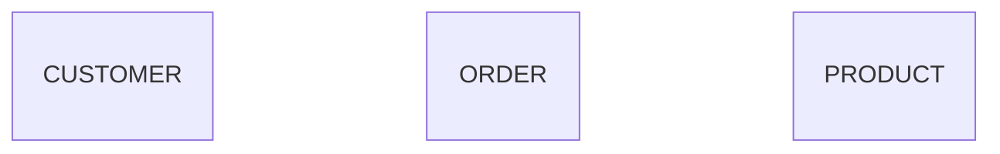

**With relationships**:
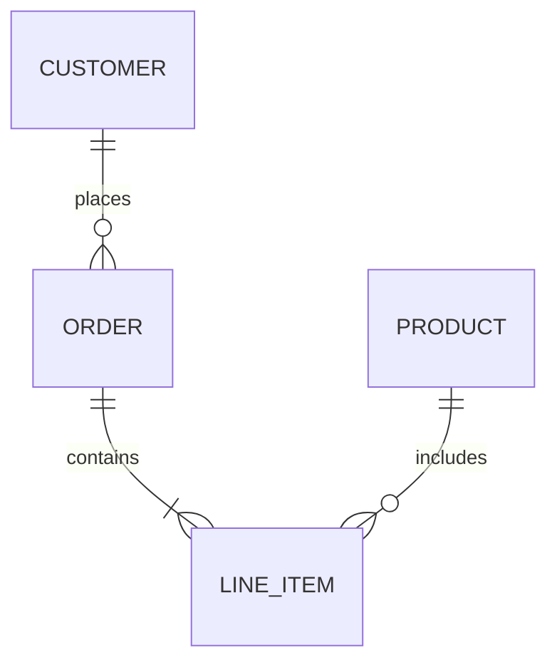

**Relationship anatomy**:
```
ENTITY_A |cardinality|--relationship--|cardinality| ENTITY_B : label
         └─────┬─────┘                └─────┬─────┘
               └─ Left side                  └─ Right side
```

### Concept 2: Cardinality Notation

**Zero or One** `|o` or `o|`:
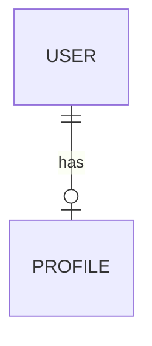
*Each user has zero or one profile*

**Exactly One** `||` or `||`:
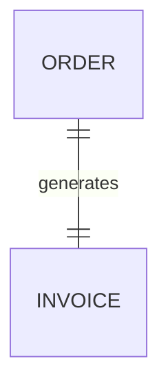
*Each order has exactly one invoice*

**Zero or More** `}o` or `o{`:
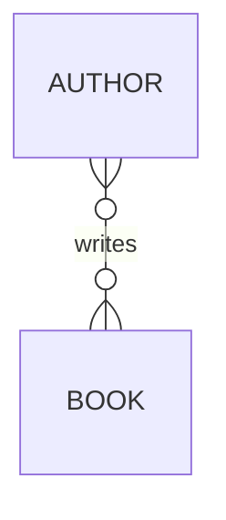
*Authors can write zero or more books*

**One or More** `}|` or `|{`:
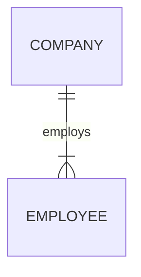
*A company has one or more employees*

**Visual reference**:
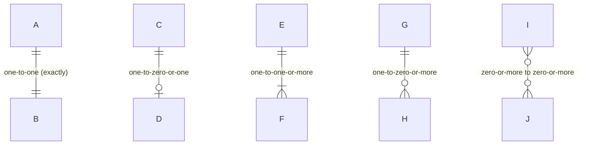

### Concept 3: Relationship Types

**Identifying relationship (solid line `--`)**:
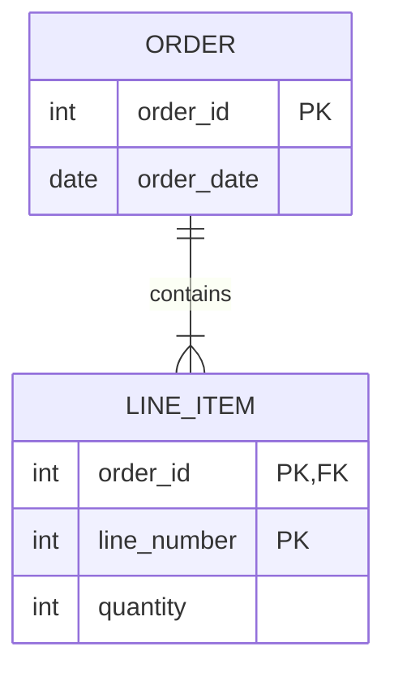
*LINE_ITEM cannot exist without ORDER (foreign key is part of primary key)*

**Non-identifying relationship (dashed line `..`)**:
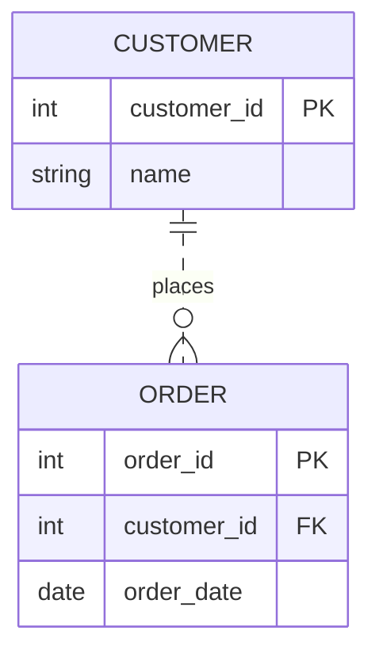
*ORDER can exist independently, just references CUSTOMER*

### Concept 4: Attributes and Keys

**Attribute definition**:
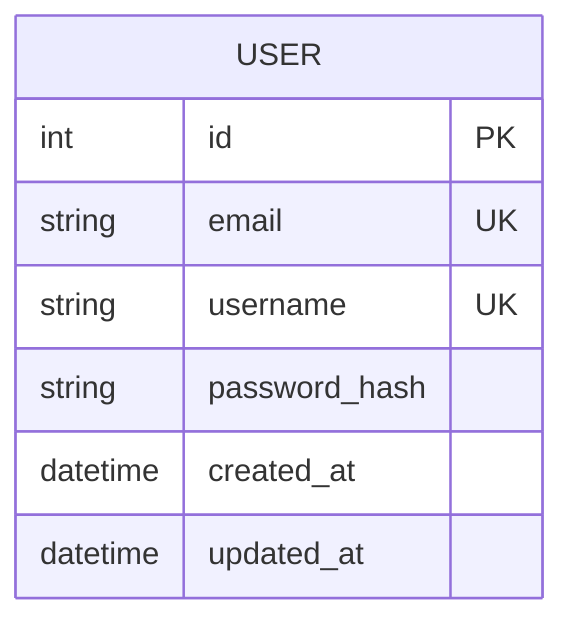

**Key types**:
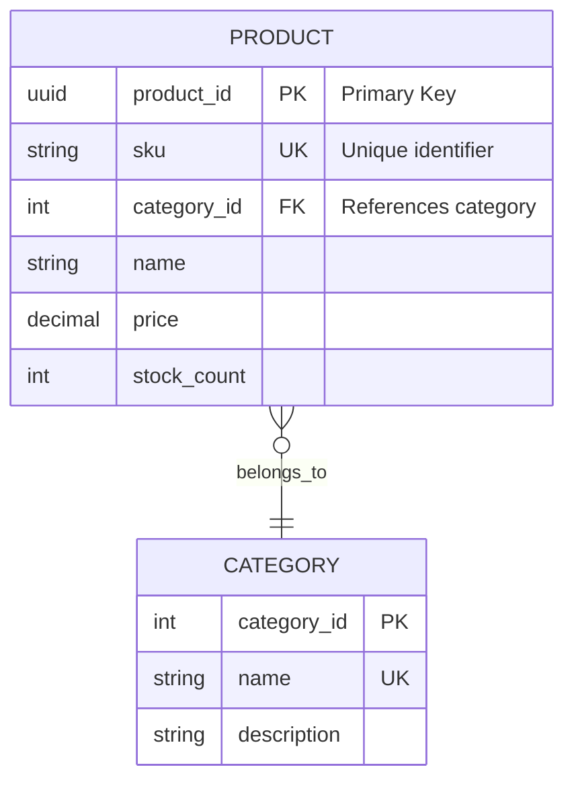

**Key annotations**:
- `PK` - Primary Key
- `FK` - Foreign Key
- `UK` - Unique Key

**Data types** (common conventions):
- `int`, `bigint`, `smallint`
- `string`, `varchar`, `text`
- `decimal`, `float`, `double`
- `boolean`, `bool`
- `date`, `datetime`, `timestamp`
- `uuid`, `json`, `blob`

### Concept 5: Complex Relationships

**Self-referential**:
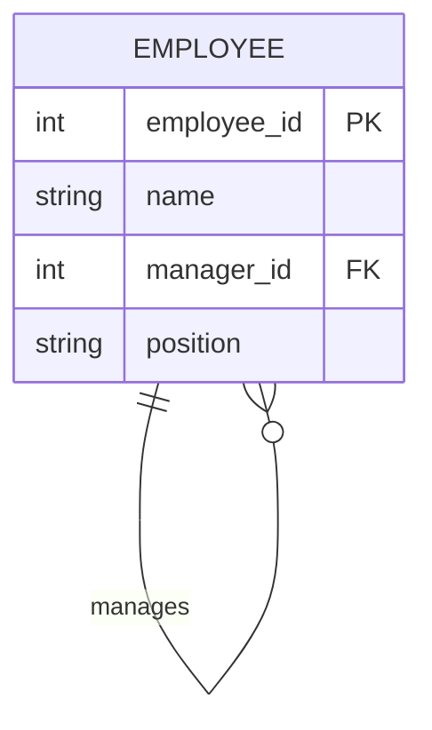

**Many-to-Many with junction table**:
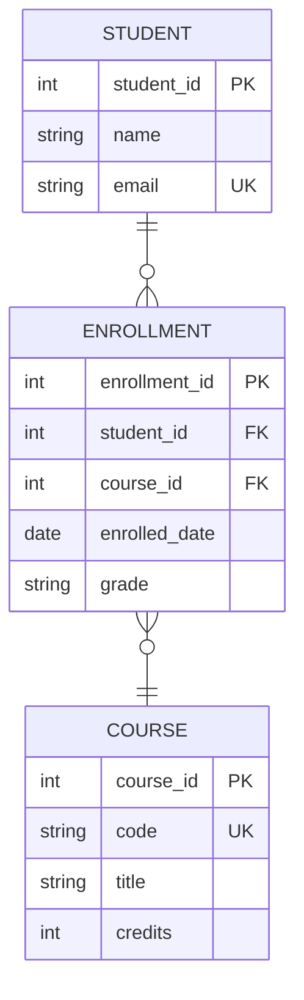

## Common Patterns

### Pattern 1: E-commerce Schema

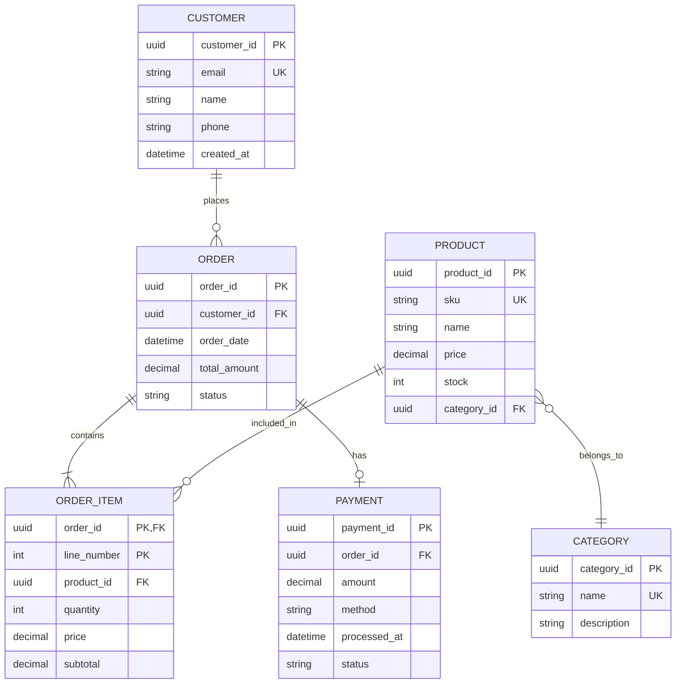

### Pattern 2: User Authentication System

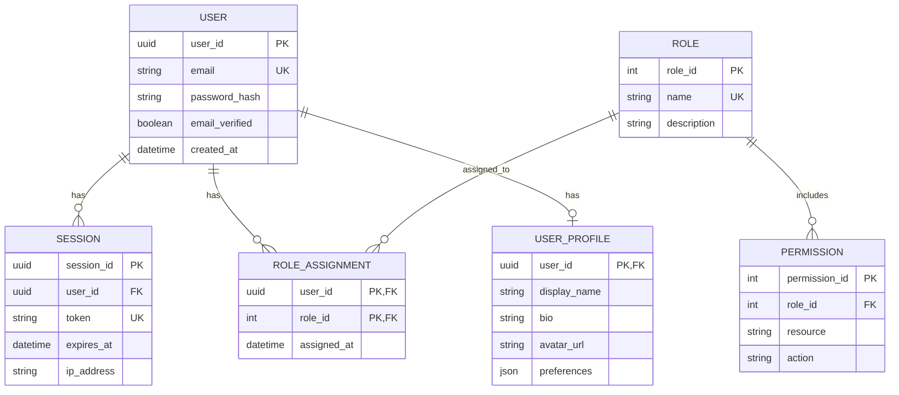

### Pattern 3: Blog/CMS Schema

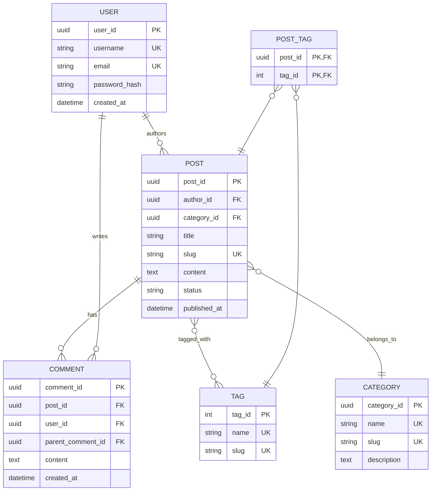

### Pattern 4: Multi-Tenancy SaaS

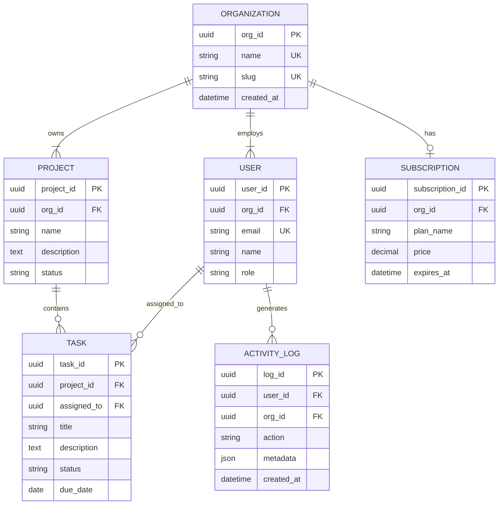

## Best Practices

### 1. Clear Entity Naming
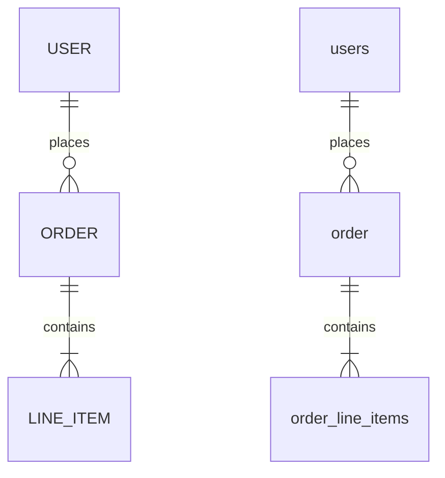

### 2. Explicit Foreign Keys
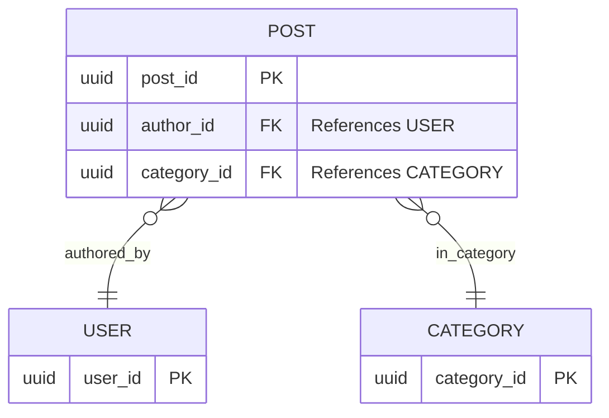

### 3. Normalize Appropriately
**Good**: Many-to-many with junction table
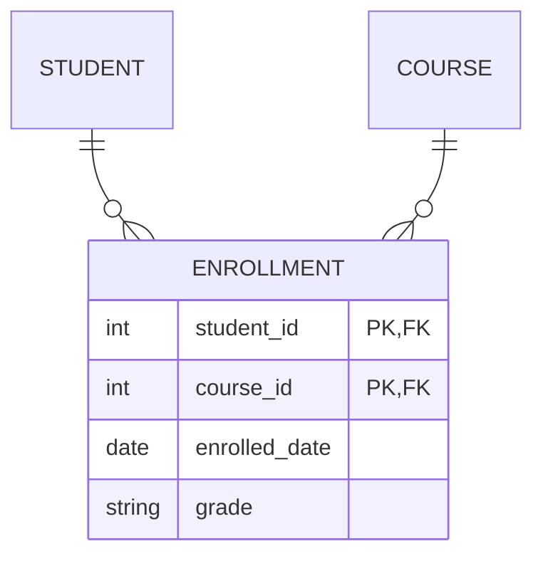

**Bad**: Denormalized array (avoid in SQL)
```mermaid
erDiagram
    STUDENT {
        int student_id PK
        string name
        json course_ids
    }
```

### 4. Use Descriptive Relationship Labels
```mermaid
erDiagram
    %% Good: Clear action verbs
    USER ||--o{ POST : authors
    COMPANY ||--|{ EMPLOYEE : employs
    ORDER ||--o| SHIPMENT : fulfilled_by

    %% Bad: Generic or missing
    USER ||--o{ POST : has
    COMPANY ||--|{ EMPLOYEE : related
    ORDER ||--o| SHIPMENT : ""
```

## Anti-Patterns

### ❌ Missing Cardinality
```mermaid
erDiagram
    USER -- ORDER : places
```
**Problem**: Relationship type unclear

**✅ Better**:
```mermaid
erDiagram
    USER ||--o{ ORDER : places
```

### ❌ No Primary Keys
```mermaid
erDiagram
    USER {
        string email
        string name
    }
```

**✅ Better**:
```mermaid
erDiagram
    USER {
        uuid user_id PK
        string email UK
        string name
    }
```

### ❌ Overloaded Entity
```mermaid
erDiagram
    ENTITY {
        int id PK
        string type
        json data1
        json data2
        json data3
        json data4
    }
```
**Problem**: God entity, lacks structure

**✅ Better**: Split into separate entities with clear responsibilities

### ❌ Circular Dependencies Without Nullables
```mermaid
erDiagram
    USER ||--|| PROFILE : has
    PROFILE ||--|| USER : belongs_to
```
**Problem**: Cannot create either without the other

**✅ Better**:
```mermaid
erDiagram
    USER ||--o| PROFILE : has
```

## Integration Tips

- **Start with ERD** → Then create migrations
- **Combine with class diagrams** → Show ORM models
- **Use sequence diagrams** → Show CRUD operations
- **Document indexes** → Add notes about performance

## Related Skills

- `mermaid-class-state-diagrams.md` - Object modeling
- `database-schema-design.md` - Schema best practices
- `database-migrations.md` - Evolution patterns

## Resources

- Official Docs: https://mermaid.js.org/syntax/entityRelationshipDiagram.html
- Live Editor: https://mermaid.live
- Chen ERD Notation: https://en.wikipedia.org/wiki/Entity%E2%80%93relationship_model
- Crow's Foot Notation: Standard cardinality visualization
