# Mermaid Flowcharts

**Scope**: Process flow visualization with Mermaid.js syntax
**Lines**: ~320
**Last Updated**: 2025-10-27
**Format Version**: 1.0 (Atomic)

---

## When to Use This Skill

Activate this skill when:
- Documenting process workflows and algorithms
- Visualizing decision trees and conditional logic
- Creating system flow diagrams
- Mapping user or data flows
- Generating architecture flow documentation
- Adding diagrams to markdown documentation
- Explaining complex procedures visually

## Core Concepts

### Concept 1: Graph Direction and Basic Structure

**Direction Options**:
- `TD` or `TB` - Top to bottom (default)
- `LR` - Left to right
- `RL` - Right to left
- `BT` - Bottom to top

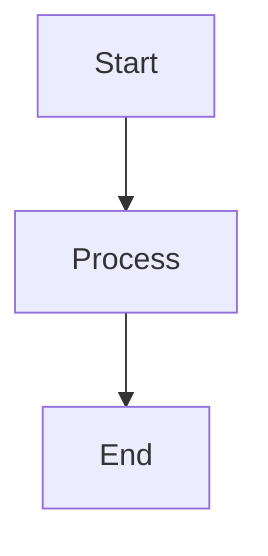

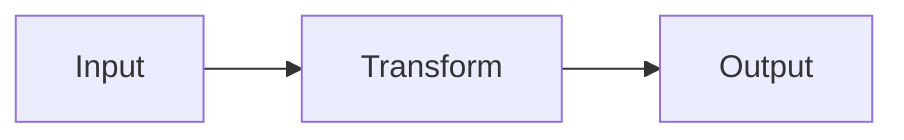

**When to use each direction**:
- TD/TB: Hierarchical processes, decision trees
- LR: Linear workflows, pipelines, data flows
- BT: Bottom-up analysis, dependency flows
- RL: Reverse processes, unwinding

### Concept 2: Node Shapes

**Shape Reference**:
```mermaid
graph TD
    A[Rectangle - Standard process]
    B(Rounded - Start/End alternative)
    C([Stadium - Start/End points])
    D[[Subroutine - Function call]]
    E[(Database - Data storage)]
    F((Circle - Connection point))
    G{Diamond - Decision}}
    H{{Hexagon - Preparation}}
    I[/Parallelogram - Input/Output/]
    J[\Inverted parallelogram - Output/Input\]
    K[/Trapezoid - Manual operation\]
    L[\Inverted trapezoid/]
```

**Semantic meaning by shape**:
- **Rectangle**: Standard process step
- **Rounded/Stadium**: Start and end points
- **Diamond**: Decision points (if/then)
- **Parallelogram**: Input/Output operations
- **Cylinder**: Database operations
- **Hexagon**: Preparation or initialization
- **Subroutine**: Function or subprocess call
- **Circle**: Connection or merge points

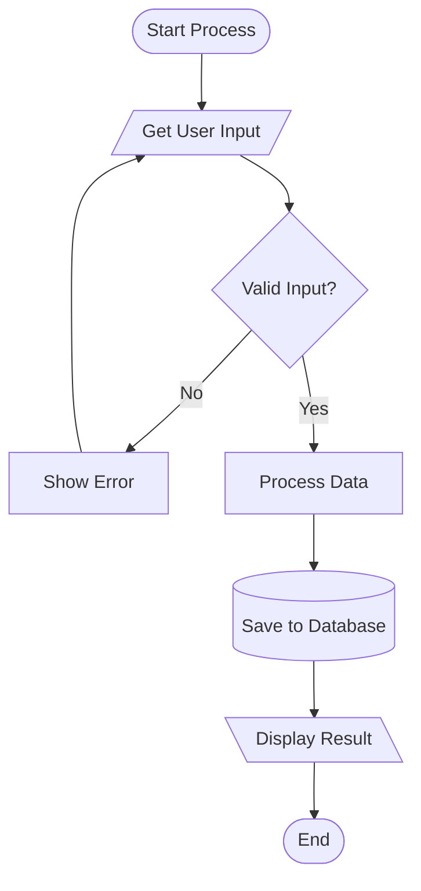

### Concept 3: Connection Types and Labels

**Arrow Styles**:
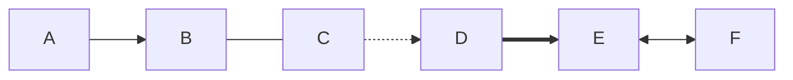

- `-->` - Solid arrow (standard flow)
- `---` - Line without arrow (connection)
- `-.->` - Dotted arrow (optional/async flow)
- `==>` - Thick arrow (emphasized flow)
- `<-->` - Bi-directional (mutual dependency)

**Link Labels**:
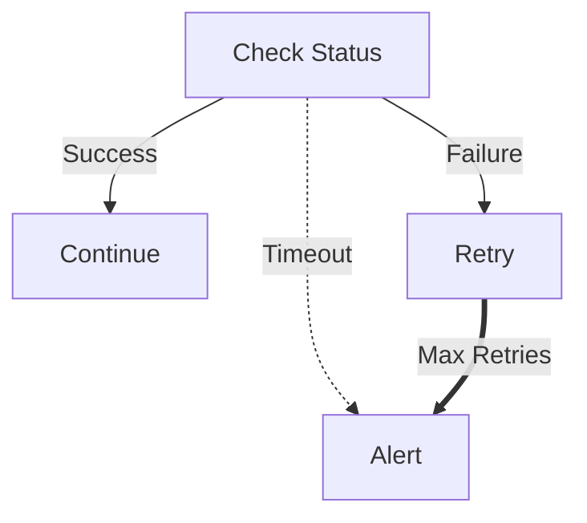

**Multi-word labels**:
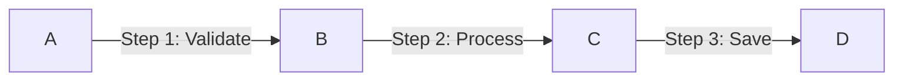

### Concept 4: Subgraphs for Organization

**Basic subgraph syntax**:
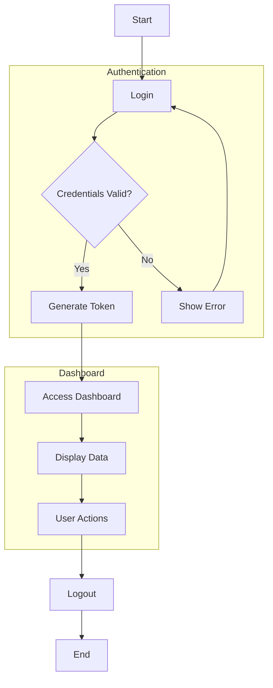

**Nested subgraphs**:
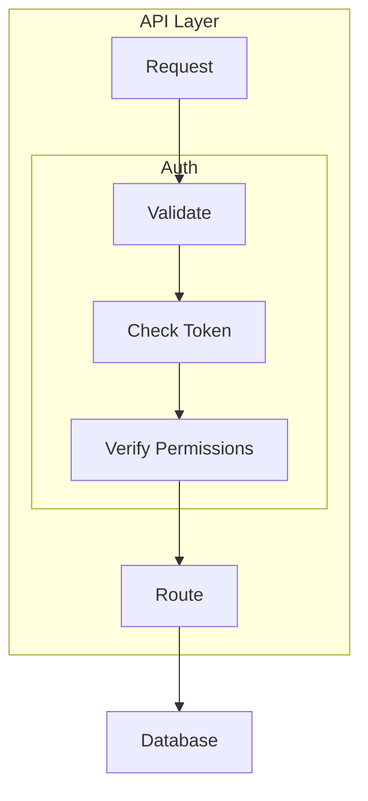

**Direction in subgraphs**:
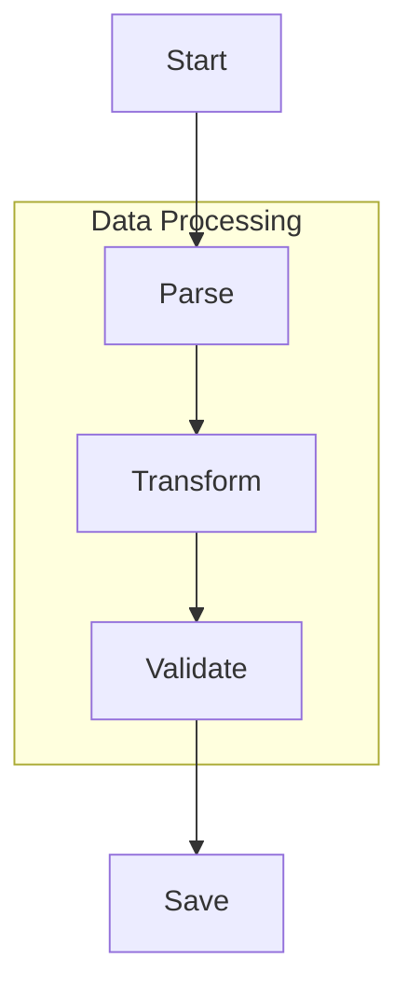

### Concept 5: Styling and Classes

**Inline node styling**:
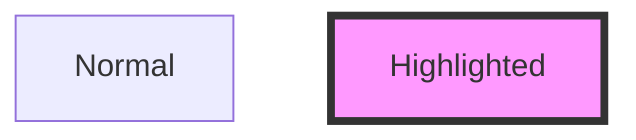

**Class definitions**:
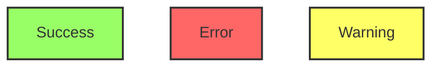

**Styling subgraphs**:
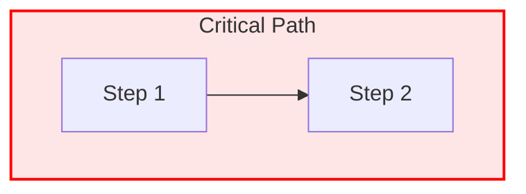

### Concept 6: Complex Flow Patterns

**Decision tree with multiple paths**:
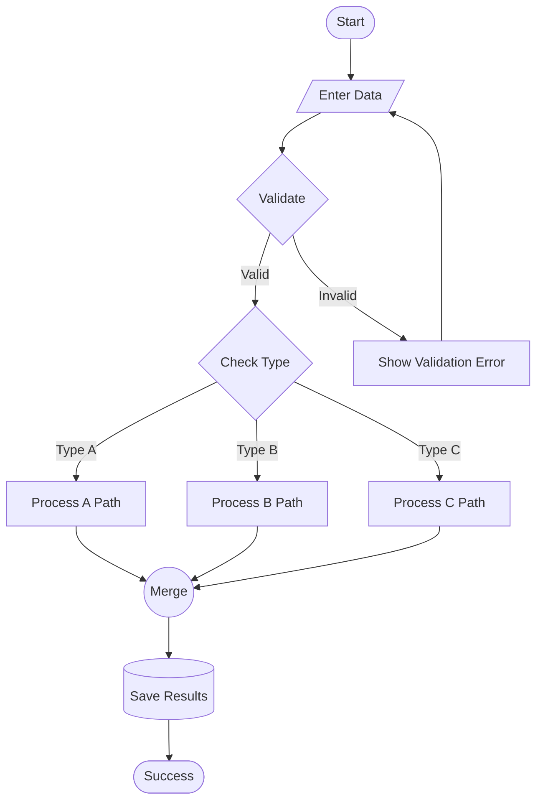

**Parallel processing**:
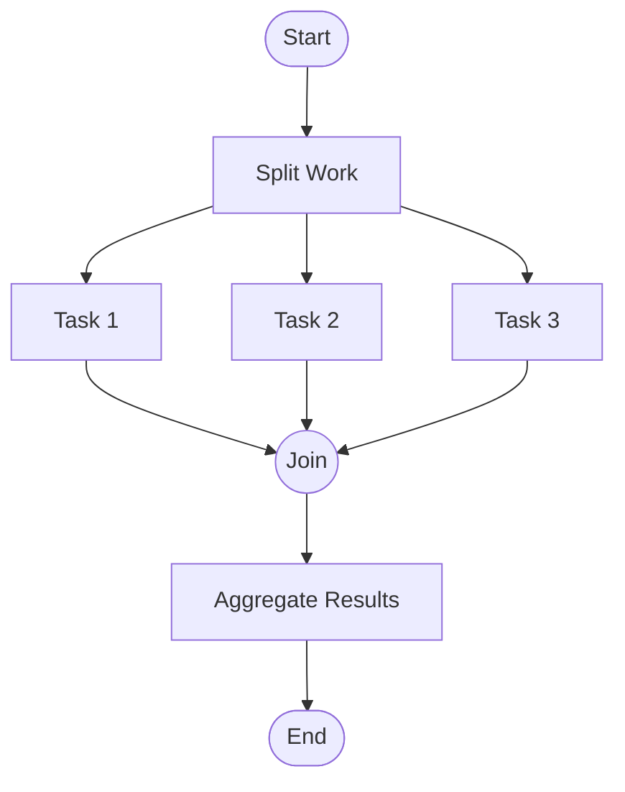

**Error handling flow**:
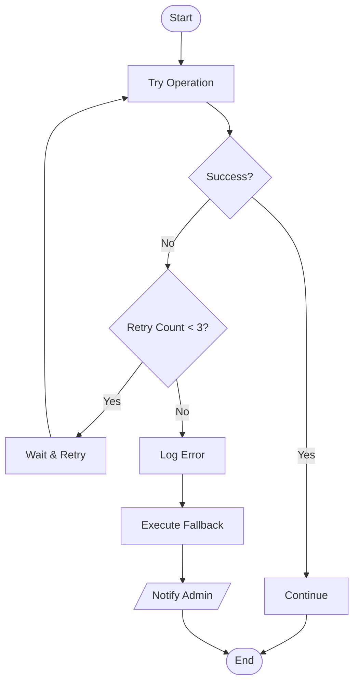

## Common Patterns

### Pattern 1: API Request Flow

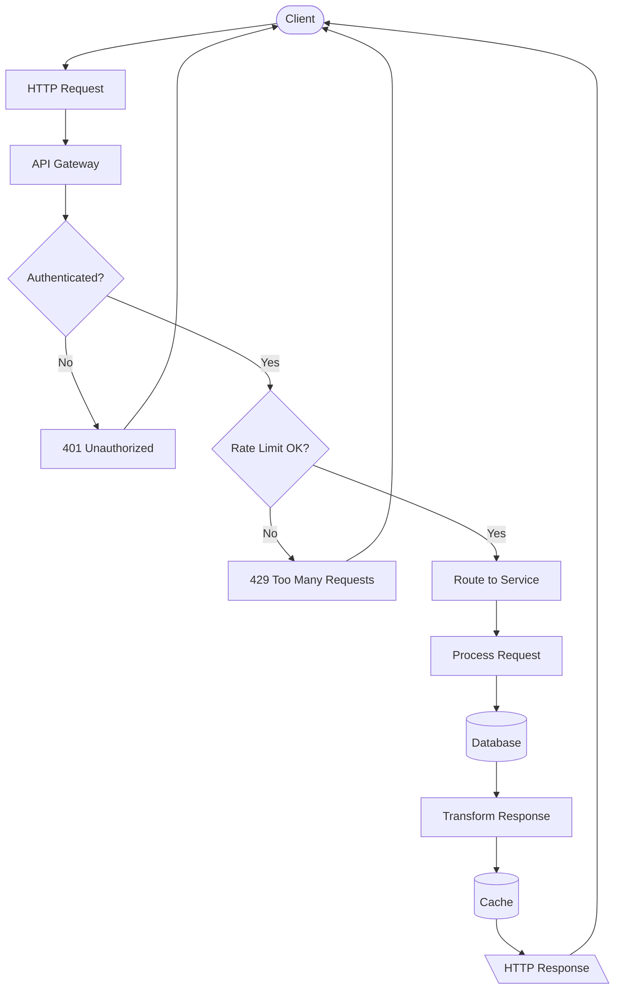

### Pattern 2: Data Pipeline

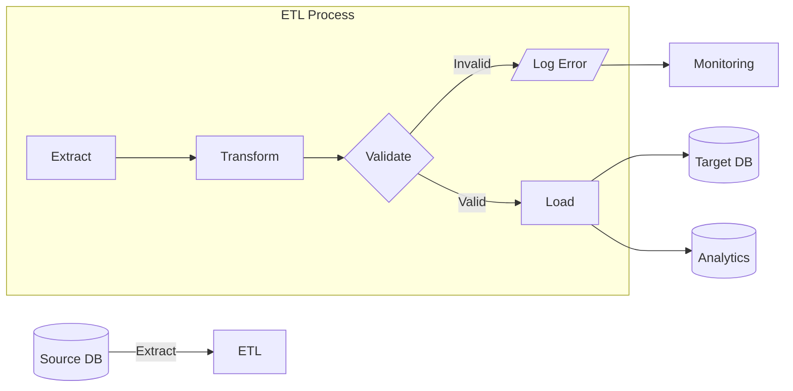

### Pattern 3: User Authentication Flow

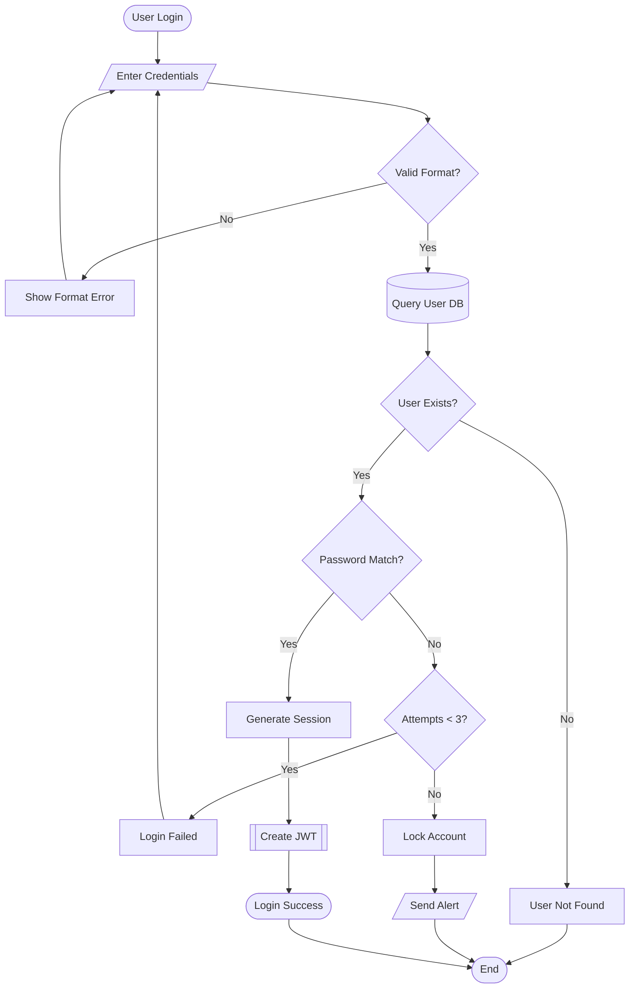

## Best Practices

### 1. Keep It Simple
- Limit to 10-15 nodes per diagram
- Use subgraphs to break down complex flows
- One main path with branches, not web of connections

### 2. Consistent Naming
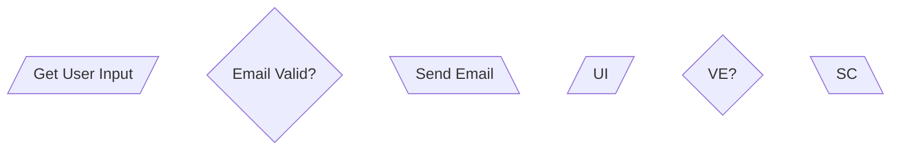

### 3: Logical Flow Direction
- Top-to-bottom for hierarchical processes
- Left-to-right for sequential pipelines
- Keep arrows flowing in primary direction
- Minimize backward arrows (creates visual clutter)

### 4. Meaningful Shapes
```mermaid
graph TD
    Start([Start/End - Stadium])
    Process[Process - Rectangle]
    Decision{Decision - Diamond}
    IO[/Input or Output - Parallelogram/]
    Data[(Database - Cylinder)]
    Function[[Function Call - Subroutine]]
```

### 5. Color Coding for Status
```mermaid
graph TD
    Normal[Normal Flow]
    Critical[Critical Path]:::critical
    Error[Error Handler]:::error
    Success[Success State]:::success

    classDef critical fill:#ffa,stroke:#ff0,stroke-width:3px
    classDef error fill:#faa,stroke:#f00,stroke-width:2px
    classDef success fill:#afa,stroke:#0f0,stroke-width:2px
```

## Integration Examples

### In Markdown Documentation
```markdown
# User Registration Process

Our registration flow follows this pattern:

\```mermaid
graph TD
    A[User Visits] --> B[Fill Form]
    B --> C{Valid?}
    C -->|Yes| D[Create Account]
    C -->|No| B
    D --> E[Send Email]
    E --> F[Verify Email]
\```
```

### In GitHub README
```markdown
## Architecture Flow

\```mermaid
graph LR
    Client --> API[API Gateway]
    API --> Auth[Auth Service]
    API --> Data[Data Service]
    Data --> DB[(PostgreSQL)]
\```
```

### In Documentation Sites (Docusaurus, VuePress, etc.)
Most support Mermaid rendering natively or via plugins.

## Anti-Patterns

### ❌ Too Many Connections
```mermaid
graph TD
    A --> B
    A --> C
    A --> D
    B --> C
    B --> D
    B --> E
    C --> D
    C --> E
    D --> E
```
**Problem**: Creates visual spaghetti, hard to follow

### ❌ Inconsistent Shapes
```mermaid
graph TD
    A[Start]
    B(Process)
    C{Decision}
    D[Another Process]
    E((End))
```
**Problem**: No semantic meaning, just random shapes

### ❌ Missing Labels on Decisions
```mermaid
graph TD
    A{Check} --> B
    A --> C
```
**Problem**: Can't tell which branch is true/false

### ✅ Correct Version
```mermaid
graph TD
    A{Valid Input?} -->|Yes| B[Process]
    A -->|No| C[Error]
```

## Related Skills

- `mermaid-sequence-diagrams.md` - For interaction flows
- `mermaid-class-state-diagrams.md` - For UML and state machines
- `mermaid-architecture-diagrams.md` - For C4 and system architecture

## Resources

- Official Docs: https://mermaid.js.org/syntax/flowchart.html
- Live Editor: https://mermaid.live
- GitHub Integration: Automatic rendering in `.md` files
- VS Code: Mermaid Preview extension
