# Mermaid Project Diagrams

**Scope**: Project timelines, Gantt charts, and chronological visualization with Mermaid.js
**Lines**: ~400
**Last Updated**: 2025-10-27
**Format Version**: 1.0 (Atomic)

---

## When to Use This Skill

Activate this skill when:
- Planning project schedules
- Visualizing task dependencies
- Creating release timelines
- Documenting historical events
- Showing product roadmaps
- Mapping sprint schedules
- Tracking milestone progress

---

# Part 1: Gantt Charts

## Core Concepts

### Concept 1: Basic Task Structure

**Simple timeline**:
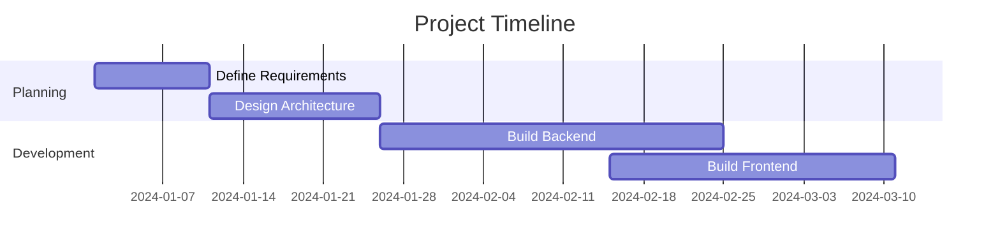

**Date format options**:
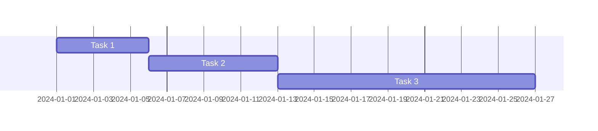

### Concept 2: Task States

**Active, done, and critical tasks**:
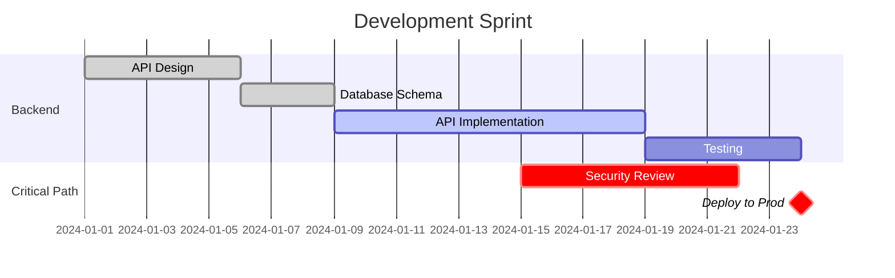

**Task tags**:
- `done` - Completed task (gray)
- `active` - Currently in progress (blue)
- `crit` - Critical path (red)
- `milestone` - Key milestone (marker)

### Concept 3: Dependencies

**Sequential tasks**:
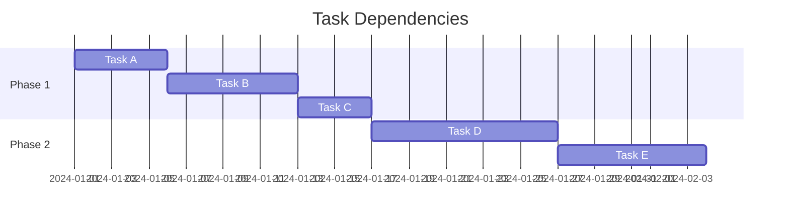

**Multiple dependencies**:
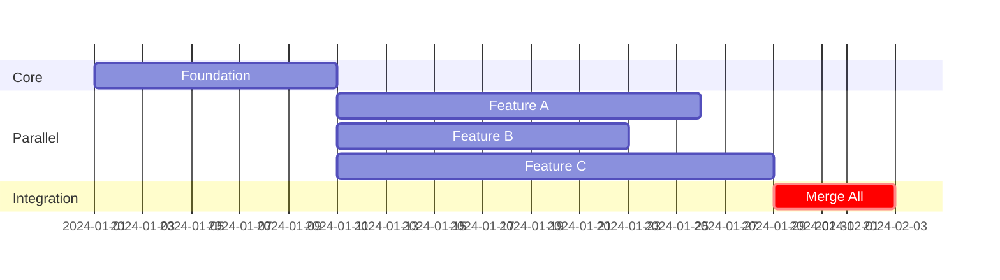

### Concept 4: Milestones

**Project milestones**:
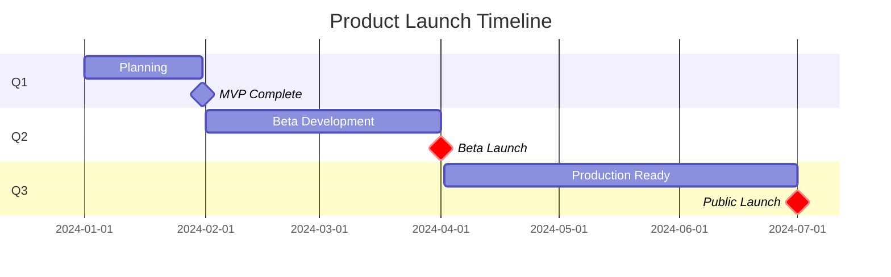

## Gantt Chart Patterns

### Pattern 1: Software Release Plan

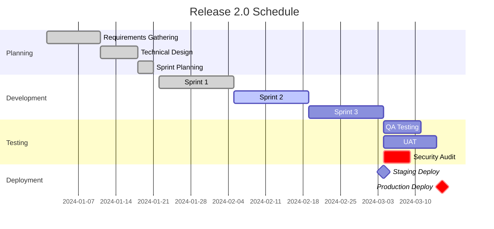

### Pattern 2: Feature Development

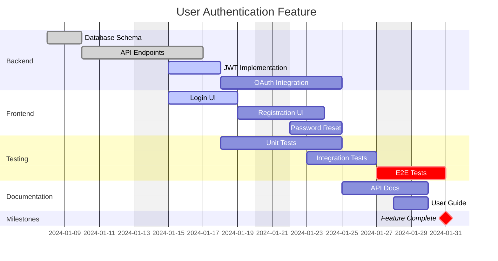

### Pattern 3: Infrastructure Migration

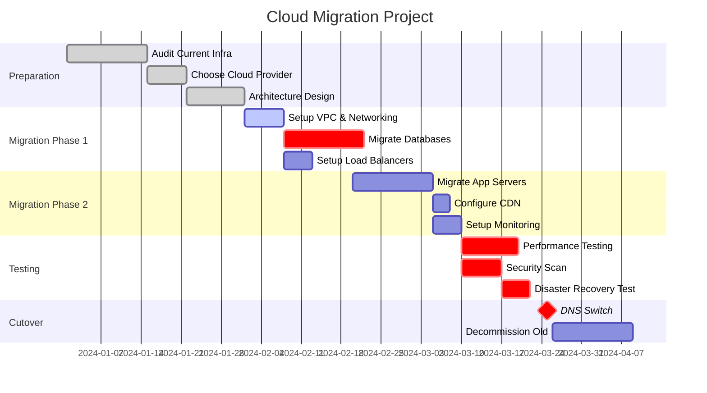

---

# Part 2: Timeline Diagrams

## Core Concepts

### Concept 1: Basic Timeline

**Simple chronology**:
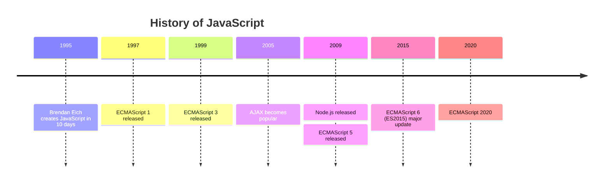

**Multiple events per period**:
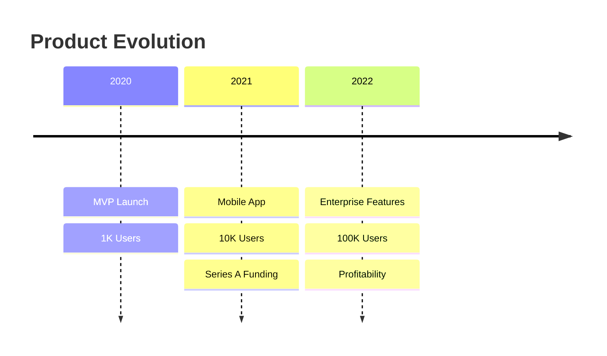

### Concept 2: Sections

**Grouped by era**:
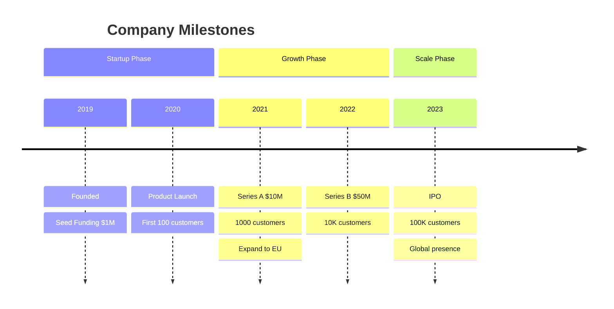

### Concept 3: Product Roadmap

**Future planning**:
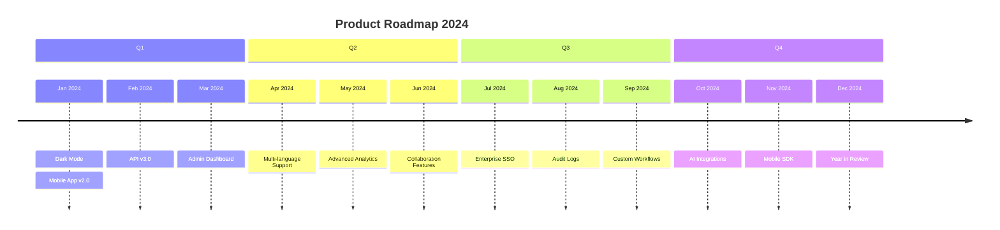

## Timeline Patterns

### Pattern 1: Technology Evolution

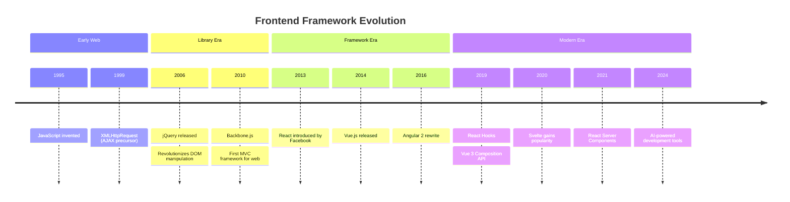

### Pattern 2: Project History

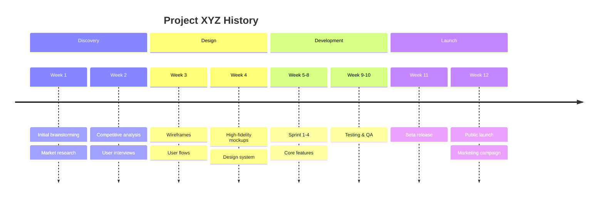

### Pattern 3: Career Timeline

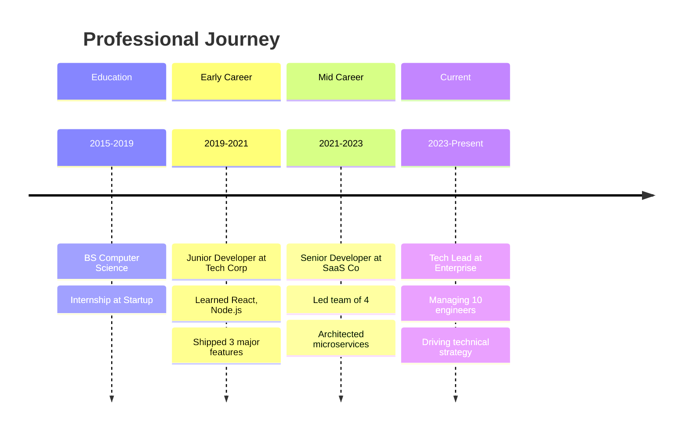

## Best Practices

### Gantt Charts

**Do**:
- Use sections to group related tasks
- Mark critical path with `crit` tag
- Show dependencies with `after` syntax
- Include milestones for key dates
- Exclude weekends for realistic timelines

**Don't**:
- Overcrowd with too many tasks (group them)
- Forget to mark completed tasks as `done`
- Mix different levels of detail
- Omit dependencies between tasks

### Timelines

**Do**:
- Group events into logical sections
- Use consistent date formats
- Include multiple events per period when relevant
- Keep descriptions concise

**Don't**:
- Mix granularities (days with years)
- Omit important context
- Create too many sections (max 5-6)
- Use overly long event descriptions

## Anti-Patterns

### ❌ Missing Dependencies
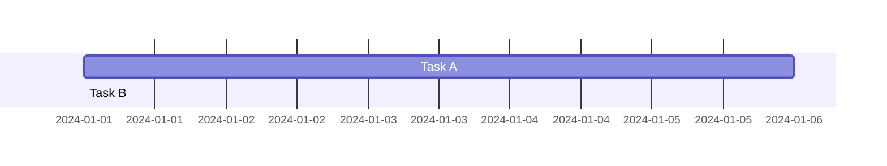
**✅ Better**: Use `after` for sequential tasks

### ❌ No Critical Path
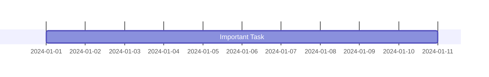
**✅ Better**: Mark critical tasks
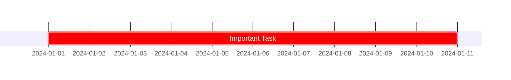

### ❌ Inconsistent Timeline Granularity
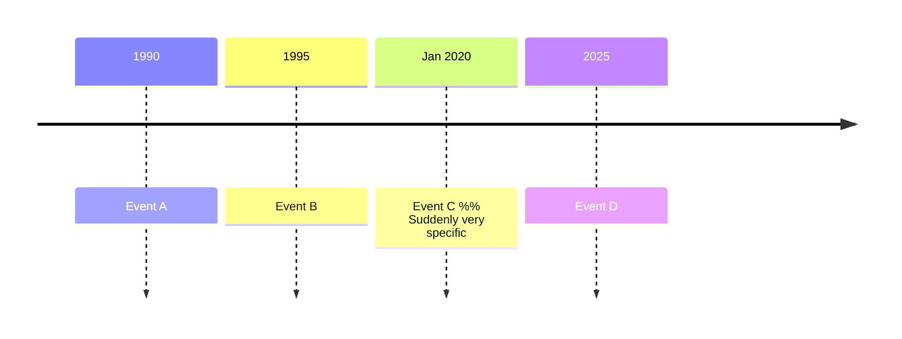
**✅ Better**: Maintain consistent time scale

## Integration Tips

- **Gantt + Flowchart**: Process flow → then timeline
- **Timeline + Sequence**: History → then detailed interaction
- **Gantt + Architecture**: What to build → when to build it

Use Gantt for:
- Sprint planning
- Release schedules
- Resource allocation
- Dependency tracking

Use Timeline for:
- Product history
- Technology evolution
- Company milestones
- Roadmap communication

## Related Skills

- `mermaid-flowcharts.md` - Process flows
- `mermaid-sequence-diagrams.md` - Temporal interactions
- `project-management.md` - Planning methodologies

## Resources

- Official Docs:
  - https://mermaid.js.org/syntax/gantt.html
  - https://mermaid.js.org/syntax/timeline.html
- Live Editor: https://mermaid.live
- Project Management: PMBOK Guide
- Agile Planning: Scrum Guide
