# Mermaid Sequence Diagrams

**Scope**: Interaction and message flow visualization with Mermaid.js
**Lines**: ~350
**Last Updated**: 2025-10-27
**Format Version**: 1.0 (Atomic)

---

## When to Use This Skill

Activate this skill when:
- Documenting API interactions and request/response flows
- Visualizing microservice communication patterns
- Showing user-system interactions
- Mapping message flows in distributed systems
- Illustrating protocol sequences
- Creating actor interaction diagrams
- Documenting async/sync communication patterns

## Core Concepts

### Concept 1: Participants and Actors

**Basic participant definition**:
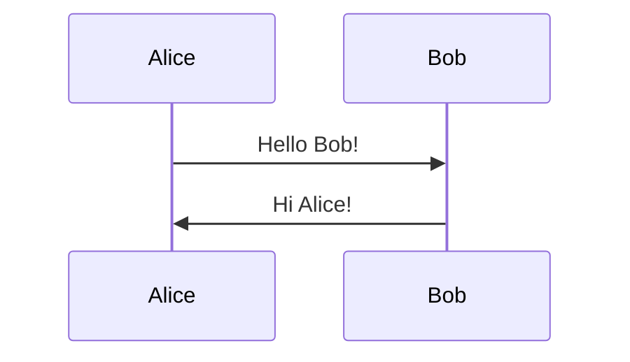

**Participant types**:
```mermaid
sequenceDiagram
    actor User
    participant API as API Gateway
    participant Auth as Auth Service
    database DB as PostgreSQL
    queue Q as Message Queue

    User->>API: POST /login
    API->>Auth: Verify credentials
    Auth->>DB: Query user
    DB-->>Auth: User data
    Auth-->>API: Token
    API->>Q: Log event
    API-->>User: 200 OK + Token
```

**Participant ordering**:
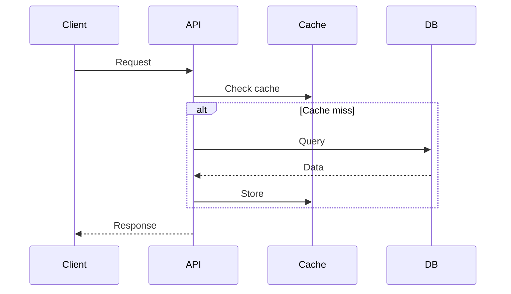

### Concept 2: Message Arrow Types

**Arrow styles and meanings**:
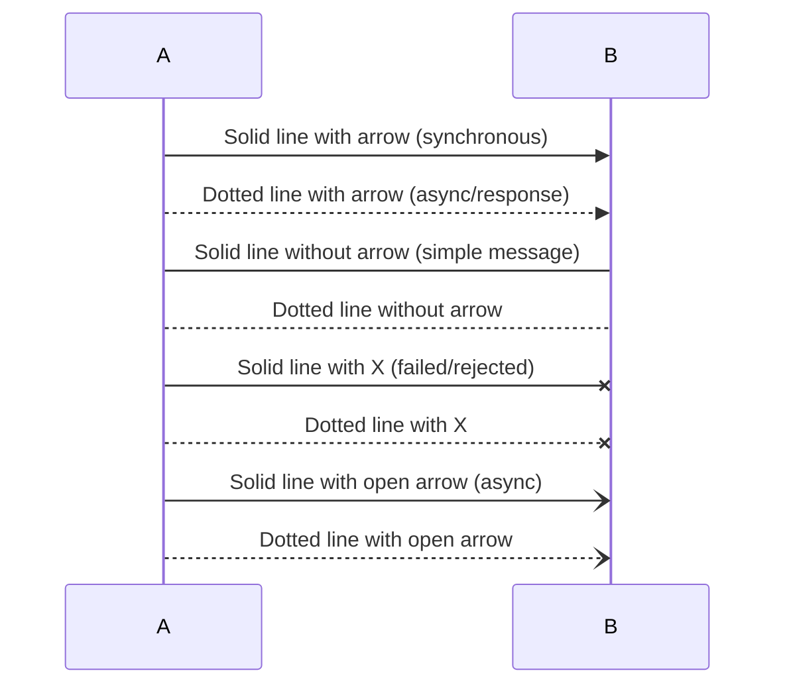

**Semantic usage**:
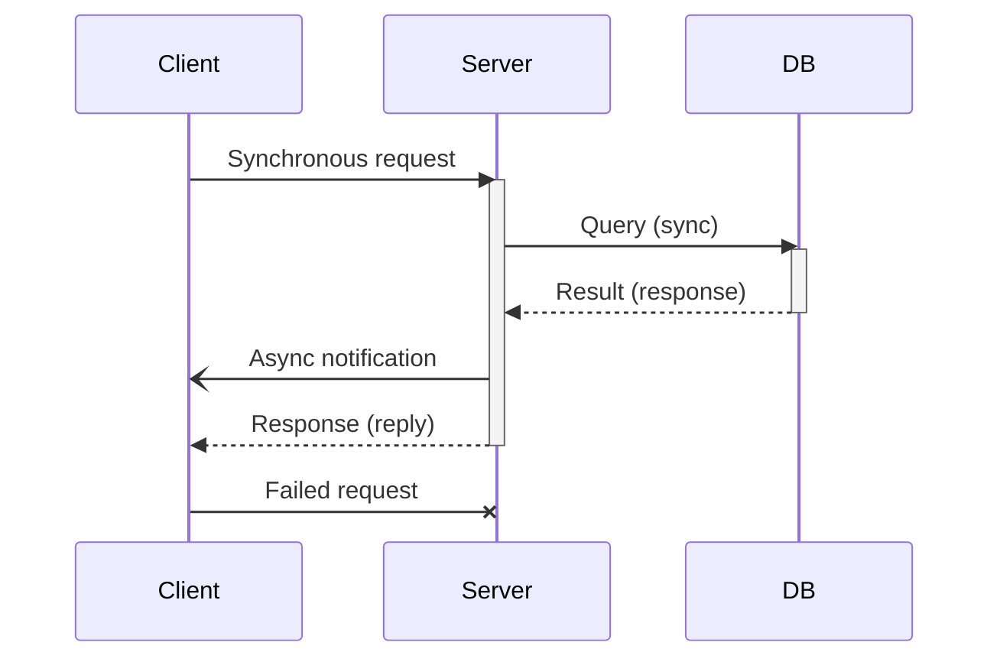

### Concept 3: Activation Boxes

**Manual activation**:
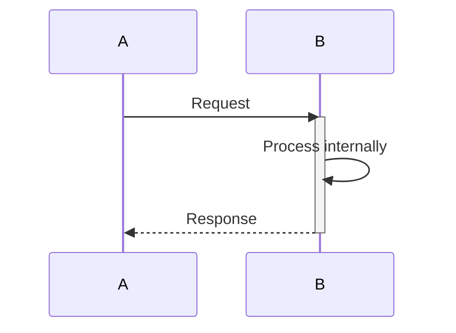

**Shorthand with +/-**:
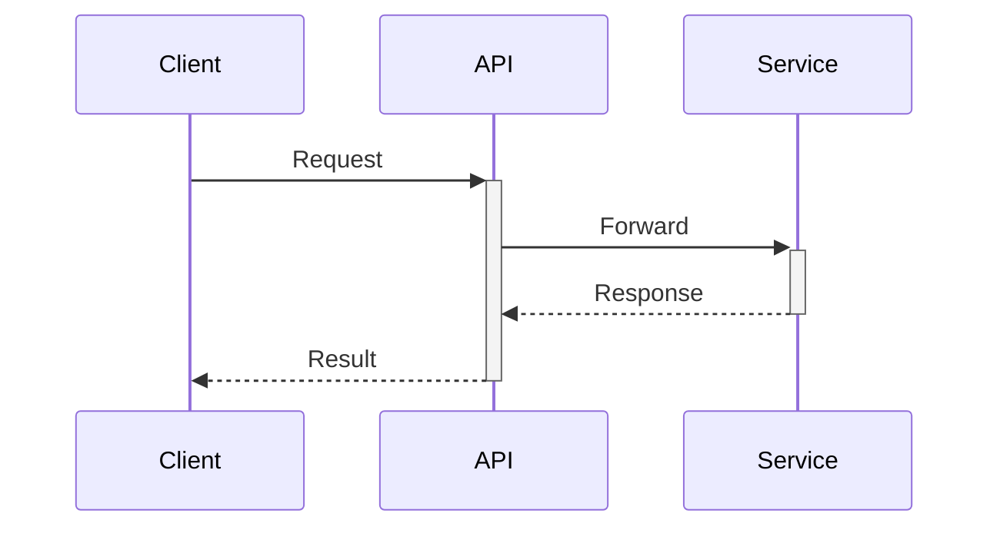

**Nested activations**:
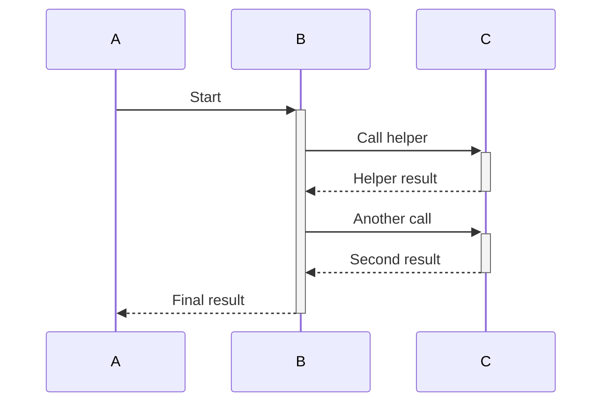

### Concept 4: Control Flow Blocks

**Alternatives (if/else)**:
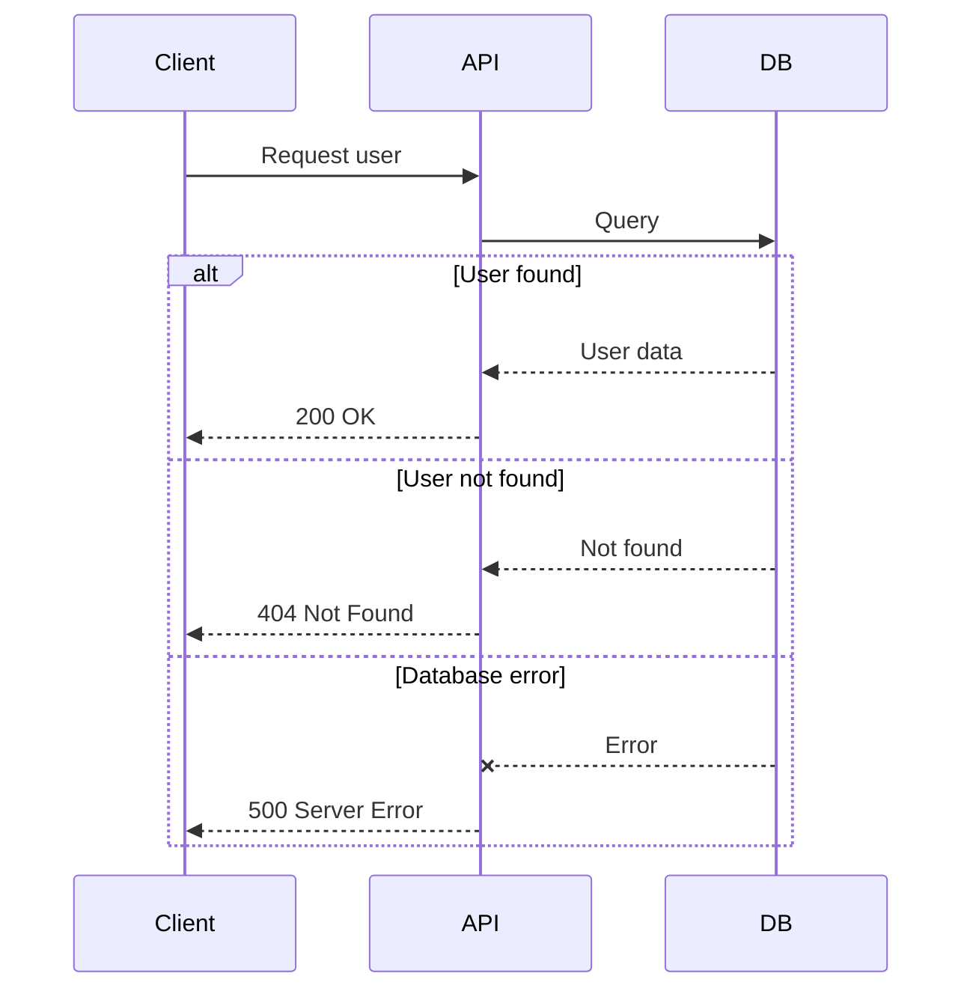

**Optional block**:
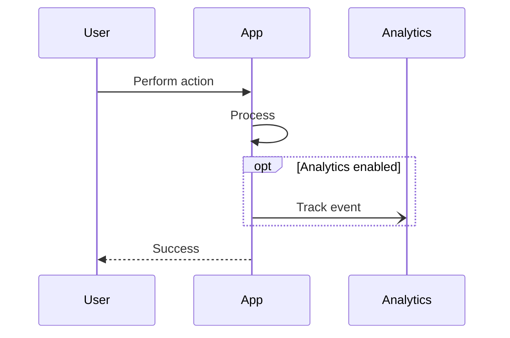

**Loop block**:
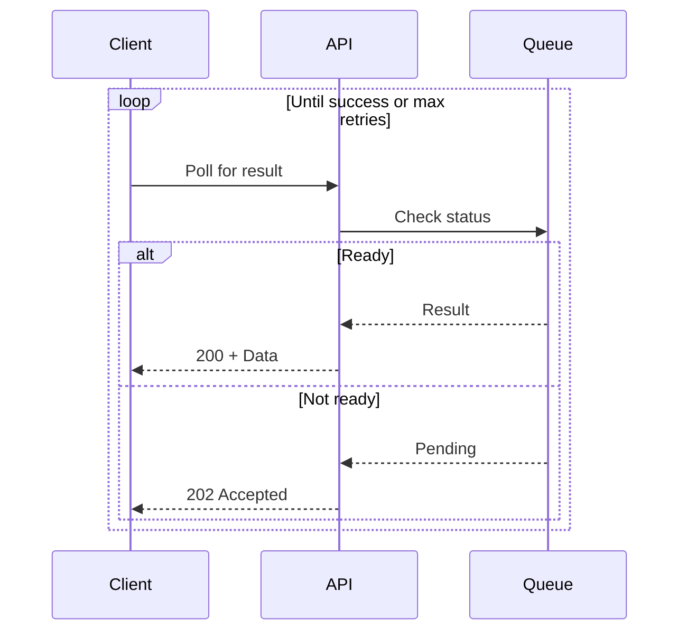

**Parallel blocks**:
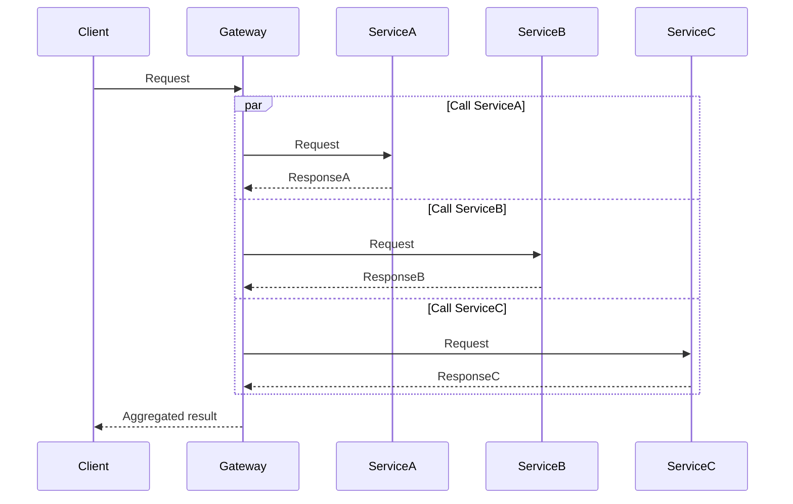

**Critical sections**:
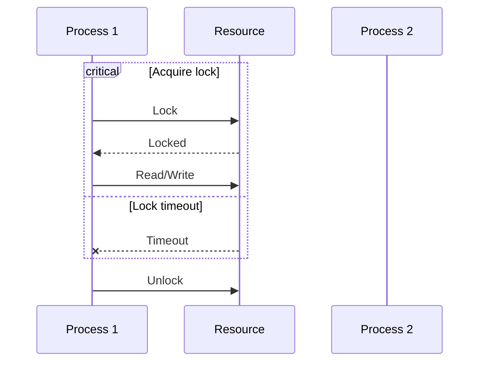

### Concept 5: Notes and Comments

**Note positioning**:
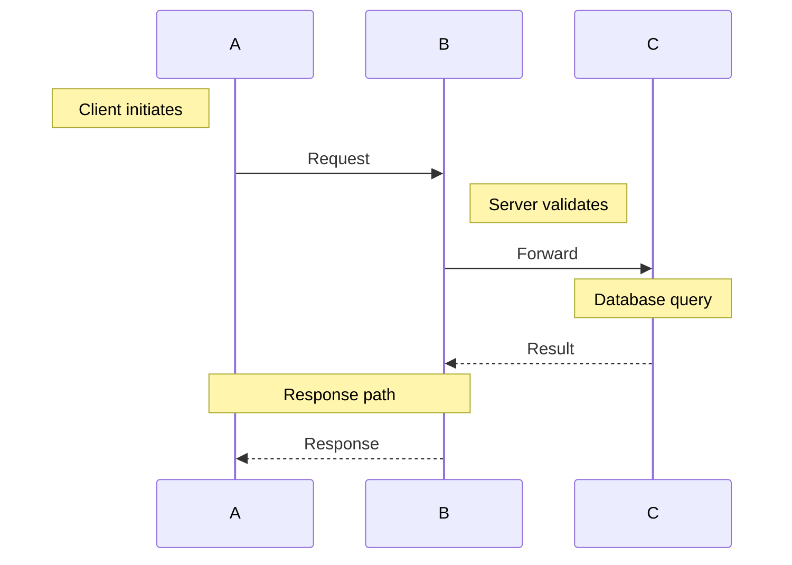

**Multi-line notes**:
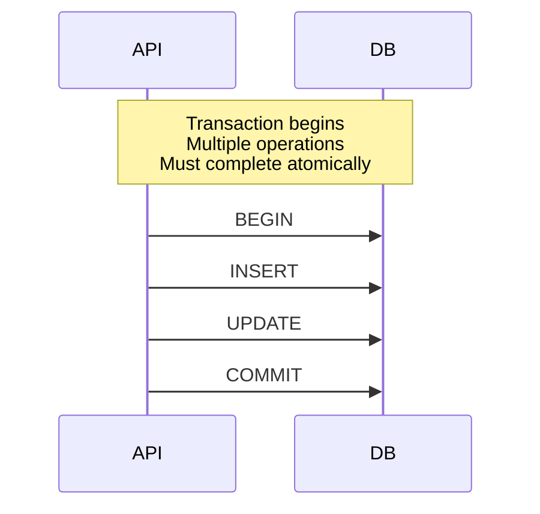

**Comments**:
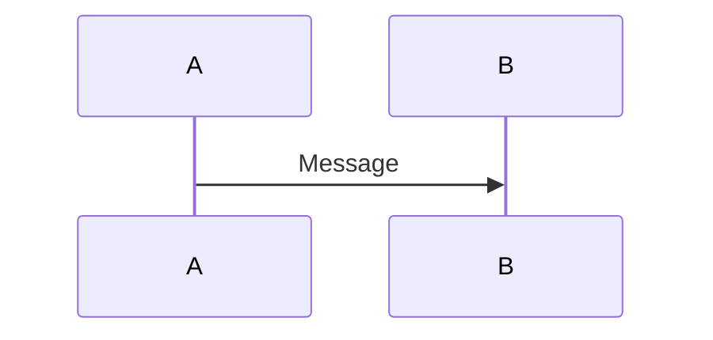

## Common Patterns

### Pattern 1: RESTful API Request/Response

```mermaid
sequenceDiagram
    actor Client
    participant Gateway as API Gateway
    participant Auth as Auth Service
    participant API as User Service
    database DB as PostgreSQL

    Client->>+Gateway: POST /users/login
    Note over Client,Gateway: HTTPS with credentials

    Gateway->>+Auth: Verify JWT
    alt Valid token
        Auth-->>-Gateway: Claims
        Gateway->>+API: GET /users/{id}
        API->>+DB: SELECT * FROM users
        DB-->>-API: User record
        API-->>-Gateway: 200 OK + User data
        Gateway-->>-Client: 200 OK
    else Invalid token
        Auth-->>-Gateway: Unauthorized
        Gateway-->>Client: 401 Unauthorized
    end
```

### Pattern 2: Microservice Communication

```mermaid
sequenceDiagram
    participant Order as Order Service
    participant Inventory as Inventory Service
    participant Payment as Payment Service
    participant Shipping as Shipping Service
    queue EventBus as Event Bus

    Order->>+Inventory: Reserve items
    Inventory-->>-Order: Reserved

    Order->>+Payment: Charge customer
    alt Payment success
        Payment-->>-Order: Success
        Order-)EventBus: OrderPaid event
        EventBus-)Inventory: Confirm reservation
        EventBus-)Shipping: Initiate shipment

        par Ship order
            Shipping->>Shipping: Create shipment
        and Update inventory
            Inventory->>Inventory: Decrement stock
        end
    else Payment failed
        Payment-->>-Order: Failed
        Order->>Inventory: Release reservation
        Order-->>Order: Cancel order
    end
```

### Pattern 3: Retry with Exponential Backoff

```mermaid
sequenceDiagram
    participant Client
    participant API
    participant Service

    loop Retry up to 3 times
        Client->>+API: Request
        API->>+Service: Call external API

        alt Success
            Service-->>-API: 200 OK
            API-->>-Client: Success
        else Failure
            Service--xAPI: 503 Service Unavailable
            API-->>-Client: 503 + Retry-After
            Note over Client: Wait exponentially<br/>(1s, 2s, 4s)
        end
    end

    alt Max retries exceeded
        Client->>Client: Log failure
        Note over Client: Circuit breaker opens
    end
```

## Best Practices

### 1. Clear Participant Naming
```mermaid
sequenceDiagram
    %% Good: Descriptive names
    actor User
    participant WebApp as Web Application
    participant AuthAPI as Authentication API
    database UserDB as User Database

    %% Bad: Cryptic abbreviations
    participant A
    participant B
    participant C
```

### 2. Use Activation Appropriately
```mermaid
sequenceDiagram
    participant A
    participant B

    %% Shows that B is processing
    A->>+B: Request
    B->>B: Long process
    B-->>-A: Response

    %% Not needed for simple pass-through
    A->>B: Quick message
    B-->>A: Quick reply
```

### 3. Group Related Interactions
```mermaid
sequenceDiagram
    box User Layer
        actor User
        participant UI
    end

    box Application Layer
        participant API
        participant Service
    end

    box Data Layer
        database DB
        database Cache
    end

    User->>UI: Click button
    UI->>API: POST /action
    API->>Service: Process
    Service->>Cache: Check
    Service->>DB: Query
```

### 4. Label Meaningful Responses
```mermaid
sequenceDiagram
    participant A
    participant B

    %% Good: Shows what's returned
    A->>B: GET /user/123
    B-->>A: 200 OK + {id, name, email}

    %% Bad: Generic response
    A->>B: Request
    B-->>A: Response
```

## Anti-Patterns

### ❌ Too Many Participants
Creates visual clutter, hard to follow:
```mermaid
sequenceDiagram
    participant A
    participant B
    participant C
    participant D
    participant E
    participant F
    participant G
```
**Solution**: Group related participants or split into multiple diagrams

### ❌ Missing Activations
Can't tell when services are actively processing:
```mermaid
sequenceDiagram
    A->>B: Start long process
    B->>C: Sub-task
    C-->>B: Done
    B-->>A: Complete
```

**✅ Better**:
```mermaid
sequenceDiagram
    A->>+B: Start long process
    B->>+C: Sub-task
    C-->>-B: Done
    B-->>-A: Complete
```

### ❌ Unlabeled Decision Points
```mermaid
sequenceDiagram
    A->>B: Request
    alt
        B-->>A: Response1
    else
        B-->>A: Response2
    end
```

**✅ Better**:
```mermaid
sequenceDiagram
    A->>B: Request
    alt Valid input
        B-->>A: 200 OK
    else Invalid input
        B-->>A: 400 Bad Request
    end
```

## Integration with Other Diagrams

- **Start with sequence** → Then create flowchart for complex logic
- **Sequence for interactions** → Class diagram for structure
- **Sequence for runtime** → Architecture diagram for deployment

## Related Skills

- `mermaid-flowcharts.md` - For process logic
- `mermaid-class-state-diagrams.md` - For object structure
- `mermaid-architecture-diagrams.md` - For system design

## Resources

- Official Docs: https://mermaid.js.org/syntax/sequenceDiagram.html
- Live Editor: https://mermaid.live
- GitHub/GitLab: Auto-rendering in markdown
