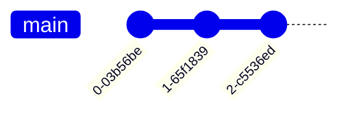
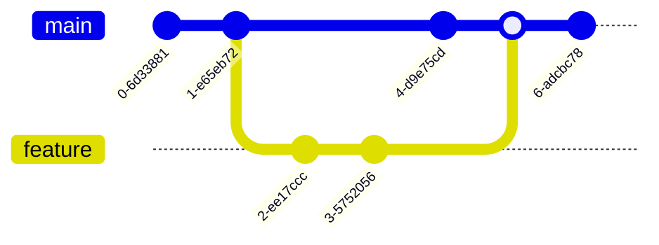

# Mermaid Specialized Diagrams

**Scope**: GitGraph, Sankey, mindmaps, and advanced diagram types in Mermaid.js
**Lines**: ~430
**Last Updated**: 2025-10-27
**Format Version**: 1.0 (Atomic)

---

## When to Use This Skill

Activate this skill when:
- Visualizing Git workflows and branching strategies
- Showing data flows and transformations (Sankey)
- Creating hierarchical concept maps (mindmaps)
- Documenting version control processes
- Illustrating energy/material flows
- Brainstorming and organizing ideas
- Mapping dependencies and conversions

---

# Part 1: Git Graphs

## Core Concepts

### Concept 1: Basic Commits and Branches

**Linear commits**:


**Feature branch**:


### Concept 2: Commit Metadata

**Commits with IDs and tags**:


### Concept 3: Commit Types

**Visual emphasis**:


**Commit types**:
- `NORMAL` - Standard commit (default)
- `HIGHLIGHT` - Important commit (emphasized)
- `REVERSE` - Reverted or rolled back commit

## Git Graph Patterns

### Pattern 1: Gitflow Workflow


### Pattern 2: Trunk-Based Development


### Pattern 3: Release Branches


---

# Part 2: Sankey Diagrams

## Core Concepts

### Concept 1: Basic Flow

**Simple data flow**:


### Concept 2: Complex Flows

**Energy distribution**:


### Concept 3: Multi-Stage Flows

**Data pipeline**:


## Sankey Patterns

### Pattern 1: User Journey Flow


### Pattern 2: Budget Allocation


### Pattern 3: Application Resource Usage


---

# Part 3: Mindmaps

## Core Concepts

### Concept 1: Basic Hierarchy

**Simple structure**:


### Concept 2: Node Shapes

**Different shapes for emphasis**:
```mermaid
mindmap
    root((Core Concept))
        [Important Category]
            (Sub-item 1)
            (Sub-item 2)
        {Cloud Topic}
            ((Circle Item))
            [!Bang Item!]
        {{Hexagon Topic}}
```

**Shape reference**:
- `((text))` - Circle (root default)
- `(text)` - Rounded square
- `[text]` - Square
- `{text}` - Cloud
- `{{text}}` - Hexagon
- `[!text!]` - Bang

### Concept 3: Icons and Styling

**With icons**:
```mermaid
mindmap
    root((Project))::icon(fa fa-project-diagram)
        Planning::icon(fa fa-calendar)
            Requirements
            Timeline
        Development::icon(fa fa-code)
            Frontend
            Backend
        Deploy::icon(fa fa-rocket)
```

## Mindmap Patterns

### Pattern 1: System Architecture


### Pattern 2: Learning Path


### Pattern 3: Project Breakdown


---

# Part 4: Other Specialized Diagrams

## Requirement Diagrams

**Requirements traceability**:
```mermaid
requirementDiagram
    requirement UserAuth {
        id: REQ-001
        text: Users must authenticate
        risk: high
        verifymethod: test
    }

    functionalRequirement LoginAPI {
        id: FREQ-001
        text: Provide login endpoint
    }

    element AuthService {
        type: service
        docRef: auth-service.md
    }

    UserAuth - satisfies -> LoginAPI
    LoginAPI - implements -> AuthService
```

## Best Practices

### Git Graphs

**Do**:
- Show realistic branching strategies
- Use tags for releases
- Highlight important commits
- Show merge directions clearly

**Don't**:
- Create overly complex graphs (limit to 20-30 commits)
- Mix different workflows in one diagram
- Omit critical merge points

### Sankey Diagrams

**Do**:
- Use for flow visualization (data, energy, resources)
- Ensure flow values are consistent (in = out)
- Label nodes clearly
- Show losses/waste explicitly

**Don't**:
- Use for hierarchies (use mindmap)
- Create circular flows
- Omit significant flow paths

### Mindmaps

**Do**:
- Start with central concept
- Group related items
- Use shapes for categorization
- Limit depth to 4-5 levels

**Don't**:
- Create unbalanced trees
- Mix abstraction levels
- Overcrowd with too many nodes

## Anti-Patterns

### ❌ Overcomplicated Git Graph
```mermaid
gitGraph
    commit
    branch feat1
    branch feat2
    branch feat3
    %% ... 10 more branches
```
**Solution**: Split into multiple diagrams or show just relevant branches

### ❌ Inconsistent Sankey Flows
```mermaid
sankey-beta
Input,Process,100
Process,Output,120  %% Where did extra 20 come from?
```
**✅ Better**: Flows must balance

### ❌ Flat Mindmap (No Hierarchy)
```mermaid
mindmap
    root
        Item1
        Item2
        Item3
        %% No grouping or structure
```
**✅ Better**: Group related concepts into hierarchies

## Integration Tips

- **GitGraph + Sequence**: Version control workflow + runtime behavior
- **Sankey + Architecture**: Data flow + system structure
- **Mindmap + Flowchart**: Concept breakdown + process flow
- **GitGraph + Project Timeline**: Development workflow + schedule

## Related Skills

- `mermaid-flowcharts.md` - Process flows
- `mermaid-sequence-diagrams.md` - Interactions
- `mermaid-architecture-diagrams.md` - System design
- `version-control.md` - Git workflows

## Resources

- Official Docs:
  - https://mermaid.js.org/syntax/gitgraph.html
  - https://mermaid.js.org/syntax/sankey.html
  - https://mermaid.js.org/syntax/mindmap.html
- Live Editor: https://mermaid.live
- Gitflow: https://nvie.com/posts/a-successful-git-branching-model/
- Trunk-Based Development: https://trunkbaseddevelopment.com/
