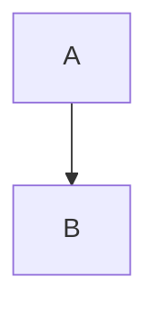

# Diagrams Skills Discovery

Provides automatic access to comprehensive Mermaid.js diagram skills for visual documentation.

## When This Skill Activates

This skill auto-activates when you're working with:
- Process flows and flowcharts
- Sequence and interaction diagrams
- System architecture and C4 diagrams
- Database schemas and ER diagrams
- Class diagrams and state machines
- Data visualization charts
- Project timelines and Gantt charts
- Git workflows and branching
- Mindmaps and concept hierarchies
- Any Mermaid.js diagram creation

## Available Skills

### Quick Reference

The diagrams category contains 8 specialized Mermaid.js skills:

1. **mermaid-flowcharts** - Process flows, decision trees, node shapes, subgraphs
2. **mermaid-sequence-diagrams** - Interactions, message flows, participants, lifelines
3. **mermaid-class-state-diagrams** - UML classes, relationships, state machines, FSM
4. **mermaid-er-diagrams** - Entity-relationship, database schemas, cardinality
5. **mermaid-architecture-diagrams** - C4 diagrams, block diagrams, system design
6. **mermaid-charts** - Pie, XY, quadrant, radar charts for data visualization
7. **mermaid-project-diagrams** - Gantt charts, timelines, project planning
8. **mermaid-specialized** - Git graphs, Sankey flows, mindmaps, requirement diagrams

### Load Full Category Details

For complete descriptions and workflows:

```bash
cat skills/diagrams/INDEX.md
```

This loads the full diagrams category index with:
- Detailed skill descriptions
- When to use which diagram type
- Common workflow combinations
- Best practices and integration patterns

### Load Specific Skills

Load individual skills as needed:

```bash
# Process and logic
cat skills/diagrams/mermaid-flowcharts.md
cat skills/diagrams/mermaid-sequence-diagrams.md

# Structure and design
cat skills/diagrams/mermaid-class-state-diagrams.md
cat skills/diagrams/mermaid-er-diagrams.md
cat skills/diagrams/mermaid-architecture-diagrams.md

# Data and metrics
cat skills/diagrams/mermaid-charts.md

# Planning and history
cat skills/diagrams/mermaid-project-diagrams.md

# Specialized diagrams
cat skills/diagrams/mermaid-specialized.md
```

## Common Workflows

### Document REST API
**Sequence**: Architecture → Sequence → ER

```bash
cat skills/diagrams/mermaid-architecture-diagrams.md  # System design
cat skills/diagrams/mermaid-sequence-diagrams.md      # Request/response flows
cat skills/diagrams/mermaid-er-diagrams.md            # Database schema
```

### Document Feature Implementation
**Sequence**: Flowchart → Sequence → State

```bash
cat skills/diagrams/mermaid-flowcharts.md             # Business logic
cat skills/diagrams/mermaid-sequence-diagrams.md      # Service interactions
cat skills/diagrams/mermaid-class-state-diagrams.md   # State management
```

### Project Planning
**Sequence**: Mindmap → Gantt → Timeline

```bash
cat skills/diagrams/mermaid-specialized.md            # Brainstorm with mindmap
cat skills/diagrams/mermaid-project-diagrams.md       # Schedule with Gantt
cat skills/diagrams/mermaid-project-diagrams.md       # Roadmap with timeline
```

### System Architecture Documentation
**Sequence**: C4 Context → C4 Container → Sequence

```bash
cat skills/diagrams/mermaid-architecture-diagrams.md  # System context
cat skills/diagrams/mermaid-architecture-diagrams.md  # Technology choices
cat skills/diagrams/mermaid-sequence-diagrams.md      # Runtime behavior
```

### Database Design
**Sequence**: ER → Class

```bash
cat skills/diagrams/mermaid-er-diagrams.md            # Schema design
cat skills/diagrams/mermaid-class-state-diagrams.md   # ORM models
```

## Diagram Selection Guide

**Process & Logic:**
- **Flowchart**: Algorithms, workflows, decision trees
- **Sequence**: API calls, protocols, service communication
- **State**: Lifecycle management, FSM, protocol states

**Structure & Design:**
- **Class**: Object models, API structure, OOP design
- **ER**: Database schema, data relationships
- **Architecture**: System topology, infrastructure, C4 diagrams

**Data & Metrics:**
- **Pie**: Distribution percentages, market share
- **XY Charts**: Trends over time, performance metrics
- **Quadrant**: Prioritization matrices, risk assessment
- **Radar**: Skill assessments, feature comparison
- **Sankey**: Flow analysis, conversion funnels

**Planning & History:**
- **Gantt**: Project schedules, task dependencies
- **Timeline**: Product roadmaps, company history
- **GitGraph**: Branching strategies, release workflows

**Ideation:**
- **Mindmap**: Brainstorming, concept hierarchies, learning paths

## Integration with Other Skills

Diagram skills commonly combine with:

**API skills** (`discover-api`):
- Sequence diagrams for API interactions
- ER diagrams for data models
- Architecture diagrams for system design

**Database skills** (`discover-database`):
- ER diagrams for schema design
- Sequence diagrams for query patterns
- Flowcharts for migration processes

**Testing skills** (`discover-testing`):
- Flowcharts for test scenarios
- Sequence diagrams for test flows
- State diagrams for state-based testing

**Frontend skills** (`discover-frontend`):
- Flowcharts for user flows
- State diagrams for UI state management
- Sequence diagrams for data fetching

**Infrastructure skills** (`discover-infra`, `discover-cloud`):
- Architecture diagrams for deployment
- Sequence diagrams for CI/CD pipelines
- Gantt charts for migration schedules

## Usage Instructions

1. **Auto-activation**: This skill loads automatically when Claude Code detects diagram/visualization work
2. **Browse skills**: Run `cat skills/diagrams/INDEX.md` for full category overview
3. **Load specific skills**: Use bash commands above to load individual diagram skills
4. **Follow workflows**: Use recommended sequences for comprehensive documentation
5. **Combine diagrams**: Multiple diagram types provide complete picture

## Progressive Loading

This gateway skill (~200 lines, ~2K tokens) enables progressive loading:
- **Level 1**: Gateway loads automatically (you're here now)
- **Level 2**: Load category INDEX.md (~3K tokens) for full overview
- **Level 3**: Load specific skills (~2-3K tokens each) as needed

Total context: 2K + 3K + skill(s) = 5-10K tokens vs 30K+ for entire category.

## Quick Start Examples

**"Create a flowchart for user authentication"**:
```bash
cat skills/diagrams/mermaid-flowcharts.md
```

**"Document API interactions"**:
```bash
cat skills/diagrams/mermaid-sequence-diagrams.md
```

**"Design database schema"**:
```bash
cat skills/diagrams/mermaid-er-diagrams.md
```

**"Show system architecture"**:
```bash
cat skills/diagrams/mermaid-architecture-diagrams.md
```

**"Create class diagram for ORM models"**:
```bash
cat skills/diagrams/mermaid-class-state-diagrams.md
```

**"Visualize project timeline"**:
```bash
cat skills/diagrams/mermaid-project-diagrams.md
```

**"Show data distribution"**:
```bash
cat skills/diagrams/mermaid-charts.md
```

**"Document Git workflow"**:
```bash
cat skills/diagrams/mermaid-specialized.md
```

## Best Practices

1. **Start broad, drill down**: Architecture → Sequence → Class → Flowchart
2. **One diagram, one purpose**: Don't mix abstraction levels
3. **Label everything**: Relationships, transitions, axes, values
4. **Limit complexity**: Split large diagrams into focused views
5. **Use GitHub/GitLab rendering**: Diagrams auto-render in markdown
6. **Iterate in https://mermaid.live**: Fast feedback loop

## Mermaid.js Quick Tips

**In Markdown files**:
````markdown

````

**Live Preview**:
- https://mermaid.live - Official editor
- VS Code: Install "Mermaid Preview" extension
- GitHub/GitLab: Auto-renders in README.md

**Common Gotchas**:
- Use quotes for labels with spaces: `A["Label with spaces"]`
- Escape special characters in labels
- Check syntax highlighting for errors
- Start simple, add complexity incrementally

---

**Next Steps**: Run `cat skills/diagrams/INDEX.md` to see full category details, or load specific diagram skills using the bash commands above.
