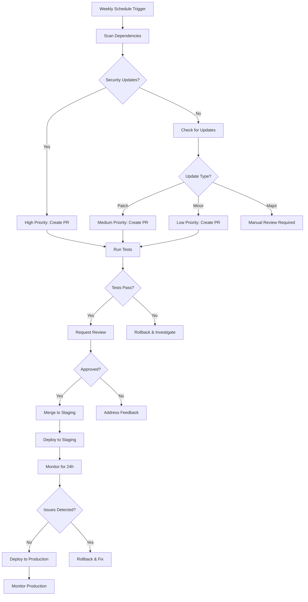

# Dependency Update Workflow

Comprehensive workflow for managing dependency updates with testing, review, and deployment.

## Overview

This workflow provides a systematic approach to:
1. Automated dependency discovery
2. Security prioritization
3. Testing and validation
4. Review and approval
5. Deployment and monitoring

## Weekly Update Schedule

```
Monday:     Dependency scan and update PRs
Tuesday:    Review and approve security updates
Wednesday:  Review and approve patch updates
Thursday:   Review and approve minor updates
Friday:     Deploy approved updates
```

## Workflow Diagram



## GitHub Actions Workflow

```yaml
# .github/workflows/dependency-updates.yml
name: Dependency Update Workflow

on:
  schedule:
    # Monday 9 AM UTC
    - cron: '0 9 * * 1'
  workflow_dispatch:
    inputs:
      strategy:
        description: 'Update strategy'
        required: true
        default: 'balanced'
        type: choice
        options:
          - conservative
          - balanced
          - aggressive

jobs:
  scan-dependencies:
    name: Scan for Updates
    runs-on: ubuntu-latest
    outputs:
      has_security: ${{ steps.check.outputs.has_security }}
      has_patch: ${{ steps.check.outputs.has_patch }}
      has_minor: ${{ steps.check.outputs.has_minor }}
      has_major: ${{ steps.check.outputs.has_major }}

    steps:
      - uses: actions/checkout@v4

      - name: Setup Node.js
        uses: actions/setup-node@v4
        with:
          node-version: '18'
          cache: 'npm'

      - name: Install dependencies
        run: npm ci

      - name: Check for security updates
        id: security
        run: |
          npm audit --json > audit.json || true
          COUNT=$(jq '.metadata.vulnerabilities.total' audit.json)
          echo "count=$COUNT" >> $GITHUB_OUTPUT

          if [ "$COUNT" -gt 0 ]; then
            echo "has_security=true" >> $GITHUB_OUTPUT
          fi

      - name: Check for outdated packages
        id: outdated
        run: |
          npm outdated --json > outdated.json || true

          PATCH=$(jq '[.[] | select(.current != .wanted and .wanted != .latest)] | length' outdated.json)
          MINOR=$(jq '[.[] | select(.wanted != .latest)] | length' outdated.json)

          echo "patch=$PATCH" >> $GITHUB_OUTPUT
          echo "minor=$MINOR" >> $GITHUB_OUTPUT

      - name: Set outputs
        id: check
        run: |
          if [ "${{ steps.security.outputs.count }}" -gt 0 ]; then
            echo "has_security=true" >> $GITHUB_OUTPUT
          fi

          if [ "${{ steps.outdated.outputs.patch }}" -gt 0 ]; then
            echo "has_patch=true" >> $GITHUB_OUTPUT
          fi

          if [ "${{ steps.outdated.outputs.minor }}" -gt 0 ]; then
            echo "has_minor=true" >> $GITHUB_OUTPUT
          fi

  security-updates:
    name: Security Updates
    runs-on: ubuntu-latest
    needs: scan-dependencies
    if: needs.scan-dependencies.outputs.has_security == 'true'

    steps:
      - uses: actions/checkout@v4

      - name: Setup Node.js
        uses: actions/setup-node@v4
        with:
          node-version: '18'

      - name: Install dependencies
        run: npm ci

      - name: Apply security fixes
        run: npm audit fix

      - name: Run tests
        run: npm test

      - name: Run build
        run: npm run build

      - name: Create Pull Request
        uses: peter-evans/create-pull-request@v5
        with:
          token: ${{ secrets.GITHUB_TOKEN }}
          commit-message: "security: fix vulnerabilities"
          branch: security/automated-fixes
          title: "🔒 Security: Fix vulnerabilities"
          body: |
            ## Security Updates

            This PR fixes security vulnerabilities identified by npm audit.

            **Priority**: 🔴 High
            **Tests**: ✅ Passing
            **Type**: Security patch

            ### Changes
            - Applied `npm audit fix`
            - All tests passing
            - Build successful

            ### Review Checklist
            - [ ] Review vulnerability details
            - [ ] Verify tests pass
            - [ ] Check for breaking changes
            - [ ] Deploy to staging
            - [ ] Monitor for 24 hours

            **Action Required**: Please review and merge ASAP.
          labels: |
            security
            dependencies
            high-priority
            automated
          reviewers: |
            security-team
            platform-team

  patch-updates:
    name: Patch Updates
    runs-on: ubuntu-latest
    needs: scan-dependencies
    if: needs.scan-dependencies.outputs.has_patch == 'true'

    steps:
      - uses: actions/checkout@v4

      - name: Setup Node.js
        uses: actions/setup-node@v4
        with:
          node-version: '18'

      - name: Install dependencies
        run: npm ci

      - name: Update patch versions
        run: |
          npm outdated --json | \
          jq -r 'to_entries[] | select(.value.current != .value.wanted) | .key' | \
          xargs -I {} npm install {}@wanted

      - name: Run tests
        run: npm test

      - name: Create Pull Request
        uses: peter-evans/create-pull-request@v5
        with:
          token: ${{ secrets.GITHUB_TOKEN }}
          commit-message: "chore: update patch dependencies"
          branch: deps/patch-updates
          title: "📦 Dependencies: Patch updates"
          body: |
            ## Patch Updates

            Automated patch version updates (bug fixes only).

            **Priority**: 🟡 Medium
            **Tests**: ✅ Passing
            **Type**: Patch updates

            ### Review Checklist
            - [ ] Review changes
            - [ ] Verify tests pass
            - [ ] Approve and merge
          labels: |
            dependencies
            patch
            automated

  minor-updates:
    name: Minor Updates
    runs-on: ubuntu-latest
    needs: scan-dependencies
    if: needs.scan-dependencies.outputs.has_minor == 'true'

    steps:
      - uses: actions/checkout@v4

      - name: Setup Node.js
        uses: actions/setup-node@v4
        with:
          node-version: '18'

      - name: Install dependencies
        run: npm ci

      - name: Update minor versions
        run: npm update

      - name: Run tests
        run: npm test

      - name: Create Pull Request
        uses: peter-evans/create-pull-request@v5
        with:
          token: ${{ secrets.GITHUB_TOKEN }}
          commit-message: "chore: update minor dependencies"
          branch: deps/minor-updates
          title: "📦 Dependencies: Minor updates"
          body: |
            ## Minor Updates

            Automated minor version updates (new features, backward compatible).

            **Priority**: 🟢 Low
            **Tests**: ✅ Passing
            **Type**: Minor updates

            ### Review Checklist
            - [ ] Review changelogs
            - [ ] Verify tests pass
            - [ ] Check for deprecations
            - [ ] Approve and merge
          labels: |
            dependencies
            minor
            automated

  deploy-to-staging:
    name: Deploy to Staging
    runs-on: ubuntu-latest
    needs: [security-updates, patch-updates, minor-updates]
    if: always() && (needs.security-updates.result == 'success' || needs.patch-updates.result == 'success' || needs.minor-updates.result == 'success')
    environment:
      name: staging
      url: https://staging.example.com

    steps:
      - uses: actions/checkout@v4
        with:
          ref: develop

      - name: Setup Node.js
        uses: actions/setup-node@v4
        with:
          node-version: '18'

      - name: Install dependencies
        run: npm ci

      - name: Build
        run: npm run build

      - name: Deploy to staging
        run: |
          # Your deployment script
          npm run deploy:staging

      - name: Run smoke tests
        run: npm run test:smoke -- --env=staging

  monitor-staging:
    name: Monitor Staging
    runs-on: ubuntu-latest
    needs: deploy-to-staging

    steps:
      - name: Wait for deployment
        run: sleep 300  # 5 minutes

      - name: Check health endpoints
        run: |
          curl -f https://staging.example.com/health || exit 1

      - name: Run integration tests
        run: |
          # Run your integration tests
          npm run test:integration -- --env=staging

      - name: Check error rates
        run: |
          # Query monitoring system
          # Fail if error rate > threshold

      - name: Notify on issues
        if: failure()
        uses: slackapi/slack-github-action@v1
        with:
          webhook-url: ${{ secrets.SLACK_WEBHOOK_URL }}
          payload: |
            {
              "text": "⚠️ Dependency updates failing in staging",
              "blocks": [
                {
                  "type": "section",
                  "text": {
                    "type": "mrkdwn",
                    "text": "Staging deployment of dependency updates has issues. Manual intervention required."
                  }
                }
              ]
            }
```

## Review Process

### Security Updates (< 24 hours)

```markdown
## Security Update Checklist

- [ ] Verify CVE/vulnerability details
- [ ] Check CVSS score and exploitability
- [ ] Review breaking changes in changelog
- [ ] Confirm tests pass
- [ ] Deploy to staging
- [ ] Monitor staging for 4 hours
- [ ] Deploy to production
- [ ] Monitor production for 24 hours
```

### Patch Updates (< 3 days)

```markdown
## Patch Update Checklist

- [ ] Review bug fixes in changelog
- [ ] Confirm no breaking changes
- [ ] Verify tests pass
- [ ] Check dependencies of dependencies
- [ ] Approve PR
- [ ] Auto-merge (if configured)
```

### Minor Updates (< 1 week)

```markdown
## Minor Update Checklist

- [ ] Review new features
- [ ] Check for deprecations
- [ ] Review migration guide (if any)
- [ ] Verify backward compatibility
- [ ] Test in development
- [ ] Test in staging
- [ ] Get team approval
- [ ] Merge and deploy
```

### Major Updates (Manual process)

```markdown
## Major Update Checklist

- [ ] Create RFC for major update
- [ ] Review breaking changes
- [ ] Estimate migration effort
- [ ] Create migration plan
- [ ] Update documentation
- [ ] Test in feature branch
- [ ] Get team consensus
- [ ] Schedule deployment
- [ ] Perform migration
- [ ] Monitor closely
```

## Rollback Procedure

```bash
#!/bin/bash
# rollback-dependencies.sh

set -e

echo "Rolling back dependency update..."

# Revert to previous commit
git revert HEAD

# Install dependencies
npm ci

# Run tests
npm test

# Deploy
npm run deploy

echo "Rollback complete"
```

## Monitoring After Updates

```yaml
# monitoring-checklist.yml
checks:
  - name: Error Rate
    threshold: < 1%
    duration: 24h
    action: alert

  - name: Response Time
    threshold: < 500ms p95
    duration: 24h
    action: alert

  - name: Memory Usage
    threshold: < 80%
    duration: 24h
    action: alert

  - name: CPU Usage
    threshold: < 70%
    duration: 24h
    action: alert

  - name: Dependency Load Time
    threshold: < 2s
    duration: 24h
    action: alert
```

## Communication Template

### Slack Notification

```json
{
  "text": "📦 Weekly Dependency Updates",
  "blocks": [
    {
      "type": "header",
      "text": {
        "type": "plain_text",
        "text": "Weekly Dependency Updates"
      }
    },
    {
      "type": "section",
      "text": {
        "type": "mrkdwn",
        "text": "*Security Updates*: 3 packages\n*Patch Updates*: 12 packages\n*Minor Updates*: 5 packages"
      }
    },
    {
      "type": "section",
      "text": {
        "type": "mrkdwn",
        "text": "<https://github.com/org/repo/pulls?q=is%3Apr+label%3Adependencies|View PRs>"
      }
    }
  ]
}
```

## Best Practices

1. **Automate where safe**: Patch updates with passing tests
2. **Prioritize security**: Always handle security updates first
3. **Test thoroughly**: Comprehensive test coverage before auto-merge
4. **Monitor closely**: Watch metrics after deployment
5. **Document issues**: Track problems and resolutions
6. **Communicate clearly**: Keep team informed of updates
7. **Have rollback ready**: Quick rollback procedure
8. **Schedule wisely**: Updates during low-traffic periods
