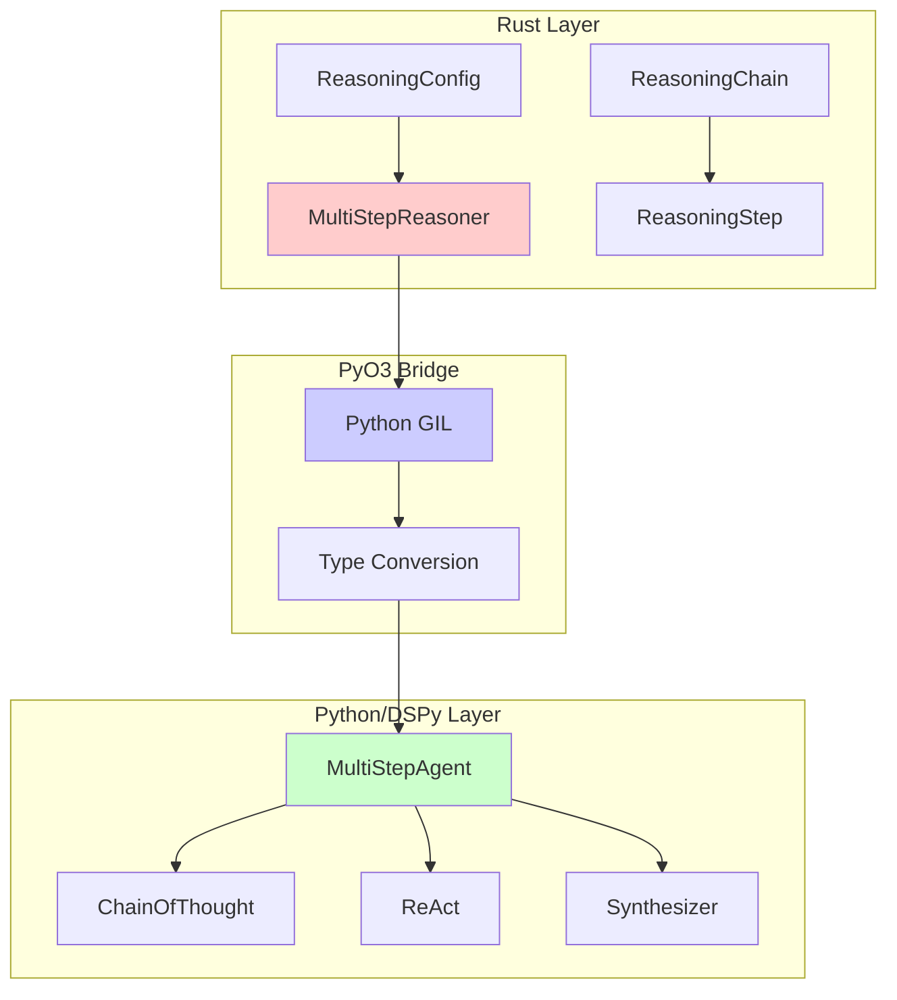
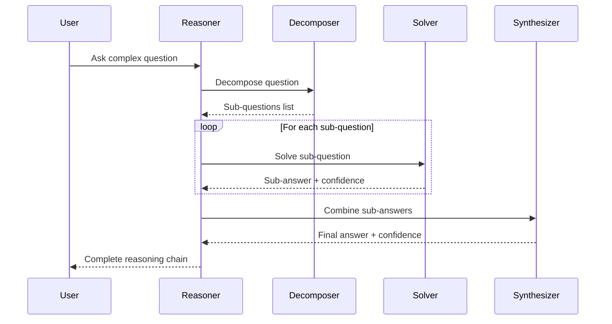

# Multi-Step Reasoning with DSPy

A comprehensive Rust example demonstrating complex reasoning through problem decomposition, sub-question generation, and answer synthesis using DSPy's ChainOfThought and ReAct modules.

## Overview

This example implements a sophisticated reasoning system that breaks down complex questions into manageable sub-questions, solves each independently, and synthesizes the results into a coherent final answer.

## Architecture

### Three-Phase Reasoning Pipeline


### Component Architecture



### Reasoning Flow



## Key Features

### 1. Problem Decomposition

The system automatically breaks complex questions into simpler sub-questions:

```rust
let reasoner = MultiStepReasoner::new(ReasoningConfig::default())?;
let chain = reasoner.reason(
    "What factors contributed to the fall of the Roman Empire \
     and how did they interact?"
)?;
```

**Example Decomposition:**
```
Complex Question:
  "What factors contributed to the fall of the Roman Empire and how did they interact?"

Sub-Questions:
  1. What were the internal political factors?
  2. What were the external military threats?
  3. What were the economic challenges?
  4. How did these factors reinforce each other?
```

### 2. Independent Sub-Question Solving

Each sub-question is solved using DSPy's ReAct (Reasoning + Acting) pattern:

```python
# Internal DSPy implementation
self.react = dspy.ReAct("question -> answer: str, confidence: float")
```

Each solution includes:
- **Answer**: The response to the sub-question
- **Confidence**: Numerical confidence score (0.0-1.0)
- **Reasoning trace**: Step-by-step thought process

### 3. Answer Synthesis

Sub-answers are intelligently combined into a coherent final conclusion:

```python
self.synthesize = dspy.ChainOfThought(
    "question, answers: list[str] -> final_answer: str, confidence: float"
)
```

The synthesizer:
- Identifies common themes across sub-answers
- Resolves contradictions
- Maintains logical coherence
- Provides overall confidence assessment

### 4. Reasoning Chain Visualization

Complete transparency into the reasoning process:

```rust
println!("{}", chain.visualize());
```

**Output:**
```
=== REASONING CHAIN ===

Step 1: What factors contributed to the fall of the Roman Empire?
  Thought: Decomposing complex question into manageable sub-questions
  Action: decompose
  Observation: Identified 4 sub-questions
  Conclusion: Political instability; Military threats; Economic decline; Interaction effects

Step 2: What were the internal political factors?
  Thought: Solving sub-question 1/4
  Action: solve
  Observation: Political corruption, succession crises, loss of civic virtue
  Confidence: 85.00%

...

=== FINAL CONCLUSION ===
The fall of the Roman Empire resulted from the interaction of multiple reinforcing factors...

Overall Confidence: 82.50%
```

## Components

### ReasoningStep

Represents a single step in the reasoning process:

```rust
pub struct ReasoningStep {
    pub step_number: usize,
    pub question: String,
    pub thought: String,
    pub action: Option<String>,
    pub observation: Option<String>,
    pub conclusion: Option<String>,
    pub confidence: Option<f64>,
    pub metadata: HashMap<String, String>,
}
```

**Builder pattern:**
```rust
let step = ReasoningStep::new(1, "Question?".to_string())
    .with_thought("Analyzing the problem")
    .with_action("decompose")
    .with_observation("Found 3 sub-problems")
    .with_confidence(0.9);
```

### ReasoningChain

Complete chain of reasoning steps with final conclusion:

```rust
pub struct ReasoningChain {
    pub steps: Vec<ReasoningStep>,
    pub final_conclusion: Option<String>,
    pub overall_confidence: Option<f64>,
    pub metadata: HashMap<String, String>,
}
```

**Methods:**
- `visualize()`: Format as human-readable text
- `to_json()`: Export to JSON
- `from_json()`: Import from JSON
- `validate()`: Check chain integrity

### MultiStepReasoner

Main reasoning engine:

```rust
pub struct MultiStepReasoner {
    agent: Py<PyAny>,
    config: ReasoningConfig,
}
```

**Configuration:**
```rust
pub struct ReasoningConfig {
    pub max_depth: usize,           // Maximum reasoning depth
    pub max_sub_questions: usize,   // Max sub-questions to generate
    pub model: String,              // LLM model to use
    pub temperature: f64,           // Generation temperature
    pub verbose: bool,              // Enable verbose output
}
```

## Usage Examples

### Example 1: Basic Usage

```rust
use multi_step_reasoning::{MultiStepReasoner, ReasoningConfig};

fn main() -> anyhow::Result<()> {
    // Create reasoner with default config
    let reasoner = MultiStepReasoner::new(ReasoningConfig::default())?;

    // Ask a complex question
    let chain = reasoner.reason(
        "How does climate change affect ocean currents, and what are \
         the cascading effects on weather patterns?"
    )?;

    // Display results
    println!("{}", chain.visualize());

    Ok(())
}
```

### Example 2: Custom Configuration

```rust
let config = ReasoningConfig {
    max_depth: 15,
    max_sub_questions: 8,
    model: "gpt-4".to_string(),
    temperature: 0.5,
    verbose: true,
};

let reasoner = MultiStepReasoner::new(config)?;
let chain = reasoner.reason("Your complex question")?;
```

### Example 3: Chain Analysis

```rust
let chain = reasoner.reason("Complex question")?;

// Validate chain
chain.validate()?;

// Analyze steps
for step in &chain.steps {
    println!("Step {}: {}", step.step_number, step.question);
    if let Some(conf) = step.confidence {
        println!("  Confidence: {:.1}%", conf * 100.0);
    }
}

// Export to JSON
let json = chain.to_json()?;
std::fs::write("reasoning_chain.json", json)?;
```

### Example 4: Strategy Comparison

```rust
// Fast strategy (fewer sub-questions)
let fast_config = ReasoningConfig {
    max_sub_questions: 3,
    ..Default::default()
};
let fast_reasoner = MultiStepReasoner::new(fast_config)?;

// Thorough strategy (more sub-questions)
let thorough_config = ReasoningConfig {
    max_sub_questions: 8,
    ..Default::default()
};
let thorough_reasoner = MultiStepReasoner::new(thorough_config)?;

// Compare results
let question = "Your question";
let fast_chain = fast_reasoner.reason(question)?;
let thorough_chain = thorough_reasoner.reason(question)?;

println!("Fast: {} steps", fast_chain.len());
println!("Thorough: {} steps", thorough_chain.len());
```

## Running the Examples

### Build

```bash
cargo build --release
```

### Run Interactive Demo

```bash
cargo run
```

The interactive demo provides:
1. **Example Questions**: Pre-loaded complex questions across domains
2. **Custom Questions**: Ask your own complex questions
3. **Strategy Comparison**: Compare different reasoning configurations
4. **Visualization**: See detailed reasoning chains
5. **Export**: Save chains to JSON

### Example Questions Included

1. **Historical Analysis**
   - What factors contributed to the fall of the Roman Empire and how did they interact?

2. **Scientific Reasoning**
   - How does climate change affect ocean currents, and what are the cascading effects?

3. **Economic Analysis**
   - What are the relationships between inflation, unemployment, and GDP growth?

4. **Technical Problem**
   - What are the trade-offs between microservices and monolithic architectures?

5. **Philosophical Question**
   - How do consciousness, free will, and determinism relate in modern neuroscience?

## Implementation Details

### DSPy Integration

The system embeds a DSPy module directly in Rust:

```rust
let module = PyModule::from_code_bound(
    py,
    r#"
import dspy

class MultiStepAgent(dspy.Module):
    def __init__(self, max_sub_questions=5):
        super().__init__()

        # Decomposition module
        self.decompose = dspy.ChainOfThought(
            "complex_question -> sub_questions: list[str]"
        )

        # Solving module
        self.react = dspy.ReAct(
            "question -> answer: str, confidence: float"
        )

        # Synthesis module
        self.synthesize = dspy.ChainOfThought(
            "question, answers: list[str] -> final_answer: str, confidence: float"
        )

    def forward(self, question):
        # Execute three-phase reasoning
        ...
"#,
    "multi_step_reasoning.py",
    "multi_step_reasoning",
)?;
```

### Type Safety

All Python-Rust conversions are type-safe:

```rust
// Extract with error handling
let final_answer: String = result.getattr("answer")
    .and_then(|a| a.extract())
    .map_err(|e| ReasoningError::SynthesisFailed(
        format!("Failed to extract answer: {}", e)
    ))?;
```

### Error Handling

Comprehensive error types:

```rust
pub enum ReasoningError {
    PythonError(PyErr),
    InvalidStep(String),
    MaxDepthExceeded(usize),
    NoConclusion,
    DecompositionFailed(String),
    SynthesisFailed(String),
}
```

## Best Practices

### Question Design

**Good questions for multi-step reasoning:**
- ✅ "What are the causes, effects, and feedback loops of X?"
- ✅ "How do factors A, B, and C interact to produce outcome D?"
- ✅ "Compare and contrast X and Y across multiple dimensions"
- ✅ "What are the trade-offs and when should each approach be used?"

**Poor questions (too simple):**
- ❌ "What is the capital of France?"
- ❌ "When was the Declaration of Independence signed?"
- ❌ "Who invented the light bulb?"

### Configuration Tuning

| Use Case | max_sub_questions | max_depth | temperature |
|----------|------------------|-----------|-------------|
| Quick answers | 3 | 5 | 0.3 |
| Balanced | 5 | 10 | 0.7 |
| Thorough analysis | 8 | 15 | 0.5 |
| Creative exploration | 6 | 12 | 0.9 |

### Performance Optimization

1. **Parallel solving**: Sub-questions could be solved in parallel (future enhancement)
2. **Caching**: Cache sub-answers for similar questions
3. **Early stopping**: Stop if confidence threshold reached
4. **Adaptive depth**: Adjust depth based on question complexity

## Testing

Run tests:

```bash
cargo test
```

Tests include:
- Step builder pattern validation
- Chain construction and validation
- JSON serialization/deserialization
- Error handling
- Configuration validation

## Advanced Topics

### Chain Persistence

```rust
// Save chain
let json = chain.to_json()?;
std::fs::write("chain.json", json)?;

// Load chain
let json = std::fs::read_to_string("chain.json")?;
let chain = ReasoningChain::from_json(&json)?;
```

### Custom Visualization

```rust
// Implement custom visualization
for step in &chain.steps {
    match step.action.as_deref() {
        Some("decompose") => println!("🔍 Decomposing..."),
        Some("solve") => println!("💡 Solving..."),
        Some("synthesize") => println!("🔗 Synthesizing..."),
        _ => {}
    }
}
```

### Confidence Analysis

```rust
// Analyze confidence distribution
let confidences: Vec<f64> = chain.steps
    .iter()
    .filter_map(|s| s.confidence)
    .collect();

let avg_confidence = confidences.iter().sum::<f64>() / confidences.len() as f64;
let min_confidence = confidences.iter().fold(f64::INFINITY, |a, &b| a.min(b));

println!("Average confidence: {:.1}%", avg_confidence * 100.0);
println!("Minimum confidence: {:.1}%", min_confidence * 100.0);
```

## Troubleshooting

### Common Issues

1. **Python import errors**
   ```bash
   pip install dspy-ai
   ```

2. **Model not found**
   ```bash
   export OPENAI_API_KEY="your-api-key"
   ```

3. **Build errors**
   ```bash
   cargo clean
   cargo build
   ```

## Performance Characteristics

- **Time complexity**: O(n) where n = number of sub-questions
- **Space complexity**: O(n) for chain storage
- **Typical latency**: 5-15 seconds depending on model and sub-question count
- **Memory usage**: ~50MB base + ~10MB per step

## Future Enhancements

- [ ] Parallel sub-question solving
- [ ] Adaptive depth based on question complexity
- [ ] Confidence-based early stopping
- [ ] Chain comparison and ranking
- [ ] Interactive chain editing
- [ ] Sub-question caching
- [ ] Streaming results
- [ ] Multi-modal reasoning (images, tables)

## References

- [DSPy Documentation](https://dspy-docs.vercel.app/)
- [PyO3 Guide](https://pyo3.rs/)
- [Chain-of-Thought Prompting](https://arxiv.org/abs/2201.11903)
- [ReAct: Reasoning and Acting](https://arxiv.org/abs/2210.03629)

## License

This example is part of the pyo3-dspy-agents skill resources.

## Contributing

Contributions welcome! Areas for improvement:
- Additional example questions
- Performance optimizations
- New visualization formats
- Enhanced error handling
- More configuration options
