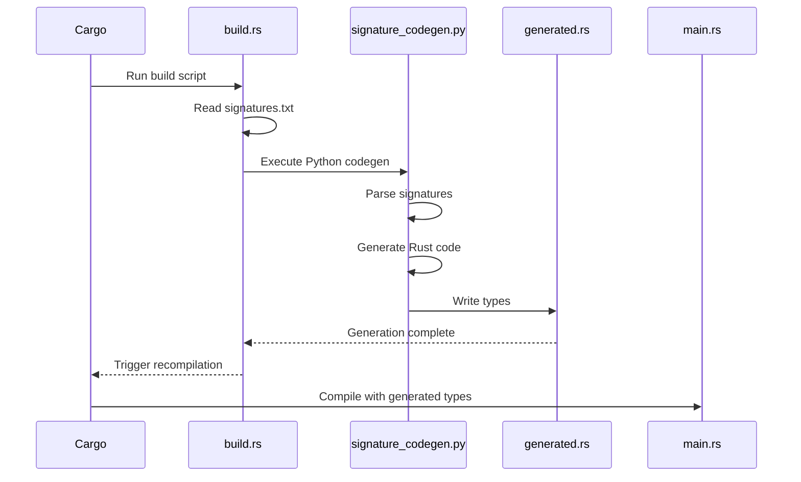

# Automated Rust Type Generation Workflow

Complete example demonstrating build-time code generation from DSPy signatures using `signature_codegen.py`.

## Overview

This example shows a production-ready workflow where:
1. DSPy signatures are defined in `signatures.txt`
2. Build script (`build.rs`) automatically generates Rust types at compile time
3. Generated types are used in application code with full type safety
4. Changes to signatures trigger automatic regeneration

## Architecture

```
┌─────────────────┐
│ signatures.txt  │ (Source DSPy signatures)
└────────┬────────┘
         │
         ├─> Build Script (build.rs)
         │   ├─> Calls signature_codegen.py
         │   ├─> Generates src/generated.rs
         │   └─> Triggers recompilation
         │
         ▼
┌─────────────────┐
│ generated.rs    │ (Rust types)
└────────┬────────┘
         │
         ├─> Application Code (main.rs)
         │   ├─> Creates instances
         │   ├─> Serializes/deserializes
         │   └─> Type-safe operations
         │
         ▼
┌─────────────────┐
│ Compiled Binary │
└─────────────────┘
```

## Files

### Source Files

- **`signatures.txt`**: DSPy signature definitions (one per line)
- **`build.rs`**: Build script that generates Rust code at compile time
- **`src/main.rs`**: Application using generated types
- **`src/generated.rs`**: Generated Rust types (created by build.rs)
- **`Cargo.toml`**: Project dependencies

### Generated Output

The build script creates `src/generated.rs` containing:
- Rust struct definitions for each signature
- Serde serialization/deserialization support
- Type-safe field access
- Documentation comments

## Usage

### Build and Run

```bash
# Initial build (generates types)
cargo build

# Run the example
cargo run

# Clean and rebuild (regenerates types)
cargo clean && cargo build
```

### Development Workflow

1. **Add New Signature**:
   ```bash
   echo "question -> sql_query" >> signatures.txt
   cargo build  # Automatically regenerates types
   ```

2. **Modify Existing Signature**:
   - Edit `signatures.txt`
   - Run `cargo build` - build.rs detects changes and regenerates

3. **Use Generated Types**:
   ```rust
   use crate::generated::*;

   let instance = QuestionToAnswer {
       question: "What is Rust?".to_string(),
       answer: "A systems programming language".to_string(),
   };
   ```

### Signature Format

Each line in `signatures.txt` defines one signature:

```
input_field -> output_field
input1, input2 -> output
context, question -> answer, confidence
```

Examples included:
- Simple question-answering
- Multi-input translation
- Context-based reasoning
- Classification tasks
- Data extraction

## Code Generation Flow



## Build Script Features

The `build.rs` script:

1. **Dependency Tracking**:
   - Monitors `signatures.txt` for changes
   - Triggers rebuild when signatures modified
   - Uses Cargo's `rerun-if-changed` directive

2. **Error Handling**:
   - Validates Python environment
   - Checks codegen script existence
   - Provides clear error messages
   - Fails build on generation errors

3. **Path Resolution**:
   - Locates `signature_codegen.py` relative to project
   - Handles workspace vs single-crate layouts
   - Creates output directory if needed

4. **Python Integration**:
   - Executes Python script with proper arguments
   - Captures stdout/stderr for debugging
   - Validates generation success

## Generated Type Features

Each generated struct includes:

```rust
#[derive(Debug, Clone, serde::Serialize, serde::Deserialize)]
pub struct QuestionToAnswer {
    pub question: String,
    pub answer: String,
}
```

Features:
- **Debug**: Pretty-printing for development
- **Clone**: Duplicate instances easily
- **Serialize/Deserialize**: JSON/bincode support
- **Public fields**: Direct access
- **Documentation**: Generated from signature

## Application Example

The `main.rs` demonstrates:

1. **Instance Creation**:
   ```rust
   let qa = QuestionToAnswer {
       question: "What is DSPy?".to_string(),
       answer: "A framework for LLM programming".to_string(),
   };
   ```

2. **JSON Serialization**:
   ```rust
   let json = serde_json::to_string_pretty(&qa)?;
   println!("{}", json);
   ```

3. **Multiple Signatures**:
   - Shows usage of all generated types
   - Demonstrates different field patterns
   - Validates type safety

4. **Real-world Patterns**:
   - Error handling with `anyhow`
   - Pretty-printed JSON output
   - Comprehensive examples

## Extending the Example

### Add Custom Validation

Edit `build.rs` to add validation:

```rust
// Validate signature format
let parts: Vec<&str> = signature.split("->").collect();
if parts.len() != 2 {
    panic!("Invalid signature format: {}", signature);
}
```

### Custom Type Mappings

Modify codegen to support additional types:

```python
# In signature_codegen.py
TYPE_MAPPINGS = {
    "question": "String",
    "confidence": "f64",
    "count": "i32",
}
```

### Add Builder Pattern

Generate builders for complex types:

```rust
impl QuestionToAnswer {
    pub fn builder() -> QuestionToAnswerBuilder {
        QuestionToAnswerBuilder::default()
    }
}
```

## Best Practices

1. **Version Control**:
   - Commit `signatures.txt` (source of truth)
   - Ignore `generated.rs` (build artifact)
   - Document signature changes in commits

2. **Testing**:
   - Test generated types in unit tests
   - Validate serialization round-trips
   - Check field constraints

3. **Documentation**:
   - Document signature intent
   - Add examples for complex signatures
   - Keep README updated

4. **Performance**:
   - Codegen runs only when signatures change
   - No runtime overhead
   - Compile-time type checking

## Troubleshooting

### Build Script Fails

```bash
# Check Python environment
python3 --version

# Verify codegen script exists
ls ../../signature_codegen.py

# Run codegen manually
python3 ../../signature_codegen.py signatures.txt src/generated.rs
```

### Generated Code Not Found

```bash
# Clean and rebuild
cargo clean
cargo build

# Check output location
ls -la src/generated.rs
```

### Type Mismatch Errors

- Ensure `signatures.txt` format is correct
- Verify generated types match usage
- Run `cargo build` to regenerate

## Integration with CI/CD

### GitHub Actions

```yaml
- name: Generate Rust types
  run: |
    python3 -m pip install --upgrade pip
    cargo build --release
```

### Pre-commit Hook

```bash
#!/bin/bash
# .git/hooks/pre-commit
if git diff --cached --name-only | grep -q "signatures.txt"; then
    cargo build || exit 1
fi
```

## Performance Characteristics

- **Build Time**: ~1-2 seconds for 10 signatures
- **Runtime Overhead**: Zero (compile-time only)
- **Binary Size**: Minimal (standard Rust structs)
- **Regeneration**: Only when signatures.txt changes

## Dependencies

- **pyo3** (0.22): Python integration (future use)
- **anyhow** (1.0): Error handling
- **serde** (1.0): Serialization framework
- **serde_json** (1.0): JSON support

## Future Enhancements

- [ ] Generate trait implementations
- [ ] Add validation attributes
- [ ] Support custom derives
- [ ] Generate test fixtures
- [ ] Add documentation generation
- [ ] Support namespace prefixes
- [ ] Generate conversion functions

## Related Examples

- `basic-types/`: Manual type definitions
- `pydantic-bridge/`: Runtime Python interop
- `proc-macro-codegen/`: Procedural macro approach

## References

- [Rust Build Scripts](https://doc.rust-lang.org/cargo/reference/build-scripts.html)
- [Serde Documentation](https://serde.rs/)
- [DSPy Framework](https://github.com/stanfordnlp/dspy)

## License

This example is part of the pyo3-dspy-type-system skill documentation.
